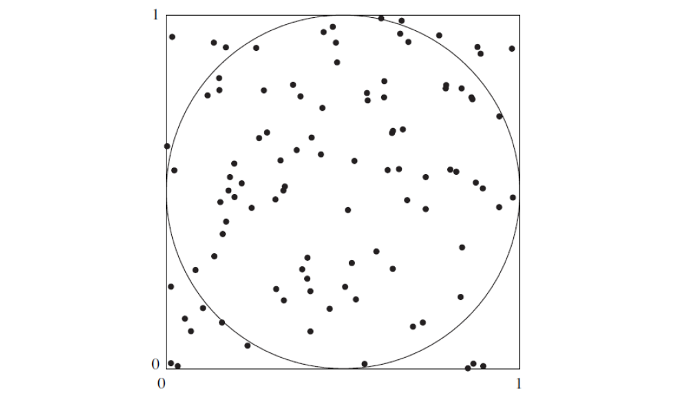

```{r setup, include=FALSE}
knitr::opts_chunk$set(echo = TRUE)
```

# **Actividad 2 - Simulación**

De manera individual deberá seleccionar uno de los siguientes problemas para ser resuelto con ayuda computacional. En un archivo pdf se deberán responder los interrogantes solicitados, adjuntado el código empleado. 

<br/><br/>

## **Ejercicio 1**

Un cable está compuesto por seis alambres. La fuerza de ruptura de cada alambre es una variable aleatoria distribuida normalmente con media de $10 kN$ y desviación estándar de $1 kN$ ($kN$=kiloNewton=$10^{3}N$). Utilizando el método de cable quebradizo, se estima que la fuerza del cable es igual a la fuerza de alambre más frágil multiplicada por el número de alambres.


a. Utilice una muestra simulada de tamaño 1000 para estimar la fuerza media de este tipo de cable.

b. Estime la mediana de la fuerza del cable.

c. Estime la desviación estándar de la fuerza del cable.

d. Para que sea aceptable en cierta obra, la probabilidad de que el cable se rompa con una carga de $70 kN$ debe ser menor a $0.01$. ¿Parece ser que el cable es aceptable? Explique.

<br/><br/><br/><br/>


## **Ejercicio 2**

Estimación del valor de $\pi$ . LA siguiente figura sugiere como estimar el valor de $\pi$ con una simulación. En la figura, un circuíto con un áreaigual a $\pi/4$, está inscrito en un cuadrado cuya área es igual a 1. Se elige de forma aleatoria 100 puntos dentro del cuadrado . La probabilidad de que un punto esté dentro del círculo es igual a la pracción del área del cuadrado que abarca a este, la cual es $\pi/4$. Por tanto, se puede estimar el valor de $\pi/4$ al contar el número de puntos dentro del círculo, que es 79 para obtener la estimación de $\pi/4 \approx 0.76$ . De este último resultado se concluye que $\pi \approx 4(0.79) =3.14$ . Este ejercicio presenta un experimento de simulación que fue diseñado para estimar el valor de $\pi$ al generar 1000 puntos en el cuadrado.




a. Genere 1000 coordenadas $x$:  $X_{1}$, . . . , $X_{1000}$. Utilice la distribución uniforme con valor mínimo de $0$ y valor máximo de $1$. La distribución uniforme genera variables aleatorias que tienen la misma probabilidad de venir de cualquier parte del intervalo $(0, 1)$.

b. Genere $1000$ coordenadas $y$ : $Y_{1}, . . . , Y_{1000}$, utilizando nuevamente la distribución uniforme con valor mínimo de $0$ y valor máximo de $1$.

c. Cada punto $(X_{i},Y_{i})$ se encuentra dentro del círculo si su distancia desde el centro $(0.5, 0.5)$ es menor a $0.5$. Para cada par $(X_{i},Y_{i})$ determine si la distancia desde el centro es menor a $0.5$. Esto último se puede realizar al calcular el valor $(X_{i}-0.5)^{2}+(Y_{i}-0.5)^{2}$, que es el cuadrado de la distancia, y al determinar si es menor que $0.25$.

d. ¿Cuántos de los puntos están dentro del círculo? ¿Cuál es su estimación de $\pi$? (Nota: Con sólo 1000 puntos, es probable que su estimación sea inferior por 0.05 o más. Una simulación con 10000 y 100000 puntos tiene mayores probabilidades de dar como resultado una estimación muy cercana al valor verdadero


<br/><br/><br/><br/>

## **Ejercicio 3**

Tres sistemas están compuestos por los componentes $R1$,$R2$,$R3$ y $R4$ conectados,  como lo muestra las siguientes figuras. El tiempo de vida en meses de los componentes $R1$ y $R3$ sigue una distribución lognormal con $\mu=1$ y $\sigma=0.5$ y la distribución en meses de los componentes $R2$ y $R4$ una distribución lognormal con $\mu=2$ y $\sigma=1$. El sistema solo funciona si A y B lo hacen.


 

a. Genere por simulación un gran número  (al menos $1000$) de los tiempos de vida de los sistemas

b. Estime la media del tiempo de vida para cada sistema.

c. Estime la probabilidad de que los sistemas fallen en un tiempo inferior a dos meses.

d. Estime el $20^{o}$ percentil ($P_{20}$) de los tiempos de vida del primer sistema .

e. Construya una gráfica de probabilidad normal de los tiempo de vida para cada sistema. ¿Los tiempos de vida de los sistemas tienen una distribución aproximadamente normal?

f. Construya un histograma de los tiempos de vida de los sistemas. ¿Están sesgados a la izquierda, sesgados a la derecha, o son aproximadamente simétricos?


<br/><br/><br/><br/>

## **Ejercicio 4**

La edad de una antigua pieza de materia orgánica se puede estimar a partir de la tasa a la que emite partículas beta como resultado del decaimiento del carbono-14. Por ejemplo , si X es el número de partículas emitidas durante diez minutos por un fragmento óseo con 10000 años de antigüedad  que contiene 1 g de carbono, entonces X tiene una distribución de Poisson con media $\lambda=45.62$ . Un arqueólogo descubrió un pequeño fragmento óseo que contiene 1 g de carbono. Si t es la edad desconocida del hueso, en años, el arqueólogo contar{a el número X de partículas emitidas en diez minutos y calculará una edad estimada $\widehat{t}$ con la fórmula:
	
$$\widehat{t}=\dfrac{\ln 15.3 - \ln (X/10)}{0.0001210} $$ 
	
El arqueólogo no lo sabe, pero el hueso tiene exactamente $100000$ años de antiguedad, por lo que $X$ tiene una distribución de Poisson con $\lambda=45.62$.


	
a. Genere una muestra simulada de 10000 valores de $X$ y sus correspondientes valores de $\widehat{t}$.

b. Estime la media de $\widehat{t}$.

c. Estime la desviación estándar de $\widehat{t}$.

d. Estime la probabilidad de que $\widehat{t}$ esté a 1000 años con una edad real de 10000 años.


<br/><br/>

Ejercicios tomados de Navidi(2006)