```{r setup, include=FALSE}
knitr::opts_chunk$set(echo = TRUE,comment = NA)

# colores
c0="#0DA5A6" # VERDE CLARO
c1="#E77C00" # NARANJA
c2="#6666FF" # AZUL  
c3="#4CBFBA" # VERDE CLARO  
c4="#E09600" # AMARILLO  
c5="#BC2B6A" # MORADO  

```


# **Guía 0.2**

<br/>
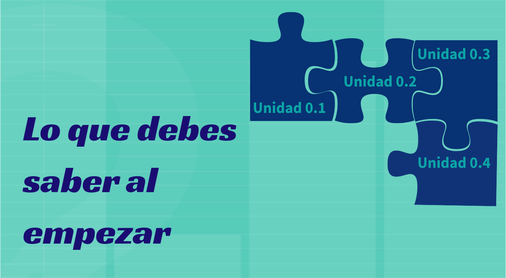

<br/><br/>

# **Teoría de conjuntos**

## **Introducción** 

A continuación se relacionan las principales características de los conjuntos y sus principales relaciones. Estos conceptos serán importante en el momento de abordar los conceptos básicos de  probabilidad que serán expuestos en el Modulo 2. 

En pesaremos con su definición

## **Definición de conjunto**

Un conjunto es una colección de objetos que se denota con una letra mayúscula (comúnmente las primeras letras del alfabeto A,B,C..) . 

Se pueden escribir por:

+ **por extensión** :  $A=\{0,1,2,3,4,5,6,7,8,9\}$, escribiendo todos los elementos que lo conforman.
 
+ **por su nombre** : los dígitos

+ **por compresión** : $A=\{ x\in\mathbb{Z},  0\le x  \le 9    \}$, utilizando  nomenclatura matemática.

Al  comparar o combinar conjuntos debemos hacer uso de sus propiedades y operaciones, dentro de  las  cuales se encuentran $A \cup B$, $A \cap B$, 

## **Unión del conjunto**

Unión del $A$ con el conjunto $B$.\hspace{.4cm} $A \cup B$, $\overline{A}$ ,$A - B$, entre  otras. La zona sombreada en la siguiente figura representa estas operación

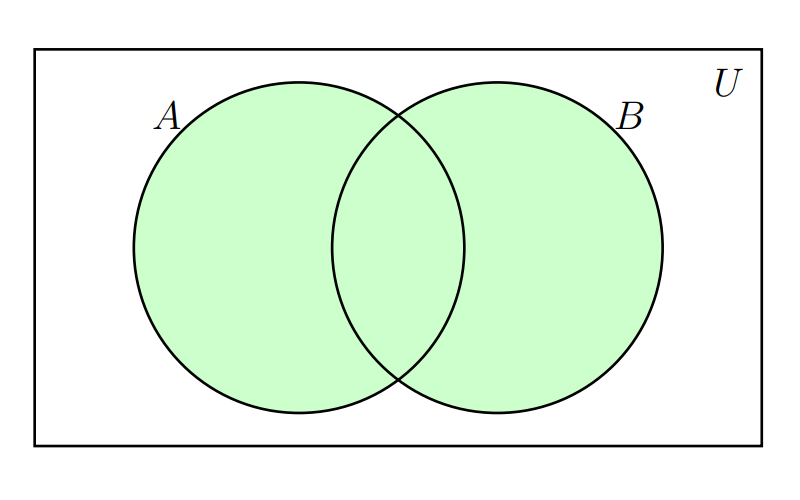{width=50%}

|    |                                     |
|:--:|:------------------------------------|
| 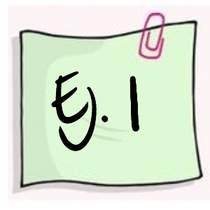|Supongamos los siguientes conjuntos : $A = \{a,e,i,o,u \}$ y $B = \{1,2,3,4,5,6,7,8,9,0\}$ |
 
 $A \cup B \{a,e,i,o,u, 1,2,3,4,5,6,7,8,9,0 \}$ 
 
 <br/><br/>
 
## **Intersección** 

La intersección entre el conjunto $A$ y el $B$ se denota por : $A \cap B$ y se representa por la siguiente zona sombreada

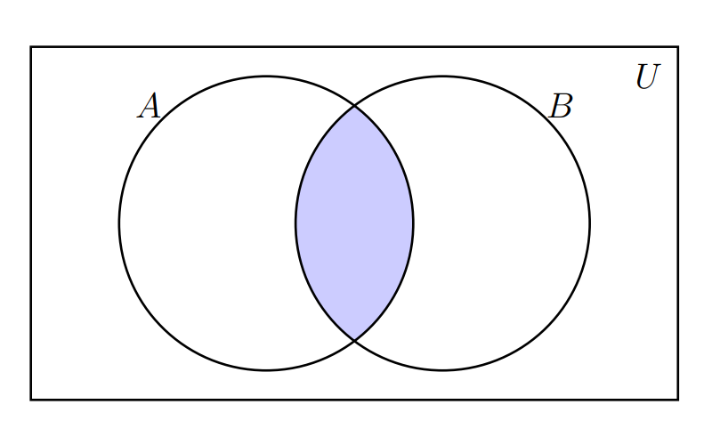{width=50%}


|    |                                     |
|:--:|:------------------------------------|
| 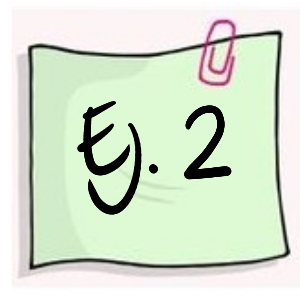 |Supongamos los siguientes conjuntos : $A = \{1,2,3,4,5,6 \}$ y $B = \{2,4,6,8,10,12,14,16,18,20 \}$  |


$A \cap B = \{ 2,4,6 \}$ 

<br/><br/>

## **Complemento**

El complemento del conjunto $A$ se escribe como: $\overline{A}$ y se representa por la siguiente zona sombreada

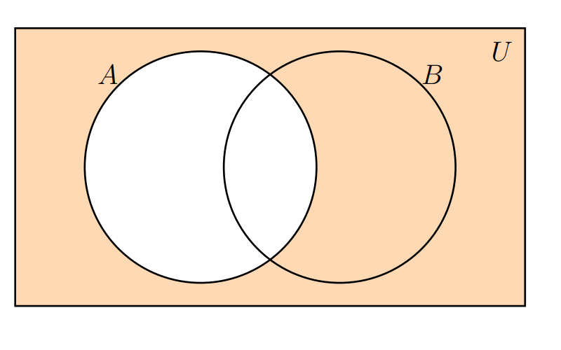{width=50%}

<br/><br/>

## **Resta**
 
La resta del conjunto $B$ menos el conjunto $A$ : $B-A$ , está representada por la zona sombreada en la siguiente figura
 
 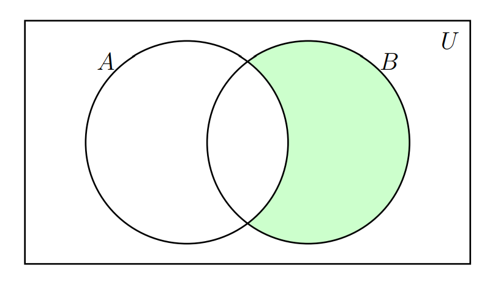{width=50%}

|    |                                     |
|:--:|:------------------------------------|
|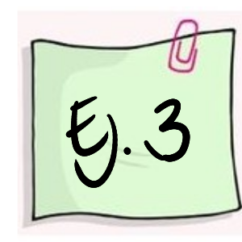 |Supongamos los siguientes conjuntos : $A = \{1,2,3,4,5,6 \}$ y $B = \{2,4,6,8,10,12,14,16,18,20 \}$ |

$B-A =\{ 8,10,12,14,16,18,20 \}$

<br/><br/>

##  **Problemas propuestos** 


<br/><br/>

# **Técnicas de conteo**

Las técnicas de conteo constituyen una serie de estrategias que permiten a través de reglas  establecer el  numero de elementos de un conjunto  finito. 

Inicialmente empezaremos por definir dos reglas:

## **Principio de la adicción**
Supongamos que un  procedimiento, designado con $P_1$, se puede hacer de $n_1$ manera diferentes. Supongamos que un  segundo  procedimiento $P_2$ se puede  realizar de $n_2$ maneras diferentes. Ademas suponga que los dos procedimientos no  se  pueden realizar juntos. Entonces  el numero de formas diferentes como se puede  realizar el procedimiento $P_1$ o el procedimiento  $P_2$ es de $n_1 + n_2$ maneras diferentes. 	

<br/><br/>

|    |                                     |
|:--:|:------------------------------------|
| 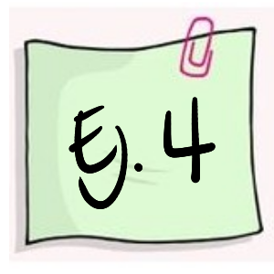 | Un estudiante tiene dos posibilidades de ir de su casa a la universidad: En transporte público o en transporte particular. Para el caso del transporte público existen 5 alternativas. Para el caso de transporte particular tienen 6 alternativas. En este caso $n_{1}=5$ y $n_{2}=6$. El número de maneras como se puede transportar de la casa a la universidad será $n=n_{1}+n_{2}=11$ formas diferentes de ir a la U. |

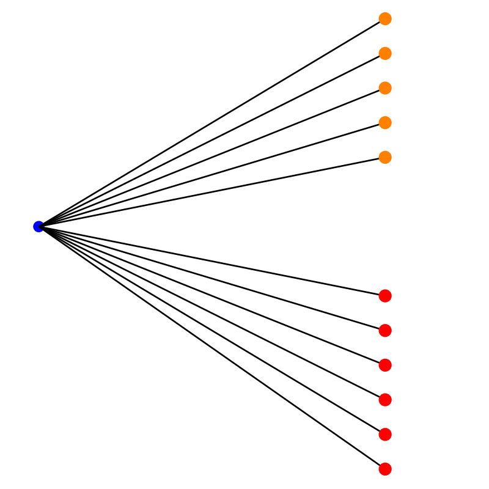{width=50%}
<br/><br/>

## **Principio de la multiplicación**

Supongamos que un  procedimiento $P1$ , se  puede realizar de $n_1$ maneras diferentes y que  otro procedimiento $P2$ se puede realizar de $n_2$ maneras diferentes, Ahora supongamos que la  manera  de  realizar  los procedimientos es  uno  después del  otro. Entonces el numero  de  formas  diferentes como  se  pueden  realizar los procedimientos $P1$ y  $P2$ de manera consecutiva es $n1*n2$ formas diferentes.	

<br/><br/>

|    |                                     |
|:--:|:------------------------------------|
| 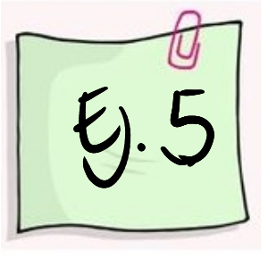 |En el proceso de fabricación de una silla se diferencian las siguientes etapas: El diseño de la silla ($P_{1}$) y el proceso de pintado ($P_{2}$). El proceso $P_{1}$ se puede realizar de 3 formas diferentes. Para el proceso $P_{2}$ se puede optar por 4 formas diferentes. ¿De cuantas formas diferentes se puede construir una silla? |

El número de posibles formas como puede fabricar una silla será:  $n_{1} \times n_{2} = 3 \times 4 = 14$

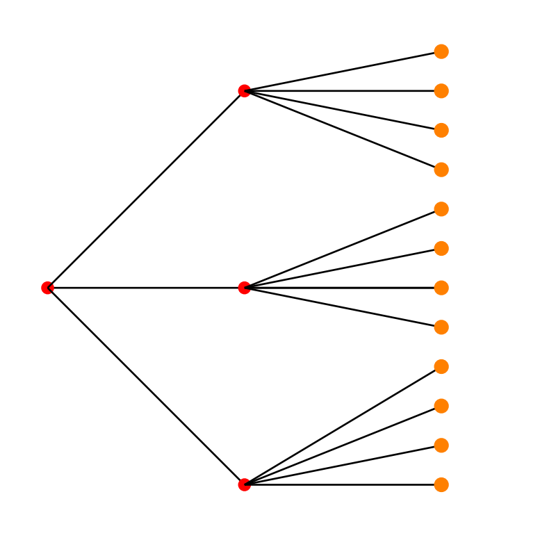{width=50%}

<br/><br/>

## **Otras técnicas de conteo** 

Para explicar un poco los otros casos de conteo utilizaremos el siguiente experimento aleatorio:

Se tiene una urna  que contiene $n$ elementos todos numerables ( se pueden contar) y de ellos se quiere seleccionar $k$ elementos como se muestra en  la siguiente figura.

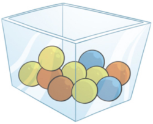

Este procedimiento se puede realizar de varias  formas:

A. Importando el  orden

+ $\mathcal{P}'(n,k)$ Con repetición o también llanada con sustitución

+ $\mathcal{P}(n,k)$ Sin repetición o sin sustitución 

B. Sin importar el  orden

+ $\mathcal{C}'(n,k)$ Con repetición o también llanada con sustitución 

+ $\mathcal{C}(n,k)$ Sin repetición o sin sustitución 

<br/><br/>

Es decir que se definen  los siguientes procedimientos:

**A1** : $\mathcal{P}'(n,k)$: Conjunto formado por todas las manera posible como se puede seleccionar una  muestra de tamaño k de una urna que contiene n elementos importando el  orden, con  sustitución. En este procedimiento se hace diferencia de la posición que tienen los elementos al ser seleccionados y también que después de  la extracción de un elemento, este se regresa  a la urna antes  de  la siguiente selección. Esto implica que hay siempre en la urna n  elementos antes de la cada selección.

**A2** : $\mathcal{P}(n,k)$: Conjunto de todas la formas posibles como se puede seleccionar una muestra de tamaño k de una urna que  contiene n elementos importando el orden, sin  sustitución. En este caso los elementos que son  seleccionados van  quedando por fuera de  la urna  y no participan en la siguiente selección.

**B1** : $\mathcal{C}'(n,k)$: Conjunto de  todas las maneras  posible como se puede  seleccionar una  muestra de tamaño k de una urna que contiene n  elementos sin importar el orden pero con  sustitución. En  esta  caso  no  tiene importancia el orden en que se seleccionan los elementos de la urna, pero  los elementos seleccionados  regresan  a  la  urna y podrían se seleccionados nuevamente.

**B2** : $\mathcal{C}(n,k)$: Conjunto  de  todas  las formas posibles como se puede selecciona una  muestra de tamaño k de una  urna que contiene n elementos, sin importar el  orden, pero en este caso los elementos seleccionados previamente son excluidos de la siguiente selección.

Contemplados estos casos vamos a definir la  forma  en  que se pueden contar  los conjuntos anteriores

<br/><br/>

### **Importa el orden con  sustitución**
	
$$\mathcal{P}(n,k) = n \times n \times n  ........ n = n^k$$
	
El numero de  maneras diferentes como  se  puede extraer  una  muestra de tamaño k de una urna que contiene n  elementos importando el orden y con sustitucion es:  $n^{k}$


<br/><br/>

### **Importa el orden sin  sustitución**
	
$$\mathcal{P}(n,k) = n \times ()n-1) \times (n-2)  ........ (n-k) = \dfrac{n!}{(n-k)!}$$
	
El numero de  maneras diferentes como  se  puede extraer  una  muestra de tamaño k de una urna que contiene n  elementos importando el orden y sin  sustitución es:  $\dfrac{n!}{(n-k)!}$,  el cual se lee n permutado con  k.	

 
<br/><br/>
 
|    |                                     |
|:--:|:------------------------------------|
| 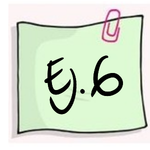 | Un Ingeniero debe realizar  visitas a 6 aéreas de trabajo diferentes durante el día. A fin de impedir a los funcionarios que sepan cuando realizara su visita, varía el orden de sus visitas. De cuantas maneras puede hacerlo? |


$$ _{6}\mathcal{P}_{6} = \dfrac{6!}{(6-6)!}=6! =720$$

<br/><br/>

### **No importa el orden sin  sustitución**
	
$$\mathcal{C}(n,k) = \dfrac{n!}{(n-k)! k!}= \binom{n}{k}$$

El número de  maneras diferentes como  se  puede extraer  una  muestra de tamaño k de una urna que contiene n  elementos importando el orden y sin sustitución es:  $\binom{n}{k}$, el cual se lee n  combinado con  k


<br/><br/>

|    |                                     |
|:--:|:------------------------------------|
| 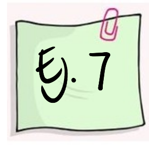 | El juego del Baloto está conformado por una urna que contiene 45 bolas numeradas del 1 al 46. ¿De cuantas formas diferentes puede salir el resultado un sorteo? |

De las 46 bolas se pueden eligen 6 sin importar el orden y sin que ninguna de las bolas se repita. Este experimento cumple con las condiciones de una combinación.  

El número de formas diferentes como se puede salir el resultado del Baloto será:

$$_{45}\mathcal{C}_{6} = \binom{45}{6}=8'145,060$$

<br/><br/>

### **No importa el orden con  sustitución** 
	
$$n(\mathcal{C}(n,k)) = \binom{n+k-1}{k}$$
	
El numero de  maneras diferentes como  se  puede extraer  una  muestra de tamaño k de una urna que contiene n  elementos importando el orden y sin  sustitución 	

<br/><br/>

## **Problemas propuestos** 

1. Cuántos números de 4 dígitos se pueden formar con los números 0,1,2,3,4,5,6,7? 
  a. Cuántos de los anteriores números son impares? 
  b. Cuántos son mayores o iguales a 1420? 

<br/><br/>

2. ¿Cuántas placas para automóvil pueden ser diseñadas si deben contener tres letras (mayúsculas)    seguidas de tres dígitos?
 
a.  Si es posible repetir letras y números.
b.  No es posible repetir letras y números.
c. Cuántas de las placas diseñadas en el punto (b)  empiezan por la letra K y termina en   cero,
d. Cuantas de las placas diseñadas en el inciso (a) empiezan por la letra K seguida de la L.

<br/><br/>

3.   ¿Cuántos números para telefónicos móviles son posible diseñar, si una de las líneas debe constar de siete dígitos?,

a. Considere que todos los números empiezan con 300. 
b. El número empieza por 312 y no es posible repetir dígitos.
c. ¿Cuántos de los números telefónicos del inciso (b) terminan  en  siete?.
d. ¿Cuántos de los números telefónicos del inciso (b) forman un número impar?.

<br/><br/>

4. ¿Cuántas maneras diferentes hay de asignar las posiciones de salida de 8 autos que participan en una carrera de fórmula uno? (Considere que las posiciones de salida de los autos.  participantes en la carrera son dadas totalmente al azar), ¿Cuántas maneras diferentes hay de asignar los primeros tres premios de esta carrera de   fórmula uno? 

<br/><br/>

5. En la configuración de un sistema de computo, para que la empresa lo use en su departamento de control de calidad, un ingeniero tiene cuatro opciones de computadora: IVM, VAX, QELL, o PH. Seis las marcas de monitores: M1 M2 M3 M4 M5 M6 y tres los tipos de impresoras gráficas: P1 P2 P3. 

a. Si todo el equipo es compatible, ¿en cuántas formas puede diseñarse el sistema?
b. Si el ingeniero necesita usar un paquete de software estadístico que está disponible sólo par    equipos IVM o QELL, ¿De cuantas maneras puede configurar el sistema? 

<br/><br/>

6. Se realizarán pruebas con cinco recubrimientos usados en la protección de cables de fibra óptica contra el frio extremo. Las pruebas se efectuaran en orden aleatorio. 

a. ¿En cuántos órdenes pueden llevarse a cabo las pruebas? 
b. Si dos de los recubrimientos son de un fabricante, ¿De cuantas maneras se puede presentar que las pruebas de esos recubrimientos se realicen una después de la otra?

<br/><br/>

7. Una multinacional  tiene 10 ingenieros industriales, ocho economistas, cuatro administradores y tres contadores. Se elegirá un equipo para un nuevo proyecto de largo plazo. El equipo consistirá entre ingenieros industriales, dos economistas, dos administradores y un contador.

a. ¿En cuántas formas puede seleccionarse el equipo? 
b. Si el gerente insiste en que se incluya en el proyecto a un ingeniero industrial con el que ha trabajado anteriormente, ¿de cuántas maneras puede seleccionarse al equipo? 

<br/><br/>

8. El Departamento de Ingeniería Industrial de una Universidad tiene 10 profesores Ph.D. De estos, cuatro son mujeres y seis hombres. Todos cuentan con las capacidades necesarias para ser elegidos como coordinadores de las 3 áreas con que cuenta el Departamento. En una selección aleatoria de 3 de estos profesores. 

a. ¿Cuál es la probabilidad que en el grupo no haya mujeres? 
b. ¿Es  lógico pensar que ninguna mujer sea elijada  bajo tales circunstancias?

<br/><br/>

9. En un plano hay 10 puntos denominados A, B, C, D, E, F, G, H, J, K. en una misma línea no hay más de dos puntos. 
a. ¿Cuántos triángulos pueden ser trazados a partir de los puntos? 
b. ¿Cuántos de los triángulos contienen el punto A? 
c. ¿Cuántos de los triángulos tienen el lado AB?. 

<br/><br/>

10. Supongamos que el CSI de la universidad le pide construya una contraseña que consista en cinco letras seguidas de un dígito. 
a. ¿Cuántas contraseñas son posibles? 
b. ¿ Cuantas contraseñas incluyen tres A y dos B, además de terminar en digito par? 
c. Si olvida completamente la contraseña y recuerda que tiene las características descritas en el párrafo b, ¿cuál es la probabilidad de que adivine correctamente en el primer intento? 

Problemas tomados y basados en  Meyer(1986)

<br/><br/>

### **Códigos en R** 

|               |                                                      |
|:--------------|:-----------------------------------------------------|
|permutación    | `nPk=function(a,b){choose(n,k)*factorial(k)} `       |
|combinación    | `nCk=function(a,b){choose(n,k)}`                     |
|               |                                                      |


