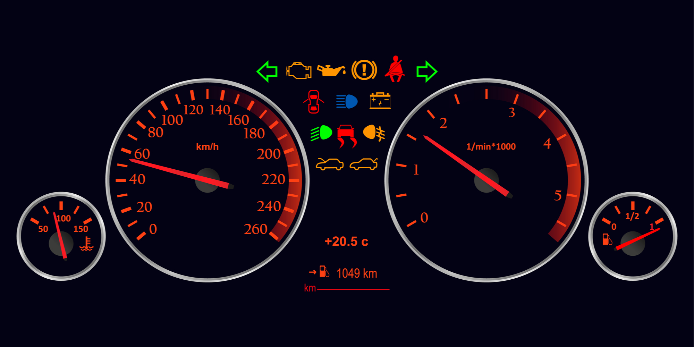
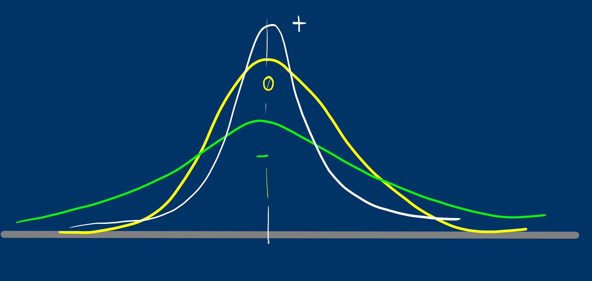
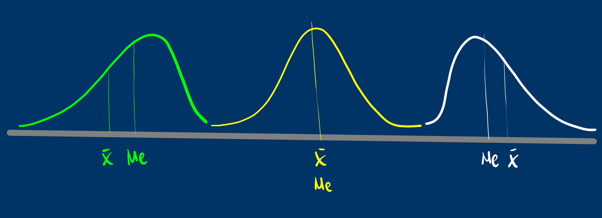

```{r setup, include=FALSE}
knitr::opts_chunk$set(echo = TRUE,comment = NA)

library(readr)
library(readxl)
library(rapportools) # miselania de estadisticas
library(summarytools)
library(agricolae)
library(stringr)
library(ggplot2)
library(agricolae)

bpe=read_delim("data/bpye20221.csv",delim = ";", escape_double = FALSE, trim_ws = TRUE)
bpe=bpe[,c(1,2,4,5)]

# colores
c0="#0DA5A6" # VERDE CLARO
c1="#E77C00" # NARANJA
c2="#6666FF" # AZUL  
c3="#4CBFBA" # VERDE CLARO  
c4="#E09600" # AMARILLO  
c5="#BC2B6A" # MORADO  

```

# **Guía de aprendizaje 1.2**


<br/><br/>

## **Introducción**

El **Análisis Descriptivo** permite examinar información contenida en una base de datos, procesarla y mediante la construcción de tablas, indicadores y gráficos y con esto elementos realizar un primer análisis de la información, permitiendo así tener una primera impresión de lo que dicen los datos, con la cual se pueden construir hipótesis que luego podrán ser verificadas.

En este proceso es importante conocer el tipo de variable ( cualitativa o cuantitativa) y su tipo de escala (nominal, ordinal en el caso de las cualitativas o de intervalo, de razón en el caso de las cuantitativas), con fin de seleccionar la manera adecuada de construir tablas que resuman la información e indicadores en cada caso.

En esta unidad se tratara en primer lugar el resumen de información mediante tablas de frecuencia y en una segunda parte lo relacionado con los indicadores de posición, centro o tendencia, dispersión e indicadores de forma.

<br/><br/>

## **Objetivos de la unidad**

Al finalizar esta unidad el estudiante estará en capacidad de RESUMIR e INTERPRETAR información mediante la construcción de TABLAS DE FRECUENCIA, INDICADORES DESCRIPTIVOS que permitan un correcto análisis de datos.

<br/><br/>

## **Duración**

La presente unidad será desarrollada durante la segunda semana del semestre ( 31 de enero al 06 de febrero  de 2022). Ademas del material suministrado contaran con el acompañamiento del profesor en
dos sesiones (lunes, miércoles y viernes) y de manera asincrónica con foro de actividades académicas. Los entregables para esta unidad deberán enviarse a través de la plataforma Brightspace hasta el 06 de febrero.


Para alcanzar los objetivos planteados se propone realizar las siguientes actividades


<br/><br/>

## **Cronograma de trabajo**


|Actividad104   | Descripción                    | 
|:--------------|:-----------------------------  |
|Trabajo individual| **Actividad 104** - **Caso 101** :  Realice las actividades consignadas en el caso101, adjunte y envíe las respuesta a la plataforma de Brightspace en formato pdf |
|Recursos       |[Video indicadores estadísticos](https://youtu.be/dWVs-M7oCh4)         |
|| [Vídeo calculo indicadores con tablas de distribución](https://youtu.be/n2UCDZNncls)|
| Fecha         | 06 de febrero de 2022          |
| Hora          | 23:59                         |

<br/> 

|Actividad105   | Descripción                    | 
|:--------------|:-----------------------------  |
|Trabajo individual|**Actividad 105** :  A partir de la información contenida en la **base de datos seleccionada en la Actividad 102**, realice un análisis de al menos dos variables cualitativas y dos cuantitativas teniendo como soportes las tablas de frecuencia y los indicadores estadísticos correspondiente.|
|Recursos| Base de datos actividad-1 Unidad 1.1|
|               |Excel                |
|               |RStudio              |
||Código u1.2                         |
|Fecha          | 06 de febrero 2022  |
|Hora           |  23:59 hora local   |


<br/><br/>

## **Criterios de evaluación**

+ Reconocer e interpretar las diferentes formas de resumir los datos a través de tablas de frecuencia para los casos de variables cuantitativas y para variables cualitativas.

+ Calcular e interpretar los diferentes indicadores de posición, tendencia, dispersión y forma que permitan un correcto análisis de los datos

+ Utilizar herramientas computacionales para el procesamiento de la información.

<br/> <br/> 

Los entregables completos y enviados dentro de los tiempos establecidos otorgarán 25 puntos en cada caso, para un total de 50 puntos.

<br/><br/>

## **Entregables** 

| Entregable    |  Descripción                   |
|:--------------|:-------------------------------|
|Entregable 1:  | **Actividad104.pdf** : Caso 101 |
|Entregable 2:  | **Actividad105.pdf** : Aplicar lo aprendido a base de datos actividad102    |
|Fecha          |Domingo 06 de febrero de 2022    | 
|Hora límite    | 23:59  hora  local             |

<br/><br/><br/><br/>

## **Presentaciones**

<br/><br/><br/>

## **Caso de estudio 101**

**Caso de estudio : CARACTERISTICAS DE LA CERVEZA**


La siguiente información recoge cinco de las principales características de un grupo de marcas de cerveza que fue recogida con la finalizad de clasificar los productos y además permita realizar un análisis descriptivo de las 69 marcas recogidas

Inicialmente el director de investigación desea su apoyo en una primera etapa del análisis que consiste en resumir la información suministrada en tablas e indicadores que le permitan validar algunas de sus hipótesis.

La base compartida contiene información sobre 69 marcas de cervezas que son distribuidas en la ciudad. 
Las variables recogidas corresponden a:  

+ **precio** de la presentación en caja de seis botellas de 12 onzas, 

+ contendo de **calorias** congtenidas en una unidad de 12 onzas, 

+ porcentaje de contenido de **alcohol** por 12 onzas de contenido, 

+ **tipo** de cerveza (1-lager artesanal, 2-clara artesanal, 3-lager importada, 4-cerveza normal y helada, y 5-cerveza baja en calorías y sin alcohol) y 

+ país de **origen** (1-nacional, 2- importada).

Su trabajo consiste en escribir un primer informe basado en una evaluación descriptiva, que contenga las tablas que resumen la información para cada variable de base de datos y  resumen de sus indicadores estadísticos.

Finalmente adjunte un análisis de los resultados obtenidos.

<br/>

|Producto | Precio | Calorías  | Alcohol   | Tipo   | Origen |
|:--------|-------:|-----------:|---------:|-------:|-------:|
|c1       |  6.24  | 159        |5.2       |1       |1       |
|c2       |4.49    |160         |5.0       |1       |1       |
|c2       |5.96    |160         |4.9       | 1      |1       |
|...      |........|............|..........|........|........|
|...      |........|............|..........|........|........|
|         |        |            |          |        |        | 

<br/>

[DATOS: beer.csv](https://github.com/dgonzalez80/pye20221.io/blob/main/beer.csv)

Video : Como etiquetar una variable en RStudio

<iframe width="560" height="315" src="https://www.youtube.com/embed/IUaEOmKRmUs" title="YouTube video player" frameborder="0" allow="accelerometer; autoplay; clipboard-write; encrypted-media; gyroscope; picture-in-picture" allowfullscreen></iframe>


```{r, eval=FALSE}
# Cargar la base de datos
library(readr)
beer <- read_delim("beer.csv", 
                   delim = ";", escape_double = FALSE, trim_ws = TRUE)

# Recodificar variable origen
beer$origen[beer$origen==0]="nacional"
beer$origen[beer$origen==1]="importada"

# Construir tablas de frecuencia
table(beer$origen)
summarytools::freq(beer$origen, cumul = FALSE)
```
<br/><br/> <br/>

# **Recursos**

<br/> <br/>


### **¿Que es un indicador?**

<br/>



<br/>

Cuando nos subimos a un auto  observamos un tablero con muchos indicadores que permiten al conductor validar el estado del vehículo. Todos los podemos visualizar al tiempo con el fin de darnos una idea del nivel de combustible, la temperatura, el estado de la batería, si alguna puerta esta abierta, la velocidad a la que se viaja, entre otros.

<br/>

Al igual que la situación anterior cuando nos enfrentamos a una análisis de datos, requerimos resumirlos en indicadores, tablas y gráficos que nos permitan un fácil análisis de ellos

<br/> <br/> <br/>

## **Tablas de frecuencia** 

 <br/>
 
### **Tablas de frecuencia para variables cualitativas**

<br/>

| Categorías (c1)| frecuencia absoluta (c2) | frecuencia relativa   (c3)  | 
|:---------------|:-------------------------|:----------------------------|
|                |                          |                             |

<br/>

Las distribuciones de frecuencia o también llamadas tablas de frecuencia nos sirven para agrupar los datos y así permitir resumir para poder tener una idea mas clara de sus características.

Para las variables cualitativas la tabla posee 3 columnas : 

+ c1: los diferentes valores que toma la variable. 

+ c2:  **frecuencia absoluta** que consiste en el conteo para cada uno de los valores distintos que toma la variable. 

+ c3: **frecuencia relativa ** que corresponde  al porcentaje la cantidad de datos para cada los valores


 <br/> <br/>

```{r, echo=TRUE, message=FALSE, warning=FALSE}
# Forma simple
data.frame(table(bpe$carrera))
```
 
 <br/> <br/>

```{r, message=FALSE, warning=FALSE}
#utilizando summarytools
carrera=as.factor(bpe$carrera)
summarytools::freq(carrera, cumul = FALSE)
```

Nota: paquete [summarytools](https://cran.r-project.org/web/packages/summarytools/vignettes/Introduction.html) 

 <br/> <br/>
 
### **Tablas de frecuencia para variables cuantitativas**

Para las variables cuantitativas las tablas de frecuencias tiene una presentación diferente a la vista anteriormente. Como se trata de variables con una gran número de valores diferentes, es necesario dividirlas por intervalos .

Cuando tenemos los datos sin agrupar nos es difícil extraer información que nos permita hacer un análisis de los mismos

```{r}
bpe$promedio
```

Una primera aproximación pude ser el diagrama de tallos y hojas con consiste en separar los dígitos de los datos en dos : una primera parte que se repite llamada tallo y otra parte que tiene diversos valores. Este diagrama también nos permite ordenar los datos de menor a mayor

```{r}
stem(bpe$promedio)
```

Una forma de construir una tabla de freciencias por intervalos es utilizando la funcion `graph.freq` del paquete agricolae

```{r,  echo=TRUE, message=FALSE, warning=FALSE}
h2=with(bpe,graph.freq(promedio,plot=FALSE));t2=table.freq(h2);
colnames(t2) = c("  LI  ", "  LS  ", "marca clase'", "Frec.Abs","Frec.Rel", "Frec.Abs.Ac","Frec.Rel.Ac")
t2
```
Frec.Abs : Frecuencia absoluta <br/>
Frec.Rel : Frecuencia relativa <br/><br/>
Frec.Abs.Ac : Frecuencia Absoluta Acumuada <br/>
Frec.Rel.Ac : Frecuencia Relativa Acumulada 

 <br/> <br/>

```{r}
data("iris")
summarytools::freq(iris$Species, cumul = FALSE, headings = FALSE)
```

 <br/> <br/> <br/>
 
## **Rango percentil**

 <br/>
 
Es un número que divide la muestra en dos partes. $x$ % de los datos de la muestra son iguales o menores que $P_x$ y un $(100-x)$ % por encima  de el.


 <br/>
 
 Para ilustrar el concepto, pensemos en que participamos de una carrera y que el grupo está conformado por 100 corredores.  El percentil dará cuenta de mi posición dentro del grupo. Por ejemplo si mi posición en la carrera en orden de llegada es la décima, indica que por detrás de mi están 90 atletas. Indica esto que soy el percentil 90 ($P_{90}$).
 
 <br/> <br/>
 
 
 
 
+ Participé en una carrera **K10** y ocupé el percentil 30 : $P_{30}$

+ Mi nota en un examen de matemáticas ocupó el percentil 90 : $P_{90}$

+ Que significa: $P_{25}$ ; $P_{50}$ ;  $P_{75}$


 <br/> <br/> <br/>
 
### **Diagrama de cajas** 

 <br/>
 
```{r, warning=FALSE, message=FALSE, fig.height=2, fig.width=10.7} 
ggplot(bpe, aes(x=promedio))+geom_boxplot()
```

 <br/>
 
atípico | $LI=Q_{1}- 1.5(Q_{3}-Q_{1})$ | $Q_{1}$ | $Q_{2}$ | $Q_{3}$ | $LS=Q_{3}+ 1.5(Q_{3}-Q_{1})$ |  atípico 

 <br/> <br/> <br/>
 
 
 Con ayuda del diagrama de tallos y hojas es posible ubicar los percentiles en un conjunto de datos
 
```{r}
stem(bpe$promedio)
```

Determine los percentiles :

+ $P_{25}$
+ $P_{50}$
+ $P_{75}$
+ $P_{10}$


```{r}
quantile(bpe$promedio, c(0.25,.50,0.75,0.10))
```
 
 
## **Características de los  datos**

 <br/>
 
| Central                    | Dispersión                   | Forma                          |
|:---------------------------|:-----------------------------|:-------------------------------|
| media                      | rango                        | sesgo o asimetría              |
| mediana                    | varianza                     | curtosis                       |
| moda                       | desviación estándar          |                                |
| media truncada             | coeficiente de variación     |                                |
| rango medio                |                              |                                |
| media armónica             |                              |                                |
| media geométrica           |                              |                                |
|                            |                              |                                |
 

 <br/> <br/>


### **Media aritmética** 

 <br/>
 
$$\widehat{x}= \frac{1}{n} \sum_{i=1}^{n} x_{i}$$

 <br/>
 
Es una de los indicadores estadísticos mas conocidos

Propiedades de la media :

+ La suma de las desviaciones de los datos con respecto a la media es cero. $\sum (x_{i}-\bar{x})=0$.

+ La suma de los cuadrados de las desviaciones de los datos con respecto a un valor {\bf $a$} es mínimo cuando $a=\bar{x}$.

+ Si $x_{i}=k$ para todo $i$, entonces, $\bar{x}=k$.

+ Si todos los datos de una variable se multiplican por una constante $k$, es decir $y_{i}=kx_{i}$, entonces $\bar{y}=k\bar{x}$

+ Si $z_{i}=a x_{i}+b y_{i}$, donde: **a**, **b** constantes y $x_{i}$, $y_{i}$ variables, entonces: $\bar{z}=a\bar{x}+b\bar{y}$. 

 <br/> <br/>
 
**Ejemplo 1**


```{r}
mean(mtcars$mpg,na.rm = TRUE)
```

 <br/> <br/>

**Ejemplo 2**

```{r}
mean(bpe$promedio, na.rm = TRUE)
```

 <br/> <br/>
 
**Ejemplo 3**

```{r}
x=1:10
x
cat("media :",mean(x))


```


 <br/> <br/>
 
 **Ejemplo 4**

```{r}
x=1:10
x[10]=20
x
cat("media :" ,mean(x))
```

 <br/> <br/>
 
### **Mediana** 

**Me** :Es el número que divide la muestra en dos partes de igual proporción (50% : 50%). Es decir que corresponde a:

$P_{50} = D_{5} = Q_{2}$

también corresponde a la linea central del diagrama de cajas.

```{r}
median(bpe$promedio,na.rm = TRUE)
```

 <br/> <br/>
 
```{r, warning=FALSE, message=FALSE, fig.height=3, fig.width=7}
boxplot(bpe$promedio, las=1, horizontal = TRUE, col = c1)
```
 
 <br/> <br/>
 
La **Me** corresponde a la linea central de a caja en el diagrama de cajas


La mediana es mas robusta a los cambio en los datos extremos. En presencia de datos atípicos es mejor utilizar la mediana en lugar que la media.

```{r}
x=1:10
x
cat("media :" ,median(x))
```

 <br/> <br/>
 
```{r}
x[10]=20
x
cat("media :" ,median(x))
```

 <br/> <br/>

### **Moda**  

**Mo** : Dato o valor que más se repite. Es utilizada como medida de tendencia central en variables cualitativas o o en cuantitativas discretas con pocos valores. En una tabla o  gráfico se puede distinguir fácilmente. 

```{r, message=FALSE}
#utilizando summarytools
summarytools::freq(bpe$carrera, cumul = FALSE, headings = FALSE)
```

moda : **Ingeniería de Sistemas**

 <br/> <br/>
 
### **Otras medidas de centro**

 <br/> <br/>
 
### **Media truncada**

```{r, warning=FALSE, message=FALSE}

mean(bpe$promedio, na.rm = TRUE, trim = 0.10)
```

 <br/> <br/>
 
### **Rango medio**  

$\frac{1}{2}(max(x)+min(x))$


```{r, warning=FALSE, message=FALSE}
(max(bpe$promedio,na.rm = TRUE)+min(bpe$promedio,na.rm = TRUE))/2
```

 <br/> <br/>
 
###  **Media geométrica** 

este indicador de tendencia central se utiliza para promediar tasa de crecimiento o de interés. Para encontrar su valor se multiplican los valores de $n$ tasas incrementadas en uno. A ese producto se le extrae la raíz n-esima.

 <br/> <br/>

###  **Media armónica**  

Este indicador corresponde al inverso de la media aritmética 

 <br/> <br/>
 
### **Problema reconocimiento de grupo**

|                             |                                    |
|:----------------------------|:-----------------------------------|
|**Grupo 1**                  |**Grupo 2**                         | 
|Edades : 19, 22, 18, 21      |Edades : 39, 38, 2, 1               |
|Promedio : 20 años           |Promedio : 20 años                  |
|                             |                                    |


Hace falta otro indicador que nos oriente de cual grupo hablamos cuando solo tenemos como información : media = 20 años.

 <br/> <br/>
 
## **Indicadores de Dispersión**

### **Rango**

$r = max(x) - min(x)$

En caso de los dos grupos:

|**Grupo 1**                  | **Grupo 1**                        |
|:----------------------------|:-----------------------------------|
|$\bar{x} = 20$ años          |$\bar{x} = 20$ años                 |
|$r = 4$ años                 |$r = 38$ años                       |  
|                             |                                    |
  
Indicador muy útil cuando se deben realizar cálculos rápidos

 <br/> <br/>
 
### **Varianza**

Es la medida de dispersión más utilizada en estadística y está definida por 

$$s^{2}=\frac{1}{n-1} \sum_{i=1}^{n} (x_{i}-\bar{x})^{2}$$

 <br/> <br/>
 
#### **Propiedades de la varianza**

+ $s^{2} = \frac{1}{n} \sum x_{i}^{2}- (\bar{x})^{2}$ 

+ La varianza es siempre no negativa  $s^{2} >=0$

+ La varianza de una constante es cero $s_{k}^{2}=0$

+ Si $y_{i}=k x_{i}$, entonces $s_{y}^{2}= k^{2} s_{x}$

+ Si $y_{i}=x_{i} + k$ , entonces  $s_{y}^{2} = s_{x}$

+ Si $z_{i} = a x_{i} + b y_{i}$, entonces $s_{z}^{2}$ = $a^{2}s_{x}^{2}$ + $b^{2}s_{y}^{2}$ + $2ab$ $cov(xy)$

La varianza se puede interpretar como el promedio de las diferencias cuadradas entre cada uno de los datos y la media

El problema de la varianza es su **interpretación**

Sus unidades son al cuadrado y en la mayoría de los casos no es posible interpretarlos. Por esta razón se optó por utilizar otra mediada de dispersión

 <br/> <br/>
 
### **Desviación estándar** 

Es la raíz cuadrada de la varianza

$$s=\sqrt{s^{2}}$$

**Nota** : no aplican todas las propiedades de la varianza

```{r}
cat( "Varianza :",var(bpe$promedio), "\n" )
cat("Desviación estándar :",sd(bpe$promedio))
```

Aunque la desviación estándar reduce el problema debido a tener las mismas unidades de la variable, es útil para comparación de dos grupos

 <br/> <br/>
 
### **Coeficiente de variación**

Nos indica que tan grande o que tan pequeña es la desviación estándar con respecto a su media

$$CV= \dfrac{s}{\bar{x}} \times 100 \% $$

Existen diferentes reglas empíricas para la interpretación del coeficiente de variación. Una de ellas establece como límite el 20% para separar los grupos homogéneos de los heterogéneos Por lo general se utiliza un valor hasta el 20% para determinar que un grupo de datos son homogéneos, de lo contrario se calificará como heterogéneo.

```{r}
cat("Coeficiente de variación :",sd(bpe$promedio)/mean(bpe$promedio)*100, " %")
```

 <br/> <br/>
 
## **Indicadores de forma**

### **Curtosis**

Se mide a través del coeficiente de curtosis que mide cuan **puntiaguda** es una distribución respecto a la curva de la distribución normal entandar.

De acuerdo con su valor, la puntudez de los datos puede clasificarse en tres grupos:

+ **Leptocúrtica**, con valores grandes para el coeficiente (CA>0)

+ **Mesocúrtica**, con valores medianos para el coeficiente (CA=0)

+ **Platicútrica**, con valores pequeños para el coeficiente (CA<0) 



 <br/> <br/>
 
```{r}
rapportools::kurtosis(bpe$promedio)
```
 
 
 
### **Asimetría o sesgo**

Mide que tanto la forma de la distribución de frecuencias de los datos es simétrica o no con respecto a la media. Esta característica de los datos se mide a través del coeficiente de asimetría o sesgo.

+ Es **simétrica** si el  valor del indicador es 0  ($\bar{x}=Me$)

+ Es **asimétrica a la izquierda** si el valor del indicador es negativo ($\bar{x}<Me$)

+ Es **asimétrica a la derecha** si el valor del indicador es positivo ($\bar{x}>Me$)



+ **Asimetria negativa ** : Poco con poco, mucho con mucho
+ **Simetrica** : Poco con poco, poco con mucho, mucho al rededor de un centro
+ **Asimetria positiva** : Mucho con poco, poco con mucho

```{r}
rapportools::skewness(bpe$promedio)
```


```{r, message=FALSE, warning=FALSE}

summarytools::descr(bpe$promedio)

```


```{r}
summarytools::descr(mtcars$mpg)
```


```{r, message=FALSE, warning=FALSE}
d1=density(bpe$promedio, na.rm=TRUE); plot(d1)
```


```{r, message=FALSE, warning=FALSE}
data("mtcars")
d2=density(mtcars$mpg); plot(d2)

```


 <br/> <br/>
 
## **Actividades**

<br/>

+ **Actividad 104**: Realice las  actividades consignadas en  el **Taller 1-01**.  Adjunte y envíe las respuesta a la plataforma de Brightspace en  formato pdf.
    + **Nota**: RMarkdown permite realizar el trabajo fácilmente

<br/>

+ **Actividad 105** : A partir de la  información contenida en  la base de datos  seleccionada en la **Unidad 1.1**, realice un análisis de al menos una variable cualitativa y una cuantitativa teniendo como soportes las tablas de frecuencia y los indicadores estadísticos correspondiente.

<br/><br/><br/>


## **Formulario**

|Estadística             | fórmula                               | código R                      |
|:-----------------------|:--------------------------------------|:------------------------------|
|**centro**              |                                       |                               |
|media aritmética        | $\displaystyle\dfrac{1}{n}\sum_{i=1}^{n} x_{i}$    | `mean(x)`                     |
|mediana                 | $Me = P_{50} = X_{n+1/2}$             | `median(x)`                   |
|moda                    | $Mo$ dato que más se repite           |                               |
|media truncada | media calculada con el 90% central de los datos|`mean(x,trim=10/100)`          |
|rango medio             | $rm=\dfrac{min\{x\}-max\{x\}}{2}$     | `max(x)-min(x)`               |
|media geométrica        | $(x_{1} \times x_{2} \times x_{3} .... x_{n})^{1/n}$  |               |
|media armónica          | $\dfrac{n}{\dfrac{1}{x_{1}}+\dfrac{1}{x_{2}}+\dfrac{1}{x_{3}}+...+\dfrac{1}{x_{n}}}$ | |
|**dispersión**          |                                       |                               |
|rango                   |$r= min\{x\}-max\{x\}$                 |`max(x)-min(x)`                |
|varianza                |$s^{2} = \dfrac{1}{n-1} \displaystyle\sum_{i=1}^{n}(x_{i}-\bar{x})^{2}$  |`var(x)`    |
|desviación estandar     |$s = \sqrt{s^{2}}$                     |`sd(x)`                        |
|coeficiente de variación|$cv= \dfrac{s}{\bar{x}} \times 100$ %  |`sd(x)/mean(x)*100`            |
|**forma**               |                                       |                               |
|coeficiente de curtosis |$\displaystyle\dfrac{Q_{3}-Q_{1}}{P_{90}-P_{10}}$ |`rapportools::kurtosis(bpe$promedio)`|
|coeficiente de asimetría|$\displaystyle\dfrac{3(\bar{x}-Me)}{s}$|`rapportools::skewness(bpe$promedio)`|
|percentil 25            |$X_{n \times 0.25}$                    |`quantile(x,0.25)`             |
|percentil 50            |$X_{n \times 0.50}$                    |`quantile(x,0.50)`             |
|percentil 75            |$X_{n \times 0.75}$                    |`quantile(x,0.75)`             |
|rango intercuartílico   |$Q_{3}-Q_{1}$                          |                          |


 <br/> <br/>


## **Taller 121**

### **Nivel de ansiedad**

Los siguientes datos corresponden al **nivel de ansiedad** de un grupo de estudiantes de la universidad valorada antes de la presentación del primer examen parcial. El investigador a cargo del proyecto utilizó una prueba para medir el nivel de ansiedad que permite puntajes entre 0 y 100. Los valores inferiores a 50 puntos se consideran como nivel bajo . Entre 50 y 80 , nivel medio y superiores a 80 se consideran altos.

Otra variable importante en el análisis corresponde a la **facultad** a la que pertence el estudiante

1. Facultad de Ingeniería y Ciencias
2. Facultad de Ciencias Económicas y Administrativas
3. Facultad de Humanidades
4. Facultad de Salud


Los resultados obtenidos se presenta a continuación :

```{r nivel, exercise=TRUE}
nivans=c(28,33,34,36,38,38,41,41,45,45,46,46,47,47,48,48,49,50,51,51,51,52,53,53,
         53,54,54,54,55,55,55,56,56,56,57,57,58,60,61,61,61,62,63,64,64,65,65,65,
         65,65,66,67,67,68,68,68,69,69,69,70,70,71,74,77,77,78,79,79,80,82,85,89,
         90,96,58,90,77,71,41,55,53,65,57,56,68,56,50,36,70,57,41,62,48,67,33,52,
         65,67,79,55,34,46,55,56,47,69,61,54,74,47,64,79,85,61,28,46,65,51,49,45,
         78,96,68,38,77,34,69,69,38,65,63,68,48,53,82,61,51,45,66,65,64,70,89,51,
         54,53,80,54,60,53)

fac=c(2,1,2,2,4,3,4,2,4,2,4,1,1,1,1,1,1,2,3,3,3,3,1,2,1,2,2,1,1,2,3,2,3,2,2,3,3,
      1,1,1,2,1,2,2,2,3,1,1,3,1,4,3,1,3,2,1,2,3,4,3,2,3,4,4,1,3,4,4,2,2,1,4,2,1,
      2,4,1,1,1,3,4,1,1,1,1,1,3,3,3,3,1,1,1,2,2,1,3,1,1,1,3,2,2,2,2,1,2,2,1,3,2,
      1,2,2,2,4,2,1,3,4,1,1,3,1,2,2,2,1,3,3,1,1,2,2,3,3,3,1,4,3,1,2,4,2,2,1,2,3,
      2,2)

data=data.frame(fac, nivans) # forma base de datos 
```


<br/><br/>

### Tablas de frecuencia

+ Construya una tabla de frecuencia que le permita establecer las frecuencias en cada uno de los rangos descritos y analice los resultados obtenidos.

**Primera forma** : Utilizando el paquete  `agricolae` 

```{r}
h2=with(data,graph.freq(nivans,plot=FALSE))
t2=table.freq(h2);
colnames(t2) = c("  LI  ", "  LS  ", "marca clase'", "Frec.Abs","Frec.Rel", "Frec.Abs.Ac","Frec.Rel.Ac")
t2
```

**Segunda forma** : utilizando la función `hist`

```{r}
h=hist(data$nivans, breaks = c(20,29.99,39.99,49.99,59.99,69.99,79.99,89.99,100), plot=FALSE)
LI=round(h$breaks[1:8],0) 
LS=round(h$breaks[2:9],0) 
ni=h$counts
hi=h$counts/150
Ni=cumsum(h$counts)
Hi=Ni/150

t=data.frame(LI,LS,ni,hi,Ni,Hi)
t
```

**Tercera forma** : utilizando la funciones :  `cut` y `cbind`

```{r}
nivans1=cut(data$nivans, breaks = c(20,29.99,39.99,49.99,59.99,69.99,79.99,89.99,100))
t2=table(nivans1)
t2=cbind(t2, t2/sum(t2),cumsum(t2), cumsum(t2)/sum(t2))
colnames(t2)=c("n","h","N","H")
t2
```


+ Cálculos las estadísticas descriptivas del nivel de ansiedad y describa los resultados en un párrafo

```{r}
summarytools::descr(data$nivans)
```
El grupo observado corresponde a un total de 150 estudiantes de las cuatro facultades de la universidad (aun no estaba la Facultad de Habitat) y presentan un valor promedio de 59.5 puntos que corresponde a un nivel medio. Su coeficiente de variación (24%) muestra un poco de heterogeneidad en los valores alcanzados por los estudiantes, mientras que su forma se aproxima a una distribución simétrica

<br/><br/>


Tabla de frecuencias para variables cualitativas  utilizando del paquete `summarytools` la función `freq`

```{r facultad, exercise=TRUE }
data$fac[data$fac==1]="Facultad de Ingeniería y Ciencias"
data$fac[data$fac==2]="Facultad de Ciencias Económicas y Administrativas"
data$fac[data$fac==3]="Facultad de Humanidades"
data$fac[data$fac==4]="Facultad de Salud"
summarytools::freq(data$fac, cumul = FALSE)

```

Los reultados indican una mayor proporción de estudiantes de la Facultad de Ingenieria y Ciencias (34%), mientras que la Facultad de Salud la menor (11.3%)


<br/><br/>


### **Lo podemos lograr...**
#### Daniel Enrique González Gómez 

Imagen tomada de : https://pixabay.com/es/images/search/paisaje/


