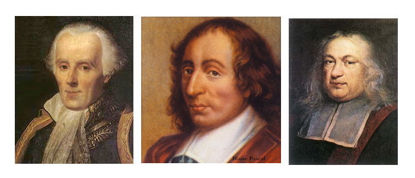
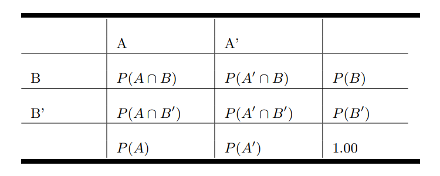

```{r setup, include=FALSE}
knitr::opts_chunk$set(echo = TRUE,comment = NA)
library(summarytools)
library(tidyverse)
# colores
c0="#0DA5A6" # VERDE CLARO
c1="#E77C00" # NARANJA
c2="#6666FF" # AZUL  
c3="#4CBFBA" # VERDE CLARO  
c4="#E09600" # AMARILLO  
c5="#BC2B6A" # MORADO  

Colombia=readRDS("data/Colombia.RDS")
Colombia22=readRDS("data/Colombia22.RDS")
```


# **Guía de aprendizaje 2.1**


<br/><br/>

<br/><br/>

## **Introducción**

El concepto de probabilidad constituye uno de los  pilares de la estadística que permiten la construcción de  conceptos posteriores como el de  **Variable Aleatoria** e **Inferencia Estadística**. Se parte de  los  conceptos básicos para lo cual se requiere revisar los temas de teoría de  conjuntos y técnicas de conteo del **Módulo 0** (**Unidad 0.2**). 

En esta unidad se consideran los conceptos básicos de probabilidad, los axiomas que la rigen y los diferentes enfoques para su calculo.

<br/><br/>

## **Objetivos de la unidad**

Al finalizar la  unidad el estudiante estará en capacidad de DESARROLLAR el pensamiento probabilístico mediante el calculo e interpretación de probabilidades mediante la  comprensión de los CONCEPTOS BÁSICOS, los diferentes ENFOQUES y TIPOS de probabilidad  que le ayuden a cuantificar el riesgo para la toma de decisiones.

<br/><br/>

## **Duración**

La presente  unidad será desarrollada durante la  cuarta semana del semestre (14 al 20 de febrero de 2022). Ademas del material suministrado  contaran con el acompañamiento del profesor en tres sesiones (Lunes, Miércoles y Viernes) y de manera asincrónica con  foro de actividades académicas. Los entregables para esta unidad podrán enviarse a través de la plataforma Brightspace hasta el  20 de febrero .

Para alcanzar los objetivos planteados se propone realizar las siguientes actividades

<br/><br/>

## **Cronograma de trabajo**


|Actividad      | Descripción                    | 
|:--------------|:-----------------------------  |
| Actividad 201 |[**Taller201**](https://github.com/dgonzalez80/presentacionespye.io/blob/main/Taller_201.pdf).  Resuelva las preguntas del siguiente  taller y entregue su solución  en formato **pdf**  en el enlace correspondiente de Brightspace.|
|Fecha  |  20 de febrero de 2022 |
|Hora   |  23:59 hora local     |
|||


## **Criterios de evaluación**

El **taller201** de la unidad 2.1 recoge los elementos estudiados y por tanto  tiene objetivo la revisión de los principales conceptos tratados.

+ Reconocer los principales conceptos de  probabilidad y su efecto sobre la toma de decisiones informadas.

+ Reconocer e identificar los diferentes tipos de probabilidad  y sus respectivas interpretación.
	
	
<br/><br/>

## **Entregables** 

| Entregable |  Descripción                    |
|:--------------|:-----------------------------|
| Actividad201    | Actividad201.pdf : Solucionario taller 201 | 
| Fecha           | 20  defebrero de 2022 | 
|Hora límite      | 23:59  hora  local |
 
<br/><br/><br/><br/>

## **Presentaciones**

[**Presentación 201**](https://github.com/dgonzalez80/probabilidad20212.io/blob/main/talleres/presentacion201.pdf)

<br/><br/>

# **Recursos**


Tomada : película El dorado 

Muchos relacionamos el concepto de probabilidad con los dados, pues forma parte de su origen y de su desarrollo inicial a través de preguntas y situaciones imaginarias y de alguna forma modelables desde la matemáticas. Pero este concepto va mucho mas alla como lo veremos en esta unidad.

La probabilidad es un concepto que se empieza a trabajar en 1654 cuando, caballero de Mered solicita a B. Pascal le ayude a resolver un problema relacionado con juegos de mesa. En particular este caballero manifestaba que las Matemáticas presentaban un vacio, pues sus cálculos no coincidían con lo que pasaba en la realidad y como consecuencia de ellos perdía dinero en las apuestas que se presentaban en el juego. 

Encomendado Pascal de esta tarea empieza a compartir su trabajo con Fermat, matemático y de la correspondencia de estos dos brillantes matemáticos nace los principios y fundamentos de  lo que hoy conocemos como probabilidad

<br/><br/>



**Problema**: 

Los dados, tal y como los conocemos hoy  en día, se hicieron muy populares en la edad media.  En esta época un caballero llamado Chevalier de Mere propuso el siguiente problema: 
 			
Qué es más probable : 

+ Sacar al menos un seis en cuatro tiradas con un solo dado o  

+ Sacar al menos un doble seis en 24 tiradas con dos dados? 

El caballero  afirmaba que este problema generaba una solución matemática que difería de la observación empírica

Este problema se retoma mas adelante

Iniciaremos con algunos conceptos básicos que nos permiten la contribución de sus fundamentos.

[El problema de los dados del caballero de
Méré: soluciones publicadas en el siglo XVII](http://materias.df.uba.ar/estadisticaa2019v/files/2019/02/El_caballero_de_Mere.pdf)

<br/><br/>

## **Conceptos básicos**

<br/><br/>

<div style="padding: 15px; border: 1px solid transparent; border-color: transparent; margin-bottom: 20px; border-radius: 4px; color: #000000; background-color: #FFFFFF ; border-color: #000000;">

**Experimento aleatorio** 

Acción que puede ser replicada bajo las  mismas condiciones y cuyo resultado no se conoce por anticipado.

</div>

+ $E_{1}$: Lanzar una moneda dos veces y observar los resultados obtenidos en sus caras superiores 

+ $E_{2}$: Lanzar dos dados y observar la suma de los resultados superiores 

+ $E_{3}$: Realizar un examen de estadística y observar el resultado obtenido  

+ $E_{4}$: En una salida de campo, observo si se cumple o no, totalmente el objetivo planteado 

+ $E_{5}$: Observo el número total de ensayos de laboratorio exitosos en  20 intentos realizados.

<br/><br/>

<div style="padding: 15px; border: 1px solid transparent; border-color: transparent; margin-bottom: 20px; border-radius: 4px; color: #000000; background-color: #FFFFFF ; border-color: #000000;">

**Espacio muestral** 

Conjunto de todos los posibles valores que puede tomar el experimento aleatorio. Este conjunto se nombra conuna letra mayuscula $S$ o tambien con **$\Omega$**
</div>

+ $S_{1}$= $\{ (cc), (cs), (sc), (ss) \}$  
<br/>

+ $\begin{equation*}
	S_{2}=\left\{
	\begin{array}{cccccc}
	&(1,1),(1,2),(1,3),(1,4),(1,5),(1,6)&\\
	&(2,1),(2,2),(2,3),(2,4),(2,5),(2,6)&\\
	&(3,1),(3,2),(3,3),(3,4),(3,5),(3,6)&\\
	&(4,1),(4,2),(4,3),(4,4),(4,5),(4,6)&\\
	&(5,1),(5,2),(5,3),(5,4),(5,5),(5,6)&\\
	&(6,1),(6,2),(6,3),(6,4),(6,5),(6,6)&
	\end{array}
	\right\}
	\end{equation*}$ 

<br/>

+ $S_{3}$= $\{ x \in \mathbb{R} | 0 \leq x \leq 5   \}$ 

<br/>

+ $S_{4}$= $\{ x \in \mathbb{N}| 0 \leq x \leq 1 \}$ 

<br/>

+ $S_{5}$= $\{ x \in \mathbb{N}| 0 \leq x \leq 20 \}$

<br/><br/>

<div style="padding: 15px; border: 1px solid transparent; border-color: transparent; margin-bottom: 20px; border-radius: 4px; color: #000000; background-color: #FFFFFF ; border-color: #000000;">

**Evento aleatorio** 

Subconjunto del espacio muestral que es de nuestro interés. Como todo conjunto se nombra con una letra mayúscula por lo general las primeras letras del alfabeto

</div>

|           |                                       |                      |
|:----------|:--------------------------------------|:---------------------|
|$A_{1}$    | Obtener solo caras                    | $A_{1}=\{ (c,c)\}$
| $A_{2}$   | Sacar un resultados es inferior a 4   | $A_{2}=\{(1,1),(1,2)(2,1)\}$
| $A_{3}$   | Ganar el examen                       | $A_{3}=\{ x \in \mathbb{R} | 3.0 \leq x \leq 5.0 \}$
| $A_{4}$   | Cumplir el objetivo de la salida      | $A_{4} =\{ 1 \}$
| $A_{5}$   | Obtener más de 5 ensayos éxitos       | $A_{5}$= $\{ x \in \mathbb{N}| 6 \leq x \leq 20 \}$

<br/><br/>


Resumiendo:

|Experimento aleatorio| Espacio muestral | Evento aleatorio |
|:--------------------|:-----------------|:-----------------|
|Lanzar una moneda dos veces y observar los resultados obtenidos en sus caras superiores| $S_{1}$= $\{ (cc), (cs), (sc), (ss) \}$ | Obtiener solo caras |
|Lanzar dos dados y observar la suma de los resultados superiores| $S_{2}$= $\{(1,1),(1,2), \dots, (6,6) \}$ | Sacar un resultados es inferior a 6 |
|Realizar un examen de estadística y observar el resultado obtenido|  $S_{3}$= $\{ x \in \mathbb{R} | 0 \leq x \leq 5 \}$| Ganar el examen|
|En una salida de campo, observo si se cumple o no, totalmente el objetivo planteado| $S_{4}$= $\{ x \in \mathbb{N}| 0 \leq x \leq 1 \}$| Cumplir el objetivo de la salida |
|Observo el número total de ensayos de laboratorio exitosos en  20 intentos realizados| $S_{5}$= $\{ x \in \mathbb{N}| 0 \leq x \leq 20 \}$| Obtener más de 5 ensayos éxitos |

## **Enfoques de probabilidad**

<br/><br/>

<div style="padding: 15px; border: 1px solid transparent; border-color: transparent; margin-bottom: 20px; border-radius: 4px; color: #000000; background-color: #FFFFFF ; border-color: #000000;">

### **Enfoque clásico**  

Es el enfoque más antiguo de probabilidad y que está basado en el supuesto de eventos individuales igualmente probables. La probabilidad bajo ese enfoque para el evento $A$ se calcula como la fracción entre el número de elementos del conjunto $A$, $n(A)$ y el número de elementos del espacio muestral $n(S)$: 
		
$P(A)=\dfrac{n(A)}{n(S)}$

</div>
	
En el caso del evento $A_{1}=\{(c,c)\}$, su probabilidad se obtiene como: 

$P(A_{1}=\dfrac{n(A_{1})}{n(S_{1})}=\dfrac{1}{4}=0.25$ 

Para $A_{2}$, la suma de los resultados es inferior a 6, se obtiene de la siguiente forma

$P(A_{2})=\dfrac{n(A_{2})}{n(S_{2})}=\dfrac{9}{36}=0.25$
<br/><br/> 


En la gran mayoria de casos no se cumplen los supuestos anteriores, pues se tienen eventos que no son igualmente probables, lo cual impide que podamos utilizar el enfoque frecuentista. 

Ahora suponemos que lo ocurrió en el pasado segirá pasando y asi estudiando la información recogida podemos predecir la posibilidad de ocurrencia de un evento futuro

<div style="padding: 15px; border: 1px solid transparent; border-color: transparent; margin-bottom: 20px; border-radius: 4px; color: #000000; background-color: #FFFFFF ; border-color: #000000;">

### **Enfoque Frecuentista**

Este enfoque basa su cálculo en la frecuencia con que ocurre un evento en un tamaño de muestra determinado $n$.

			
$\lim_{n \to{+}\infty} P(A)=\Bigg[ \dfrac{\text{número de veces que ocurre A}}{n} \Bigg]$

</div>

<br/><br/>


Si observamos el cobro de un penalti en un partido de fútbol, el cobrador tiene un gran número de posibilidades (lugares) para colocar el balón que podemos simplificar en 6 : parte baja derecha, parte alta derecha, parte baja al centro, parte alta central, parte baja izquierda y parte alta izquierda. Por su parte el arquero piensa también es estos lograres para evitar que el disparo termine en gol. Hoy en dia ambos jugadores estudian las frecuencias para determinar cual lugar ofrece mayores probabilidades de obtener éxito desde su rol.


Para calcular la probabilidad de que un jugador ejecute y convierta gol, debemos utilizar el enfoque frecuentista, contando para ello información pasada y realizando una división entre el numero de aciertos sobre el numero total de cobros.

Otro ejemplo puede estar relacionado con la probabilidad de muerte por Covid en Colombia. Es de aclarar que esta probabilidad no se mantiene constante a través del tiempo pues los efectos causados por la vacunación y su evolución hacen que esta probabilidad cambie. Por fines prácticos tomaremos la base total de colombianos infectados desde marzo del 2019 como denominador y como numerador el numero total de muertos

```{r}
Colombia=readRDS("data/Colombia22.RDS")
tabla=summarytools::freq(Colombia22$ubicacion, cumul = FALSE)
tabla
```

Con base en esta tabla podríamos pensar que la probabilidad de que una persona muera a causa del Covid-19 es del `0.0289`. Valor que se obtiene al dividir el número de personas fallecidas y el número total de personas que se han contraído covid. Claro bajo el supuesto de que todos las personas tenemos la misma probabilidad de fallecer. Hecho que se discutirá mas adelante.

<br/><br/>

<div style="padding: 15px; border: 1px solid transparent; border-color: transparent; margin-bottom: 20px; border-radius: 4px; color: #000000; background-color: #FFFFFF ; border-color: #000000;">

### **Enfoque subjetivo** 

En este caso la probabilidad es valorada y asignada por un EXPERTO, como un médico, un ingeniero, un abogado, un economista, un  estadístico ......

</div>

<br/><br/>

## **Axiomas de  probabilidad**

<div style="padding: 15px; border: 1px solid transparent; border-color: transparent; margin-bottom: 20px; border-radius: 4px; color: #000000; background-color: #FFFFFF ; border-color: #000000;">

+ $A_{1}$ : Sea $S$ un espacio muestral  asociado a un experimento. Entonces $P(S)=1$ 

+ $A_{2}$ : Para cualquier evento $A$, se cumple que $0 \leq P(A) \leq 1$ 

+ $A_{3}$ : Si $A$ y $B$ son dos eventos mutuamente excluyentes, entonces: $P(A \cup B) = P(A) + P(B)$ ( En general $P(A \cup B) = P(A)+ P(B) - P(A \cap B)$ ) 

+ $A_{4}$ : Para cualquier evento $A$, $P(\bar{A})=1-P(A)$

+ $A_{5}$ : La probabilidad de $P(\phi) =0$   

</div>

<br/><br/>

## **Tipos de probabilidad**

<br/><br/>

{width=80%}

<br/><br/>

### **Probabilidad simple o marginal**
			
+ $P(A)$ : probabilidad de que ocurra A 

+ $P(A')$ : probabilidad de que NO ocurra A 

+ $P(B)$ : probabilidad de que ocurra B 

+ $P(B')$ : probabilidad de que NO ocurra B 
			
<br/><br/>

### **Probabilidad conjunta** 
			
+ $P(A \cap B)$ : probabilidad de que ocurra A y B 
			
+ $P(A' \cap B)$ : probabilidad de que NO ocurra A y ocurra B 

+ $P(A \cap B')$ : probabilidad de que ocurra A y NO ocurra B 

+ $P(A' \cap B')$ : probabilidad de que NO ocurra A ni B 

<br/><br/>


## **RETO**

Con base en el enfoque frecuentista y la base de las personas contagiadas de COVID-19 durante el 2022 en Cali , determine la probabilidad de morir si se contagia de Covid19

PISTAS : [código 2.1](https://dgonzalez80.github.io/pye20221.io/codigo201.html)
<br/><br/><br/>

## **PROBLEMAS PROPUESTOS**

#### **Ejercicio 1**.

En el colegio Anglo-Frances se imparten sólo los idiomas inglés y francés. El 80% de los alumnos estudian  inglés y el resto francés. El 30% del os alumnos de inglés son socio del club musical del colegio, mientras de los que estudian francés son socio de dicho club el 40%. Si el director del colegio elige un alumno de manera aleatoria, ¿qué tan probable es que dicho alumno pertenezca al club de musical? . Por otra parte el psicólogo del colegio afirma que estudiar inglés es un evento independiente de estudiar francés. ¿usted que opina respecto a esta afirmación? (justifique su respuesta)

<br/><br/>

#### **Ejercicio 2**.

En una universidad de la región hay 4000 estudiantes distribuidos en tres grupos. Primeros semestre (1 a 3), mitad de carrera (4 a 7) y final de carrera (8 a 10). Esta población esta conformada por estudiantes que realizan actividades extracuricolares y aquellos que no participan en ninguna actividad, distribuidos como se muestra en la siguiente tabla:

|                   |Participa en actividades del MU| No participa en actividades del MU |
|:------------------|:------------------------------|:-----------------------------------|
|Primeros semestres |   1250                        |   1530                             |
|Mitad de carrera   |    465                        |    350                             |
|Final de carrera   |    270                        |    270                             |

Se ha encomendado a un grupo de profesores consejeros, seleccionar un estudiante de este grupo para guiarlos académicamente en su proceso de formación. El grupo de profesores está conformado por Sandra, Isabel, David, Daniel y Gerardo

Sandra prefiere que el grupo de estudiantes a su cargo sean estudiantes de primeros semestre y que participan en actividades del Medio Universitario (MU) . Isabel en cambio los eligirá dentro del grupo de estudiantes que está finalizando carrera, dentro de los que prefieren no participar en actividades del MU. Por su parte David desea estudiantes sean del rango intermedio o mitad de carrera, pues ellos no han realizado la escogencia del énfasis. Daniel solicita un listado de los estudiantes que participan  e actividades del MU y de ellos desea que el estudiante a su cargo esté cursando últimos semestre. Finalmente Gerardo solo quiere que el estudiante seleccionado para su acompañamiento sea de primeros semestre.  Si en cada caso los estudiantes son selecionados de maneta aletatoria de toda la población tiene la mayor probabilidad de ver cumplido sus deseos?

<br/><br/>

#### **Ejercicio 3**. 

Un miembro de la comunidad universitaria se somete a una prueba para detectar el Covid19. Si la persona está enferma, el test dá positivo con un 96% de certeza. Si la persona está sana, el test será negativo con un 94% de certeza. Se sabe que 1 de cada 100 personas de esta comunidad está enferma
a. Sabemos que el test resultó positivo. Que tan probable es que la persona a la que le realizaron la prueba esté enferna?
b. El test resultó negativo. ¿Cual será la probabilidad de que la persona examinada este sana?


