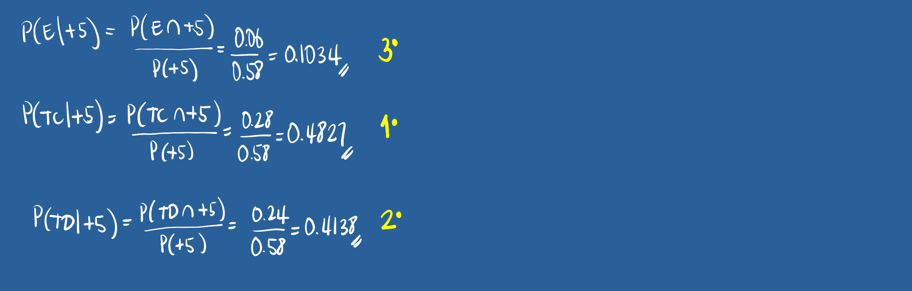

```{r setup, include=FALSE}
knitr::opts_chunk$set(echo = TRUE)

# colores
c0="#0DA5A6" # VERDE CLARO
c1="#E77C00" # NARANJA
c2="#6666FF" # AZUL  
c3="#4CBFBA" # VERDE CLARO  
c4="#E09600" # AMARILLO  
c5="#BC2B6A" # MORADO  

```


# **1.Guía de aprendizaje 2.2**

<div class="container-wrapper-genially" style="position: relative; min-height: 400px; max-width: 100%;"><video class="loader-genially" autoplay="autoplay" loop="loop" playsinline="playsInline" muted="muted" style="position: absolute;top: 45%;left: 50%;transform: translate(-50%, -50%);width: 80px;height: 80px;margin-bottom: 10%"><source src="https://static.genial.ly/resources/panel-loader-low.mp4" type="video/mp4" />Your browser does not support the video tag.</video><div id="5f4c855734dcc71ce637fbe4" class="genially-embed" style="margin: 0px auto; position: relative; height: auto; width: 100%;"></div></div><script>(function (d) { var js, id = "genially-embed-js", ref = d.getElementsByTagName("script")[0]; if (d.getElementById(id)) { return; } js = d.createElement("script"); js.id = id; js.async = true; js.src = "https://view.genial.ly/static/embed/embed.js"; ref.parentNode.insertBefore(js, ref); }(document));</script>

<br/><br/>

<br/><br/>

## **1.1. Introducción**

Como fue mencionado en la Unidad 2.1 el concepto de probabilidad es fundamental dentro de la Estadística, pues soporta los conceptos de variable aleatoria y de las funciones que las rigen. Entre sus principales aplicaciones está la valoración del riesgo en relación con la toma de decisiones, la fiabilidad de productos y garantías de productos, teoría de juegos, entre otras aplicaciones.

Como complemento de los conceptos vistos en la Unidad 2.1, en esta unidad se aborda el concepto de **Probabilidad total** y el **Teorema de Bayes**.

<br/><br/>

## **1.2. Objetivos de la unidad**

Al finalizar la unidad los estudiantes estarán  en  capacidad de  RECONOCER, CALCULAR e INTERPRETAR  los diferentes tipos de probabilidad y sus aplicaciones, con el propósito de valorar los riesgos asociados a una decisión. 

<br/><br/>

## **1.3. Duración**

La presente  unidad será desarrollada durante la semana comprendida entre el 25 y 29 de agosto de 2021. Ademas del material suministrado  contaran con el acompañamiento del profesor en dos sesiones (Lunes y Viernes) y de un monitor (Miercoles) y espacio de Atencion a estudiantes y manera asincrónica  de actividades académicas. Los entregables para esta unidad podrán enviarse a través de la plataforma Brightspace hasta el  29 de agosto de 2021

Para alcanzar los objetivos planteados se propone realizar la siguiente actividad

<br/><br/>

## **1.4. Cronograma de trabajo**


|Actividad      | Descripción                    | 
|:--------------|:-----------------------------  |
| Actividad 201 |A partir de los conceptos vistos en las Unidades 2.1 y 2.2 deberá resolver los problemas propuestos en el [**Taller 202**](https://github.com/dgonzalez80/probabilidad20212.io/blob/main/talleres/Taller_202.pdf) y entregue su solución  en formato **pdf**  en el enlace correspondiente de Brightspace.|
|Fecha  |  29 de agosto de 2021 |
|Hora   |  23:59 hora local     |
|||


<br/><br/>

## **1.5. Criterios de evaluación**

El taller del Modulo 2 recoge los elementos estudiados y por tanto  tiene objetivo la revisión de los principales conceptos tratados.

+ Reconocer los principales conceptos de  probabilidad y su efecto sobre la toma de decisiones informadas.

+ Reconocer e identificar los diferentes tipos de probabilidad  y sus respectivas interpretación.

<br/><br/>

## **1.6. Entregables** 

| Entregable |  Descripción                    |
|:--------------|:-----------------------------|
| Actividad202    | Actividad202.pdf : Solucionario taller 202 | 
| Fecha           |Domongo  29 de agosto de 2021 | 
|Hora límite      | 23:59  hora  local |

<br/><br/><br/><br/>

## **1.7. Presentaciones**

[**Presentación 202**](https://github.com/dgonzalez80/probabilidad20212.io/blob/main/talleres/presentacion202.pdf)
<br/><br/>

# **2. Recursos**
<br/><br/>

En la guía 2.1 se habló de los conceptos básicos (Experimento aleatorio, Espacio muestral y Evento aleatorio), de los diferentes enfoque de probabilidad ( Clásico, Frecuentista y Subjetivo) y de los tipos de probabilidad simple o marginal ($P(A)$) y probabilidad conjunta $P(A \cap B)$.

En esta guía se hará en énfasis en otro tipo de probabilidad llamada **probabilidad condicional**

<br/><br/>

## **2.1. Probabilidad condicional**

<div style="padding: 15px; border: 1px solid transparent; border-color: transparent; margin-bottom: 20px; border-radius: 4px; color: #F0F8FF; background-color: #0063CD ; border-color: #000000;">

**Definición : Probabilidad condicional**

La probabilidad condicional de $B$, dado $A$, se denota como $P(B|A)$, se define como:

$$P(B|A)=\dfrac{P(A \cap B)}{P(A)}$$

Siempre que $P(A) > 0$

</div>

<br/>

$P(B|A)$ se puede leer como :

+ Probabilidad de que ocurra $B$ dado que el evento $A$ ya ocurrió

+ Probabilidad de que ocurra $B$ sabiendo previamente que ocurrió el evento $A$

+ Si sabemos que ha ocurrido el evento $A$, la probabilidad de que ocurra $B$

<br/><br/>

El efecto de conocer la ocurrencia del evento $A$ hace que el espacio muestral de referencia pase de ser $S$ a solo $A$.  Ahora dentro de este nuevo espacio muestal de referencia se debe establecer la probabilidad de que ocurra $B$

De esta manera la probabilidad se expresa como la razón entre la probabilidad conjunta 
$P(A \cap B)$ con la probabilidad de $A$

<br/><br/>

### **Ejemplo:**

Supongamos que se tiene la siguiente información escrita en una tabla de doble entrada o tabla cruzada que contiene dos eventos $A$ y $B$ :

```{r}
x=c(460,140,40,260)
m=matrix(x,nrow = 2) 
rownames(m) = c("B", "B*")
colnames(m) = c("A", "A*")
m
```

En la siguiente tabla se representan los tres tipos de probabilidad :
<br/>
{width=80%}
<br/><br/>
Esta información tambien se puede representar como un diagrama de árbol 
<br/>

{width=80%}
<br/><br/>

O también como un diagrama de Venn:
<br/>
{width=80%}
<br/><br/>


Por despeje se pueden obtener la llanada regla de la multiplicación :
<br/>

<div style="padding: 15px; border: 1px solid transparent; border-color: transparent; margin-bottom: 20px; border-radius: 4px; color: #F0F8FF; background-color: #0063CD ; border-color: #000000;">

**Definición: Regla de la multiplicación de eventos**

La probabilidad de que ocurra A y B asociados a un experimento aleatorio es :

$P(A \cap B) = P(A) P(B|A)$  o  $P(A \cap B) = P(B) P(A|B)$

En el caso de los eventos A y B sean independientes entonces :

$$P(A \cap B) = P(A) P(B)$$

</div>


<br/><br/>
En el caso que se requiera evaluar si dos eventos son independientes o no, partiendo de la definición de probabilidad condicional se podría obtener la siguiente regla al despejar $P(A \cap B$ de la ecuación para obtener : $P(A \cap B) = P(A) * P(B|A)$. En caso de que la ocurrencia del evento $A$ previamente al evento $B$, no cambie su probabilidad, se podría escribir que $P(B|A)= P(B)$ y en este caso la regla indica que la probablidad conjunta de los eventos A y B es igual a la probabilidad de sus probabilidades marginales :

<br/>

<div style="padding: 15px; border: 1px solid transparent; border-color: transparent; margin-bottom: 20px; border-radius: 4px; color: #F0F8FF; background-color: #0063CD ; border-color: #000000;">

**Definición: Independencia de eventos**

Dos eventos A y B son independientes si y solo si la probabiliad del evento B no es afectada por la ocurrencia del evento A o viceversa.

$P(A \cap B) = P(A) P(B)$ o  $P(B|A)=P(B)$

</div>


<br/><br/>

### **Ejemplo :**

El departamento de crédito de la universidad, informa que el 30% de los pagos realizados en la universidad se efectúan en efectivo, un 40% con tarjeta de crédito y el resto con tarjeta débito. En todos los casos estos pagos solo son recibidos en la caja ubicada en la oficina de Registro Académico de la universidad.

Tambien se conoce que 20% de los pagos realizados en efectivo, 70% de los pagos realizados con tarjeta de crédito y el 80% de los pagos realizados con tarjeta débito, corresponden a pagos por valores superiores a $500 mil pesos

Con el fin de mejorar el servicio, se esta diseñando un sistema de turnos que agilice el procedimiento de atención . El ingeniero a cargo del diseño de sistema requiere le ayude a valorar las prioridades para las personas que deben pagar mas de $500 mil pesos, pues el ingeniero sospecha que es más probable que una persona requiere pagar más de $500 mil pesos,  lo haga con efectivo.  Ayude al ingeniero con la información necesaria que le permita reafirmar su sospecha o por el contrario a valorar las diferentes posibilidades
<br/><br/>

**Solución:**
<br/>
Definimos los siguientes eventos :

+ **E**  : El pago se realiza en efectivo
+ **TC** : El pago se realiza con tarjeta de crédito
+ **TD** : El pago se realiza con tarjeta débito
+ **+5** : El pago es por una cantidad superior a $500 mil pesos


<br/><br/>
{width=70%}
{width=70%}

<br/><br/>

## **2.2. Probabilidad Total**

Ahora supongamos que el espacio muestral esta formado por un conjunto de eventos lo podemos representar como una partición del conjunto $S$ así :

{width=50%}
<br/><br/>

**Nota:**  Una partición de un conjunto de $S$ está formada por subconjuntos $A_{1}$, $A_{2}$, $\dots$ , $A_{n}$, que deben cumplir las siguiente propiedades :

+ $A_{1} \cup A_{2} \cup \dots \cup A_{n}=S$

+ $A_{i} \cap A_{j} = \phi$ , para todo $i \neq j$
 
+ $A_{i} \neq \phi$ 
 
 <br/><br/>
 En nuestro caso podemos tener solo cinco particiones para simplificar el procedimiento
 <br/>
 
 {width=60%}
 <br/><br/>
 
 Pdemos reasaltar los conjuntos que conforman a $B$ :
 
 {width=60%}
 
 <br/><br/>
 
 Tambien podemos recostruir $B$ como :
 
 $B = (A_{1} \cap B) \cup (A_{2} \cap B) \cup (A_{3} \cap B) \cup (A_{4} \cap B) \cup (A_{5} \cap B)$
 
<br/><br/>
En terminos de probabilidad  tenemos
  
$P(B) = P(A_{1} \cap B) + P(A_{2} \cap B) + P(A_{3} \cap B) + P(A_{4} \cap B) + P(A_{5} \cap B)$

Este resultado se puede expresar en otros terminos de la regla de la multiplicacion:

$P(B) = P(A_{1})P(B|A_{1}) + P(A_{2})P(B|A_{2})  +P(A_{3})P(B|A_{})  + P(A_{4})P(B|A_{4}) + P(A_{5})P(B|A_{5})$

<br/><br/>
En general :
   
 <br/>  

<div style="padding: 15px; border: 1px solid transparent; border-color: transparent; margin-bottom: 20px; border-radius: 4px; color: #F0F8FF; background-color: #0063CD ; border-color: #000000;">

**Definición: Regla de la probabilidad total**

Dado una serie de eventos que conforman una partición $E_{1}$, $E_{2}$, $E_{3}$, $\dots$, $E_{k}$, que son mutuamente excluyentes y exaustivos y un evento A, la probabilidad del evento A se expresa como :

$$P(A)=P(E_{1})P(A|E_{1})+ P(E_{2})P(A|E_{2})+ P(E_{3})P(A|E_{3})+ \dots P(E_{k})P(A|E_{k})$$

</div>


<br/><br/>

### **Ejemplo**

En el caso que en el ejemplo anterior se requiere calcular la probabilidad $P(+5)$ utilizamos la regla de la probabilidad total:


$P(+5) = P(E)P(+5|E) + P(TC)P(+5|TC)  +P(TD)P(+5|TD)$

$P(+5) = P(E)P(+5|E) + P(TC)P(+5|TC)  +P(TD)P(+5|TD)$

$P(+5) = 0.30 \times 0.20 + 0.40 \times 0.70 + 0.30 \times 0.80$

$P(+5) = 0.06 + 0.28 +0.24 = 0.58$

<br/><br/> 

## **2.3. Teorema de Bayes**


<br/>
**Thomas Bayes** (Londres, Inglaterra, ~1702 - Tunbridge Wells, 1761) fue un matemático británico y ministro presbiteriano. Su obra más conocida es el Teorema de Bayes.

<br/><br/> 
El teorema de Bayes, que lleva el nombre del matemático británico del siglo XVIII **Thomas Bayes**, es una fórmula matemática para determinar la probabilidad condicional . La probabilidad condicional es la probabilidad de que ocurra un resultado, basada en un resultado previo. El teorema de Bayes proporciona una forma de revisar las predicciones o teorías existentes (actualizar las probabilidades) dada la evidencia nueva o adicional. En finanzas, el teorema de Bayes se puede utilizar para calificar el riesgo de prestar dinero a posibles prestatarios.

Tomado de  : https://www.investopedia.com/terms/b/bayes-theorem.asp <br/> 
Lectura recomendada : https://blogs.scientificamerican.com/cross-check/bayes-s-theorem-what-s-the-big-deal/


<br/><br/> 
<div style="padding: 15px; border: 1px solid transparent; border-color: transparent; margin-bottom: 20px; border-radius: 4px; color: #F0F8FF; background-color: #0063CD ; border-color: #000000;">

**Definición: Teorema de Bayes **

Dado una serie de eventos que conforma una partición $E_{1}$, $E_{2}$, $E_{3}$, $\dots$, $E_{k}$ , que son mutuamente excluyentes y exhautivos, con probabilidad a priori $P(E_{1})$, $P(E_{2})$ $P(E_{3})$, $\dots$, $P(E_{k})$. Si ocurre un evento $A$, la probabilidad a posteriori de $E_{i}$ dados $A$, es la probabilidad condicional :

$$P(E_{i}|A)=\dfrac{P(E_{i} \cap A)}{P(A)}= \dfrac{P(E_{i}) P(A|E_{i})}{\displaystyle\sum_{j=1}^{k} P(E_{j})P(A|E_{j})} $$

</div>

<br/><br/>

### **Ejemplo** 
<br/>
Continuando con el ejemplo anterior puede ser necesario calcular la probabilidad : $P(E|+5)$ para lo cual utilizamos el Teorema de Bayes


$P(E|+5) = \dfrac{P(E \cap +5)}{P(+5)} = \dfrac{P(E)P(+5|E)}{P(E)P(+5|E) + P(TC)P(+5|TC)  +P(TD)P(+5|TD)}$

$P(E|+5) = \dfrac{0.30 \times 0.20}{0.30 \times 0.20 + 0.40 \times 0.70 + 0.30 \times 0.80} = \dfrac{0.06}{0.58} = 0.1034$

<br/><br/>

## **2.4. Reto**

<br/><br/>
Entre Bogotá D.E., Medellín y Cali, En cuál ciudad en la que se tiene la mayor probabilidad de contraer Covid?
Indique los cálculos realizados.


<br/><br/><br/><br/>
Aplicaciones :

**Árboles de decisión**
https://rpubs.com/jboscomendoza/arboles_decision_clasificacion

https://bookdown.org/content/2031/arboles-de-decision-parte-ii.html


