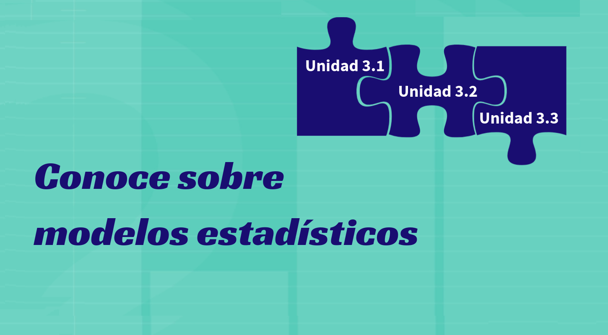

```{r setup, include=FALSE}
knitr::opts_chunk$set(echo = TRUE,comment = NA)

# colores
c0="#0DA5A6" # VERDE CLARO
c1="#E77C00" # NARANJA
c2="#6666FF" # AZUL  
c3="#4CBFBA" # VERDE CLARO  
c4="#E09600" # AMARILLO  
c5="#BC2B6A" # MORADO  
cbox="#007FFF"  # AZUL BOX
```


<span style="color:#E77C00">**En construcción**</span>

# **Guía de aprendizaje**



<br/><br/>

<br/><br/>

## **1. Introducción**

<br/>

El concepto de variable  aleatoria  conjunta y sus principales características como la correlación constituyen las bases para aplicaciones estadísticas como los modelos de regresión.  

En esta  unidad se presentan las principales características de las variables aleatorias conjuntas, mas precisamente bivariadas $(X,Y)$

<br/><br/>

## **2. Objetivos de la unidad**

<br/>

Al finalizar la unidad los estudiantes estarán  en  capacidad de IDENTIFICAR, CALCULAR y APLICAR los conceptos y las principales características  de las VARIABLE ALEATORIA CONJUNTAS para representar situaciones reales en la búsqueda de soluciones a problemas o valorar los riesgos que se pueden presentar en la toma de decisiones.

<br/><br/>

## **3. Duración**


## **4. Cronograma de trabajo**


## **5. Criterios de evaluación**


## **6. Entregables** 
