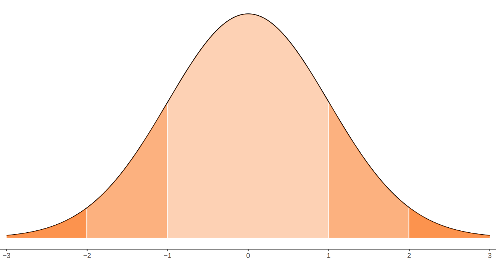

```{r setup, include=FALSE}
knitr::opts_chunk$set(echo = TRUE,comment = NA)

# colores
c0="#0DA5A6" # VERDE CLARO
c1="#E77C00" # NARANJA
c2="#6666FF" # AZUL  
c3="#4CBFBA" # VERDE CLARO  
c4="#E09600" # AMARILLO  
c5="#BC2B6A" # MORADO 

library(ggplot2)

```


# **Guía de aprendizaje 3.3**


<br/><br/>

<br/><br/>

## **Introducción**

En las unidades 3.1 y 3.2 hemos recorrido los principales conceptos relacionados caracterización de las variables aleatorias tanto discretas como continuas.  Características como:  $f(x)$, $F(x)$, $E[X]$, $V[X]$, en el caso univariado. Para el caso conjunto : $f(x,y)$, $F(x,y)$, $E[XY]$, $Cov[XY]$  y  $\rho$. 

En esta unidad se presentan los principales modelos estadísticos tanto para variables discretas como continuas y sus aplicaciones. En el caso de los modelos discretas se deberá identificar el modelo a través de  las características del experimento que la genera la variable. Para el caso continuo los ejemplos indicaran el modelo correspondiente que genera la variable.


<br/><br/>

## **Objetivos de la unidad**

Al finalizar la unidad los estudiantes estarán  en  capacidad de  IDENTIFICAR, CALCULAR y APLICAR los diferentes modelos de probabilidad para la solución de problemas en contexto  y su representación a través de la simulación.

<br/><br/>

## **Duración**

La presente  unidad será desarrollada durante la comprendida entre 23 de marzo a 3 de abril     
Ademas del material suministrado  contaran con el acompañamiento del profesor en tres sesiones (Lunes, Miércoles y Viernes) y de manera asincrónica con  foro de actividades académicas. Los entegables para esta unidad podrán enviarse a través de la plataforma Brightspace hasta el  3 de abril.

Para alcanzar los objetivos planteados se propone realizar las siguientes actividades

<br/><br/>

## **Cronograma de trabajo**


|Actividad        | Descripción                                                             | 
|:----------------|:------------------------------------------------------------------------|
|**Actividad 331**|**Poster** : Construir una poster  para cada uno de los modelos asignados que contenga sus principales características  |
|                 | Trabajo en grupo de  2 estudiantes                                      |
|Recurso          | [**Guía 3.3**](https://github.com/dgonzalez80/probabilidad20212.io/blob/main/talleres/Guia303.pdf)                                                            |
|Videos           | [**Overleaf**](https://www.youtube.com/watch?v=wg3aVBMAyu8)             | 
|                 | [**Porter en Latex**](https://www.youtube.com/watch?v=RLBNVC3McNw)      |
|                 | [**Como hacer un poster**](https://www.youtube.com/watch?v=xDfs3BFK7_k) | 
|Fecha            | 3 de abril                                                         |
|Hora             | 23:59                                                                   |


|                |                                                                         | 
|:---------------|:------------------------------------------------------------------------|
|**Activiad 332**| De manera individual deberá seleccionar uno de los siguientes problemas (**Taller de simulación**)  para ser resuelto con ayuda computacional. En un archivo pdf se deberán responder los interrogantes solicitados, adjuntado el código empleado |
|               | Trabajo individual                                                      |
|Fecha          | 3 de abril                                                              |
|Hora           | 23:59                                                                   |

<br/><br/>

## **Criterios de evaluación**

<br/><br/>


* Reconoce los modelos especiales asociados a contextos  y problemas reales

* Utiliza las herramientas estadística apropiadas en el calculo de probabilidades en la solución de problemas en contexto

* Utiliza herramientas computacionales que le permita  la solución de problemas en contexto a través de la simulación
	
<br/><br/>

## **Entregables** 

<br/><br/>

|Actividad      | Descripción                      | 
|:--------------|:---------------------------------|
|Entregable 1   | porster1.pdf , poster2.pdf       |
|Entregable 2   | actividad2.pdf                   |
| Fecha         | Domingo 3 de abril  de 2022 |
| Hora límite   | 23:59  hora  local               |


<br/><br/><br/><br/>

## **Presentaciones**

[**Presentación 331**](https://github.com/dgonzalez80/pye2021.io/blob/main/talleres/Presentacion331.pdf)<br/>
[**Taller 307**](https://github.com/dgonzalez80/pye2021.io/blob/main/talleres/Solucion_Taller_%20307.pdf)<br/>
[**Taller 308**](https://github.com/dgonzalez80/pye2021.io/blob/main/talleres/Solucion_Taller_308%20Solucion.pdf)<br/>

<br/><br/><br/><br/>

# **Recursos**

## **Modelos especiales**

<br/><br/>

A continuación se presentan los principales conceptos teóricos de esta unidad, acompañados de ejemplos resueltos. 

## **Introducción**

<br/><br/>

En las unidades abordadas previamente a esta se han trabajado las características de variables aleatorias tanto discretas como continuas dentro de  las cuales están: la función de distribución de probabilidad $f(x)$ , para el caso discreto y la función de densidad de probabilidad para las variables continuas. En ambos casos la función de probabilidad acumulada $F(x)$ que representa $P(X \leq x)$, el valor esperado $E[X]$, la varianza $V[X]$, y en el caso de las variables conjuntas la función de distribución conjunta y la función de densidad conjunta para los casos discreto-discreto y continuo-continuo, respectivamente $f_{_{XY}}(x,y)$. También característica de ellas como son: el valor esperado conjunto $E[XY]$ , la covarianza $Cov[XY]$ y el coeficiente de correlación  $\rho_{_{XY}}$ para las variables $X$ y $Y$. 

<br/><br/>
Ahora, el siguiente modelo :

$$f(x)= \frac{1}{50}e^{-(\frac{x}{50})} $$ 

<br/><br/>

Llamado exponencial, puede ser estudiado y asociado a sucesos que ocurren diariamente a nuestro alrededor.

Tener una variable cuyo comportamiento se puede caracterizar tiene la ventaja de conocer fácilmente el recorrido teórico en la construcción del modelo, las propiedades, tendencias, valor esperado, varianza, función de distribución, estimadores de sus parámetros, alternativas que facilitan el cálculo de probabilidades, su afinidad con otras variables, entre otras, características que facilitan actividades como la simulación. 

El siguiente diagrama presenta los principales modelo de probabilidad y sus diferentes relaciones

<br/><br/>


Fuente: construcción propia. basado en Univariate Distribution Relationships  ([Lawrence M. LEEMIS and Jacquelyn T. MCQUESTON](http://www.math.wm.edu/~leemis/2008amstat.pdf))

<br/><br/>

## **Algunos modelos discretos**	

<br/>

|                 |                 |                 |                 |                 |                 | 
|:---------------:|:---------------:|:---------------:|:---------------:|:---------------:|:---------------:|
| Bernoulli       | Binomial        | Poisson         | Hipergeométrico | Geométrico o de Pascal | Binomial negativo|
|                 |                 |                 |                 |                 |                 | 


A continuación se presentan los modelos más comunes con sus principales características:

<br/><br/>

Hemos clasificado como variables discretas aquellas cuyo rango $R_{X}$, corresponde a un conjunto de valores finito o infinito numerables. También es común que estas variables sean asociadas con el conteo, por lo que en su mayoría contienen la palabras **número de...**

A continuación se presentan los principales modelos discretos.\\ 

<br/><br/>

## **Bernoulli**

<br/>

Empezaremos  enunciando el modelo Bernoulli, aunque algunos autores no lo reconocen como modelo, ayuda en la compresión de los modelos siguientes. Toma  su nombre del matemático Jacob Bernoulli.\\

<br/><br/>

<div style="padding: 15px; border: 1px solid transparent; border-color: transparent; margin-bottom: 20px; border-radius: 4px; color: #000000; background-color: #FFFFFF ; border-color: #000000;">

**Distribución Bernoulli**
		
Una variable que se distribuye Bernoulli, procede de un experimento Bernoulli, descrito por las siguientes características:
	
* El experimento consta de un ensayo.

* El ensayo solo tiene dos posible resultados: éxito (E), fracaso (F).

* La probabilidad de éxito es $p$, la probabilidad de fracaso es $1-p=q$ 

La variable objeto de estudio es $X$: hay o no éxito éxitos en un ensayo de Bernoulli. Sus principales características son:

Rango : $R_{X}=\{0,1 \}$,
Función de distribución de probabilidad $

$$\begin{equation*}
		f(x)=\left\lbrace
		\begin{array}{lll}
			p & \mbox{si } x=1   \\
			q & \mbox{si } x=0
		\end{array}
		\right.
\end{equation*}$$

$$E[X]= p$$

$$V[X]= pq$$

</div> 

<br/><br/>

|    |                                     |
|:--:|:------------------------------------|
| | Un biólogo realiza una salida de campo para estudiar el comportamiento del cucarachero común. Se considera éxito si puede filmar al animal y fracaso si no puede hacerlo. Por información suministrada en artículos científicos la probabilidad de lograrlo se estima en 0.20. |

<br/><br/>

**Solución** 

Se requiere examinar si dentro de este contexto existe una variable que proceda de un experimento Bernoulli y ese caso como se podría caracterizar.

 Primero es necesario revisar las características de un experimento Bernoulli y confrontarlas contra el contexto presentado en el ejemplo. 

Primero existe un solo ensayo o salida de campo, durante después de la salida de campo se pueden obtener dos resultados posibles: lograr el objetivo de visualizar y filmar al animal (Éxito) y por otro lado el no lograrlo (Fracaso). También se posee la probabilidad de éxito ($0.20$), este caso establecida mediante el enfoque subjetivo de un experto en un artículo científico. Lo anterior nos permite poder asociar la variable que llamaremos $X$ asociada con el poder o no realizar la filmación.

La variable aleatoria se define en este caso como:

$$X =\left\lbrace
\begin{array}{lll}
	1 & \mbox{si se realiza la filmación del ave}   \\
	0 & \mbox{si no se logra realizar la filmación}
\end{array}
\right.$$

y su función de distribución de probabilidad está dada por:

$$f(x)= 0.2^{x} (1-0.2)^{1-x} ,\text{ si } x=0,1.$$

$$E[X]=p =0.20$$ 

$$V[X] =p(1-p)= 0.16$$
<br/><br/>


## **binomial** 

<br/>

El segundo modelo que abordaremos corresponde al modelo binomial, que puede verse como una generalización del modelo Bernoulli, pasando de un ensayo a $n$ ensayos. Fue investigada y analizada por el físico y matemático suizo Jakob Bernoulli en relación con problemas presentados en los juegos de azar. Su trabajo fue presentado en 1713. 

<br/>

<div style="padding: 15px; border: 1px solid transparent; border-color: transparent; margin-bottom: 20px; border-radius: 4px; color: #000000; background-color: #FFFFFF ; border-color: #000000;">

**Distribución binomial**
	
Una variable con distribución binomial es aquella que procede de un experimento binomial. 
	
Ahora un experimento binomial tiene las siguientes características: 
	
* El experimento consta de $n$ ensayos 

* Cada ensayo tiene solo dos posible resultados: éxito (E) o fracaso (F) (experimento Bernoulli),

* La probabilidad de éxito es igual a $p$ y se mantiene fija para todos los ensayos P(E). La probabilidad de fracaso es $(1-p)=q$,

* Los ensayos son independientes,

* La variable objeto de estudio $X$, corresponde al número de éxitos obtenidos en los $n$ ensayos.

* Se puede decir que la suma de $n$ variables independientes con distribución Bernoulli($p$), se distribuye de manera Bionomial($n,p$)
	
La función de distribución de probabilidad está dada por:
	
$$\begin{equation*}
		f(x)=\left\lbrace
		\begin{array}{lll}
			\displaystyle\binom{n}{x} p^{x} (1-p)^{n-x} &,& x=0,1,2, \ldots, n   \\
			&&\\
			0 &,& \mbox{en otro caso}
		\end{array}
		\right.
 \end{equation*}$$
	
$$E[X]=np$$

$$V[X]= np(1-p) $$

</div> 


```{r, echo=FALSE, fig.height=3.5}
library(ggplot2)
# modelo binomial  ok
x=0:9
fx=dbinom(x,9,0.90)
dat=data.frame(x,fx)


ggplot(dat) + geom_point(aes(x, fx),colour = "#BC2B6A", size = 3) +
  scale_x_continuous(limits = c(0, 10),
                     breaks = c(0,1,2,3,4,5,6,7,8,9), 
                     labels = c('0','1','2','3','4','5','6','7','8','9'))
```

<br/><br/>


|    |                                     |
|:--:|:------------------------------------|
| | Un sistema de seguridad para casas está diseñado para tener una confiabilidad del 90% . Suponga que nueve casas equipadas con este dispositivo sufrieron tentativa de robo. Se requiere calcular la probabilidad de que en siete de las nueve, la alarma se activará. |

<br/><br/>

**Solución**

En este caso la variable $X$ se define como el número de casas de las nueve en las que se activa el sistema de alarma. Observe que en cada caso se puede presentar dos posibles resultados frente a la tentativa de robo : 

* La alarma se active (E) o que el sistema falle y no se active (F), los cuales conforman los eventos de exito (E) y fracaso (F).

* Los sistemas operan de manera independiente y se pueden considerar como idénticos.

* La probabilidad de que un equipo se active frente a una tentativa de robo es de 0.9 ($p$) y por tanto la probabilidad de que no funcione será de 0.1 ($q$)

* Se tienen nueve casas, que representaría la realización de nueve ensayos, bajo las mismas condiciones.

Por las anteriores razones, el proceso enunciado corresponde a un experimento binomial y por tanto podemos afirmar que la variable X: número de sistemas que se activan ante la tentativa de robo, es una variable con distribución binomial con parámetros $n=9$ y $p=0.90$.

Para calcular la probabilidad requerida utilizamos la función de distribución de probabilidad del modelo Binomial

$$\begin{equation*}
	\begin{array}{lcl}
		f(7) = P(X=7)&=& \displaystyle\binom{9}{7} 0.90^{7} 0.10^{2} \\
		&=& 0.17218688 
	\end{array}
\end{equation*}$$

En R se corre el siguiente código:\

```{r}
 dbinom(7,9,0.90)
```

La siguiente gráfica corresponde a la función de distribución de probabilidad del ejemplo2 :binomial con $n=9$ y $p=0.90$

Distribución binomial $n=9$, $p=0.90$
fig_binom.pdf

<br/><br/>


## **Poisson**

<br/>

El siguiente modelo fue plantea por el físico y matemático francés Siméon-Denis Poissonen uno de sus trabajos presentado en 1838 relacionado con temas sobre juicios en temas criminales y civiles. Es  utilizado para resolver problemas asociados con el número de eventos que ocurren en un intervalo de tiempo o espacio, como por ejemplo:

* número de llamadas que recibe un conmutador durante una hora

* número de plaquetas por $mm^{3}$ de sangre

* número de servicios técnicos solicitados por día

* número de imperfecciones por $m^{2}$  de carretera

<br/>

<div style="padding: 15px; border: 1px solid transparent; border-color: transparent; margin-bottom: 20px; border-radius: 4px;color: #000000; background-color: #FFFFFF ; border-color: #000000;">

**Distribución Pisson**
	
La función de distribución de probabilidad de una variable con distribución Poisson esta dada por siguiente la expresión:
	
$\begin{equation*}
		f(x)=\left\lbrace
		\begin{array}{lll}
			\dfrac{\lambda^{x}}{x!} \hspace{.2cm} e^{-\lambda} &,& x \geq 0   \\
			&&\\
			0 &,& \mbox{en otro caso}
		\end{array}
		\right.
	\end{equation*}$
	
Donde $\lambda$ es la cantidad promedio de ocurrencias en el periodo de interés.
	
$$E[X]=\lambda$$

$$V[X]=\lambda $$

</div> 
La siguiente gráfica representa la distribución de masa de una variable de Poisson con media 2.

**Distribución Poisson ($\lambda=2$)**

```{r, echo=FALSE, fig.height=3.5}
# poiss ok
library(ggplot2)
x=0:10
fx=dpois(x,2)
dat=data.frame(x,fx)


ggplot(dat) + geom_point(aes(x, fx),colour = "#BC2B6A", size = 3) +
  scale_x_continuous(limits = c(0, 10),
                     breaks = c(0,1,2,3,4,5,6,7,8,9,10), 
                     labels = c('0','1','2','3','4','5','6','7','8','9','10'))
```

<br/><br/>

	
|    |                                     |
|:--:|:------------------------------------|
| | Se estima que en el cruce más importante de la cuidad, ocurren 2 accidentes por día y se desea valorar la probabilidad de que en un día cualquiera no ocurra ningún accidente en dicho cruce. |

<br/><br/>

**Solución**

El número de accidentes que pueden ocurrir en este cruce, para un dia cualquiera, se puede considerar como una variable aleatoria con distribución Poisson, pues la variable hace referencia al número de eventos que se pueden presentar en un determinado espacio de tiempo. 
Para calcular la probabilidad de que no ocurra ningún evento, utilizamos el modelo Poisson:

$$f(0) = P(X = 0) = \dfrac{2^{0}}{0!} \hspace{.2cm} e^{-2}=0.135335$$

```{r}
dpois(0,2)
```


<br/><br/>

## **hipergeometrico**

Este modelo nace de la necesidad de modelar eventos Bernoulli con probabilidad no constante generados en elecciones sin repetición. 

<br/>

<div style="padding: 15px; border: 1px solid transparent; border-color: transparent; margin-bottom: 20px; border-radius: 4px; color: #000000; background-color: #FFFFFF ; border-color: #000000;">

**Distribución hipergeometrica** 
	
Se tiene un conjunto de $N$ objetos que contiene $K$ objetos clasificados como éxitos y $N-K$ objetos clasificados como fracasos. Una muestra de tamaño $n$ objetos es seleccionada al azar (sin reemplazo) de la población de $N$ objetos, donde $K \leq N$ y $n \leq N $. La variable de interés $X$ corresponde al número de éxitos obtenidos en la muestra. \\
	
Su función de masa de probabilidad esta dada por 
	
$$\begin{equation*}
		f(x)=\left\lbrace
		\begin{array}{lll}
			\dfrac{\displaystyle\binom{K}{x} \displaystyle\binom{N-K}{n-x}}{\displaystyle\binom{N}{n}} &, {\text{ si }\max(0,K+n-N) \leq x \leq \min(n,K) }&   \\
			&\\
			0, \mbox{en otro caso}
		\end{array}
		\right.
	\end{equation*}$$
	
	
$$E[X]=\dfrac{nK}{N}$$
$$V[X]=n\Bigg(\frac{K}{N}\Bigg) \Bigg(1-\dfrac{K}{N}\Bigg)\Bigg(\dfrac{N-n}{N-1}\Bigg)$$
	
</div> 

**Distribución binomial hipergeometrica ($m=95, n=5, k=10$)**

```{r, echo=FALSE, fig.height=3.5}
# hyper ok
library(ggplot2)
x=5:10
fx=dhyper(x,95,5,10)
dat=data.frame(x,fx)


ggplot(dat) + geom_point(aes(x, fx),colour = "#BC2B6A", size = 3) +
  scale_x_continuous(limits = c(5, 10),
                     breaks = c(5,6,7,8,9,10), 
                     labels = c('5','6','7','8','9','10'))
```

<br/><br/>


<br/>

|    |                                     |
|:--:|:------------------------------------|
| | Las tarjetas de circuito impreso se someten a una prueba de funcionamiento antes de ser ensambladas en un dispositivo de seguridad, después de ser rellenado con chips semiconductores. Un lote de estas tarjetas contiene 140 unidades y se seleccionan aleatoriamente 20 sin reemplazo para realizar una prueba de control de calidad internacional. Si 5 tarjetas son defectuosas, ¿cuál es la probabilidad de que al menos 1 tarjeta defectuosa aparezca en la muestra? (3-92.  Mongomery) |

**Solución** 

$\begin{eqnarray*}
	P(X\geq 1)=1-P(X=0)
	&=& 1 - \dfrac{\displaystyle\binom{5}{0}\displaystyle\binom{135}{5}}{\displaystyle\binom{140}{5}}\\
	&=& 1-\Bigg[\frac{1  \times 346700277}{416965528} \Bigg] \\
	&=& 1 - 0.83148427 \\
	&=& 0.16851573
\end{eqnarray*}$

<br/><br/>

## **geométrico o de Pascal**

La distribución geométrica también conocida como distribución de Pascal, fue esbozada en el escrito El arte de la conjetura, escrita por Jakob Bernoulli. Esta distribución modela el número de ensayos Bernoulli necesarios para obtener el primer éxito. Los valores que puede tomar esta variable son:

<br/>

|	$x$   | eventos          |  $f(x)$       |                
|:------|:-----------------|:--------------|
|	$1$   |  $E$             | $p$           |
|	$2$   |  $FE$            | $p(1-p)$      |
|	$3$   |  $FFE$           | $p(1-p)^{2}$  |
|	$4$   |  $FFFE$          | $p(1-p)^{3}$  |
|	$5$   |  $FFFFE$         | $p(1-b)^{4}$  |
|       |                  |               |
|	$x$   |  $FFFF \ldots FE | $p(1-p)^{x-1}$| 

<br/>

La variable $X$ toma el valor de $1$ cuando el éxito ocurre en el primer intento. Cuando el primer éxito ocurre en el evento dos, $X$ es igual a $2$, es decir que la variable con distribución geométrica corresponde al numero del evento donde ocurre el primer éxito.

<br/>

<div style="padding: 15px; border: 1px solid transparent; border-color: transparent; margin-bottom: 20px; border-radius: 4px; color: #000000; background-color: #FFFFFF ; border-color: #000000;">

**Distribución geométrica**

$$\begin{equation*}
		f(x)=\left\lbrace
		\begin{array}{lll}
			p(1-p)^{x-1}	 &,& x \geq 1   \\
			&&\\
			0 &,& \mbox{en otro caso}
		\end{array}
		\right.
\end{equation*}$$
	
	
$$E[X]=\dfrac{1}{p}$$

$$V[X]=\dfrac{1-p}{p^{2}} $$

</div> 

<br/><br/>


**Distribución geométrica o de Pascal ($p=0.5$)**

```{r, echo=FALSE, fig.height=3.5}
# geom 
library(ggplot2)
x=1:10
fx=dgeom(x,0.5)
dat=data.frame(x,fx)


ggplot(dat) + geom_point(aes(x, fx),colour = "#BC2B6A", size = 3) +
  scale_x_continuous(limits = c(1, 10),
                     breaks = c(1,2,3,4,5,6,7,8,9,10), 
                     labels = c('1','2','3','4','5','6','7','8','9','10'))
```
 
 
<br/><br/>

|    |                                     |
|:--:|:------------------------------------|
| | En un estudio realizado en peces, los animales son sometidos a pruebas para determinar si poseen o no un gen que aumenta el riesgo de una enfermedad mortal. la probabilidad de que una animal de la especie en estudio tenga el gen es 0,5. Cuál es la probabilidad de que 3 o más animales deban ser sometidos a pruebas antes de detectar el primer pez con el gen objeto de estudio? |

<br/><br/>

**Solución** 

$$\begin{eqnarray*}
	P(X\geq 3)&=& 1-P(X\leq 2)\\
	&=& 1-[p(1)+p(2)] \\
	&=& 1-[0.5+0.5 \times 0.5] \\
	&=&0.25 
\end{eqnarray*}$$

<br/><br/>

## **binomial negativo**

<br/>

La distribución binomial negativa esta relacionada con la distribución geométrica

<br/>

<div style="padding: 15px; border: 1px solid transparent; border-color: transparent; margin-bottom: 20px; border-radius: 4px; color: #000000; background-color: #FFFFFF ; border-color: #000000;">
**Distribución binomial negativa**
	
Se considera una generalización de la distribución Geométrica. En este caso la variable objeto de estudio corresponde a $X$: número de ensayos requeridos para obtener $r$ éxitos. Esta variable se obtiene al sumar $r$ variables con distribución Geométrica con igual parámetro $p$.
	
Su función de masa está dada por :

	
$$\begin{equation*}
		f(x)=\left\lbrace
		\begin{array}{lll}
			\displaystyle \binom{x-1}{r-1} p^{r} (1-p)^{x-r}	 &,& x= r, r+1,  \ldots    \\
			&&\\
			0 &,& \mbox{en otro caso}
		\end{array}
		\right.
	\end{equation*}$$

$$E[X]=\dfrac{r}{p}$$

$$V[X]=\dfrac{r(1-p)}{p^{2}}$$	

</div> 

<br/><br/>


**Distribución binomial negativa ($k=2, p=0.50$)**


```{r, echo=FALSE, fig.height=3.5}
# nbiom
library(ggplot2)
x=2:10
fx=dnbinom(x,2,0.50)
dat=data.frame(x,fx)


ggplot(dat) + geom_point(aes(x, fx),colour = "#BC2B6A", size = 3) +
  scale_x_continuous(limits = c(2, 10),
                     breaks = c(2,3,4,5,6,7,8,9,10), 
                     labels = c('2','3','4','5','6','7','8','9','10'))
```

	
<br/><br/>

|    |                                     |
|:--:|:------------------------------------|
| | Un sitio Web está soportado por tres servidores idénticos. Sólo uno de ellos se utiliza para operar el sitio, y los otros dos son de repuesto, los  cuales se activan en caso de que el sistema principal falle. La probabilidad de falla en el sistema principal (o cualquier otro sistema de repuesto activado) ante una solicitud de servicio es 0,0005. Suponiendo que cada solicitud representa un juicio independiente, cuál es el número medio de solicitudes que se espera hasta el fracaso de los tres servidores? |
 
<br/><br/>

**Solución**

$$E[X]=\dfrac{3}{0.0005}= 6000 $$
<br/><br/>

## **Algunos modelos continuos**

Las variables continuas proceden en su mayoría de la medición y se clasifican así debido a que su rango esta formado por un conjunto infinito no numerable. A continuación se presentan los principales modelos continuos.

<br/>

|                 |                 |                 |                 |                 |                 | 
|:---------------:|:---------------:|:---------------:|:---------------:|:---------------:|:---------------:|
| Uniforme        |   Normal        |  Exponencial    |  Gamma          |  Weibull        | Cauchy          |
| Lognormal       |   Beta          | Erlang          |  Gumbel         |  Kernel	        |                 |
|                 |                 |                 |                 |                 |                 |


<br/><br/>

## **uniforme**

<br/>

<div style="padding: 15px; border: 1px solid transparent; border-color: transparent; margin-bottom: 20px; border-radius: 4px; color: #000000; background-color: #FFFFFF ; border-color: #000000;">

**Distribución uniforme**
	
Se caracteriza porque su función de densidad es constante en su recorrido o dominio de definición (intervalo [a,b])

$$\begin{equation*}
		f(x)=\left\lbrace
		\begin{array}{lll}
			\dfrac{1}{b-a}	 &,& a \leq x \leq b   \\
			&&\\
			0 &,& \mbox{en otro caso}
		\end{array}
		\right.
	\end{equation*}$$

</div> 

<br/><br/>

**Distribución uniforme ($0,1$)**

```{r, echo=FALSE, fig.height=3.5}
# uniforme
library(ggplot2)
x= c(0,1) 
fx=c(1,1) 
dat=data.frame(x,fx)
ggplot(data=dat,aes(x=x, y=fx))+ 
  scale_y_continuous(limits=c(0,1.2))+
  geom_line(size = 1, color="#BC2B6A") 
```


|    |                                     |
|:--:|:------------------------------------|
| | En la fabricación de portaobjetos, que son láminas rectangulares de vidrio muy delgada (76x26 mm y 1 mm de espesor), utilizados para  la observación de sustancias en el microscopio. Una de sus principales características está relacionada con su espesor ($X$), el cual tiene una distribución uniforme entre 0.95 mm y 1.05 mm. Determine la probabilidad de que un portaobjeto determinado tenga un espesor superior a 1.03 mm.|          

<br/><br/>

**Solución** 

 $$P(X\geq 1.03)= (1.05-1.03) \times \frac{1}{0.10}=0.20 $$

<br/><br/>

## **normal**

La distribución normal es uno de los modelos más utilizados en las aplicaciones de la Estadística. Estas aplicaciones están relacionadas con:

Usos de la distribución normal

* La mayoría de variables en la naturaleza, se distribuyen aproximadamente de manera normal

* A partir de la distribución normal se originan las distribuciones $t-student$, $\chi^{2}$ y $F$-Fisher, utilizadas en inferencia estadística

* En general la media muestral de variables que no tienen distribución normal, tiende a aproximarse a una distribución normal, a medida que el tamaño de muestra aumenta. (Teorema del Límite Central) 

* La regla empírica establece que:

    *	Aproximadamente el 68\% de la población se encuentra en el intervalo centrado $$(\mu - \sigma ; \mu + \sigma)$$

		* Aproximadamente el 95\% de la población se encuentra en el intervalo centrado $$(\mu - 2\sigma ; \mu + 2\sigma)$$

		* Aproximadamente el 99.7\% de la población se encuentra en el intervalo centrado $$(\mu - 3\sigma ; \mu + 3\sigma)$$

Su distribución fué planteada por el matemático francés del siglo 18, Abraham de Moivre, quien a partir de la distribución Binomial, con $n=2$ empezó a aumentar su tamaño hasta observar que se formaba una distribución en forma de campana. Este mismo comportamiento fué detectado por Galileo en el siglo 17, al observar los errores producto de sus mediciones en astronomía. El modelo como se conoce actualmente fue propuesto de manera simultánea por los cientificos Robert Adrain y Carl Friedrich Gauss, quien finalmente le dió el nombre.

Su función de densidad esta dada por:

<br/>

<div style="padding: 15px; border: 1px solid transparent; border-color: transparent; margin-bottom: 20px; border-radius: 4px; color: #000000; background-color: #FFFFFF ; border-color: #000000;">

**Distribución normal**
	
$$f(x)= \dfrac{1}{\sqrt{2\pi \sigma^{2}}} \hspace{.1cm} e^{-\big(\frac{1}{2\sigma^{2}}(x-\mu)^{2}\big)}	 \hspace{.5cm}  -\infty \leq  x \leq \infty $$  
	
$$E[X]=\mu$$
$$V[X]=\sigma^{2}$$

</div> 


<br/><br/>

En la siguente gráfica se muestra el efecto en la curva normal, producto de cambios en la media o en la varianza. A mayor valor de la media la curva se desplaza a la derecha, mientras que a menor varianza la curva se vuelve mas angosta o puntiaguda 

Distribuciones normales : <span style="color:blue">$N(0,1)$</span>, <span style="color:red"> $N(0,1.5)$</span> y <span style="color:orange"> $N(2,1.5)$</span>

```{r, echo=FALSE, fig.height=3.5}
# Distribucion normal
library(ggfortify)

p=ggdistribution(dnorm, seq(-4, 8, 0.1), mean = 0, sd = 1,colour = 'blue')
p=ggdistribution(dnorm, seq(-4, 8, 0.1), mean = 0, sd = 1.5,colour = 'red', p=p)
ggdistribution(dnorm, seq(-4, 8, 0.1),   mean = 2, sd = 1.5,colour = 'orange', p=p)
```


Dentro del sin número de posibles curvas que se pueden obtener con los parámetros $\mu$ y $\sigma^{2}$, existe una muy especial. Normal estándar ($N(0,1)$) con $\mu=0$ y $\sigma^{2}=1$.  La gran mayoría de libros de Estadística poseen tablas de la función de distribución acumulada de la normal estándar.\\


<div style="padding: 15px; border: 1px solid transparent; border-color: transparent; margin-bottom: 20px; border-radius: 4px; color: #000000; background-color: #FFFFFF ; border-color: #000000;">

**Distribución normal estandar N(0,1)**

Su función de distribución esta dada por :

$$f(x)= \dfrac{1}{\sqrt{2\pi}} \hspace{.1cm} e^{-\big(\frac{1}{2}(x-\mu)^{2}\big)}	 \hspace{.5cm}  -\infty \leq  x \leq \infty $$ 

Si $X \sim N(\mu, \sigma^{2})$, entonces $Z= \dfrac{X-\mu}{\sigma} \sim N(0,1)$ 

a este proceso se le llama comúnmente estandarizar.

</div> 


**normal estándar**

```{r, echo=FALSE, fig.height=3.5}
library(ggfortify)
ggdistribution(dnorm, seq(-4, 4, 0.1), mean = 0, sd = 1,fill = 'blue')
```

<br/><br/>


La propiedad empírica de la distribución normal es de gran ayuda cuando una variable  de interés se  puede aproximar al modelo normal. Ella establece un intervalo formado por la media mas o menos una desviación estándar contiene el 68\% de los datos. Si el intervalo tiene un ancho de 4 desviaciones estándar contendrá el 95\% de los datos y si este intervalo corresponde a los valores de la media mas o menos 3 desviaciones estándar contendrá el 99\% de los datos que se representa en la siguiente gráfica.


**Propiedad empírica de la distribución normal estandar**

{width=600px} 

<br/><br/>


|    |                                     |
|:--:|:------------------------------------|
| | La velocidad de transferencia de archivos desde un servidor en el campus de la universidad a un ordenador personal en casa de un estudiante en un día laborable, se distribuye normalmente con una media de 60 kilobits por segundo y una desviación estándar de 4 kilobits por segundo. ¿Cuál es la probabilidad de que el archivo se transfiera a una velocidad de 70 kilobits por segundo o más? |

<br/><br/>

**Solución** 

Para una variable $X$ con distribución $N(60,16)$, debemos calcular la probabilidad $P(X \geq 70)$ \\

$$\begin{eqnarray*}
	P(X \geq 70)&=&P\Bigg(\dfrac{X-\mu}{\sigma} \geq \dfrac{70-60}{4}\Bigg)\\
	&=& P\Bigg(Z \geq \dfrac{70-60}{4}\Bigg)\\
	&=& P(Z\geq 2.5)=1-P(Z < 2.5 )\\
	&=& 1-0.9938=0.0062
\end{eqnarray*}$$

En R se utiliza el siguiente código: 

```{r }
pnorm(70, mean=60, sd=4, lower.tail=FALSE)
```

<br/><br/>


## **exponencial** 

Este modelo fue  planteado por el matemático estadístico e ingeniero Agner Kraru Erlang, experto en el trafico de las comunicaciones y la teoría de colas. 
Distribución utilizada para modelar el tiempo entre dos eventos consecutivos. 


<br/>

<div style="padding: 15px; border: 1px solid transparent; border-color: transparent; margin-bottom: 20px; border-radius: 4px; color: #000000;background-color: #FFFFFF ; border-color: #000000;">

**Distribución exponencial**
	
$$\begin{equation*}
		f(x)=\left\lbrace
		\begin{array}{lll}
			\lambda e^{-\lambda x}  &,& x > 0   \\
			&&\\
			0 &,& x \leq 0 
		\end{array}
		\right.
	\end{equation*}$$
	
	
$$E[X]=\dfrac{1}{\lambda}$$
	
$$V[X]=\dfrac{1}{\lambda^{2}}$$
	
Observación: algunos autores utilizan $\frac{1}{\beta}$ en lugar de $\lambda$
	
$$F(x)=P(X \leq x)=1-e^{-\lambda x} \hspace{1cm} x > 0$$

</div> 

<br/><br/>


Distribuciones exponenciales : <span style="color:blue"> $exp(1)$</span>, <span style="color:red"> $exp(2)$</span> y <span style="color:orange"> $exp(5)$</span>

```{r, echo=FALSE, fig.height=3.5}
#exponencial
library(ggfortify)
p=ggdistribution(dexp, seq(0, 10, 0.1),rate=1 ,colour = 'blue')
p=ggdistribution(dexp, seq(0, 10, 0.1),rate=2 ,colour = 'red', p=p)
ggdistribution(dexp, seq(0, 10, 0.1),rate=0.5,colour = 'orange', p=p)
```
 

**Distribuciones exponenciales acumuladas**


```{r, echo=FALSE, fig.height=3.5}
library(ggfortify)
ggdistribution(pexp, seq(0, 10, 0.1),rate=1 ,colour = 'blue')
```

<br/><br/>

|    |                                     |
|:--:|:------------------------------------|
| | El tiempo entre llamadas de los clientes a una empresa de turismo ecológico tiene una distribución exponencial con un tiempo medio entre llamadas de 15 minutos. ¿Cuál es la probabilidad de que transcurra más de 20 minutos antes de que se realiza una nueva llamada? (Ejemplo 8 4-77 Mongomery) |

<br/><br/>

**Solución**

$X$: el tiempo entre dos llamadas consecutivas $\lambda=\frac{1}{15}$ minutos. 

$$\begin{eqnarray}
	P(X \geq 20) &=& 1-P(X < 20) \\
	&=& 1-(1-e^{-\frac{20}{15}}) \\
	&=& 0.2636 
\end{eqnarray}$$

En R se utiliza el siguiente código: 

```{r}
 pexp(20,1/15, lower.tail=FALSE)
```


Para tratar las distribuciones Gamma y Weibull, es necesario definir la función Gamma como:

$$\Gamma(r)= \int_{0}^{\infty} t^{r-1} e^{t} \,dt $$

Con las siguientes propiedades:


* Si $r$ es un entero, $\Gamma(r)=(r-1)!$

* para cualquier valor de $r$, $\Gamma(r+1)=r \Gamma(r)$

* $\Gamma(1/2)=\sqrt{\pi}$

* $\Gamma(1)=1,\hspace{.1cm} \Gamma(2)=1, \hspace{.1cm} \Gamma(3)=2, \hspace{.1cm}\Gamma(n+1)=n!$


<br/><br/>

## **gamma**

Esta distribución tiene su origen en la familia de curvas sesgadas propuestas por Karl Pearson. Esta distribución es otra alternativa para modelar los tiempos de espera de ocurrencia de sucesos o eventos. En ocasiones puede relacionarse con la suma de los tiempos de variables exponenciales sucesivas con igual media.

<br/><br/>

<div style="padding: 15px; border: 1px solid transparent; border-color: transparent; margin-bottom: 20px; border-radius: 4px; color: #000000;background-color: #FFFFFF ; border-color: #000000;">

**Distribución gamma**

La distribución Gamma se obtiene al sumar $r$ variables con distribución exponencial con parámetro $\lambda$. 

Distribución 

Si $Y=X_{1}+X_{2}+....+X_{r}$, $X_{i} \sim Exp(\lambda)$, entonces $Y \sim \Gamma(r,\lambda)$.
	
$$\begin{equation*}
		f(x)=\left\lbrace
		\begin{array}{lll}
			\dfrac{\lambda^{r}x^{r-1} e^{-\lambda x}}{\Gamma(r)}  &,& x > 0   \\
			&&\\
			0 &,&   x \leq 0
		\end{array}
		\right.
	\end{equation*}$$

	
Distribuciones exponenciales gamma(3,1)}, gamma(2,1) y gamma(5,1)
fig_gammas.pdf

Algunos autores utilizan $\frac{1}{\beta}$ en lugar de $\lambda$ y $\alpha$ en lugar de $r$


$$E[X]=\dfrac{r}{\lambda}$$
$$V[X]= \dfrac{r}{\lambda^{2}}$$

</div> 

<br/><br/>

Distribuciones : <span style="color:blue"> $gamma(3,1)$</span>, <span style="color:red">$gamma(2,1)$</span> y <span style="color:orange"> $gamma(5,1)$</span>

```{r, echo=FALSE, fig.height=3.5}
# gamma
library(ggfortify)
p=ggdistribution(dgamma, seq(0, 15, 0.1),shape=3,rate=1 ,colour= 'blue')
p=ggdistribution(dgamma, seq(0, 15, 0.1),shape=2,rate=1 ,colour = 'red', p=p)
ggdistribution(dgamma, seq(0, 15, 0.1),shape=5,rate=1,colour = 'orange', p=p)

```


|    |                                     |
|:--:|:------------------------------------|
| | En cierta ciudad el consumo diario de energía eléctrica, en millones de kilovatios por hora, puede considerarse como una variable aleatoria con distribución Gamma de parámetros $r= 3$ y $\lambda= 0.5$. La planta de energía de esta ciudad tiene una capacidad diaria de 10 millones de KW/hora. ¿Cuál es la probabilidad de que este abastecimientos sea insuficiente en un día cualquiera?.|


<br/><br/>

**Solución**

$X$: consumo diario de energia

$$\begin{eqnarray*}
	P(X > 10)&=& 1-P(X \leq 10) \\
	&=& 1 - \dfrac{1}{\Gamma(3)} \int_{0}^{10} (0.5)^{3}  x^{3-1} e^{-0.5x} \,dx \\
	&=& 0.124652
\end{eqnarray*}$$

<br/><br/>

## **Weibull** 

Esta distribución fue descubierta Maurice Frechet matemático francés y luego trabajada por  Rosin y Rammler quienes en 1933 estudiaron el tamaño de una partícula y posteriormente recibe su nombre del  ingeniero y matemático Waloddi Weibull . Esta distribución se utiliza para modelar el tiempo de vida de algunos componentes. La Weibull tiene dos parámetros $\alpha$ y $\beta$. Su función de distribución y sus principales características son:


<div style="padding: 15px; border: 1px solid transparent; border-color: transparent; margin-bottom: 20px; border-radius: 4px; color: #000000;background-color: #FFFFFF ; border-color: #000000;">

**Distribución Weibull** 

$$\begin{equation*}
		f(x)=\left\lbrace
		\begin{array}{lll}
			\Bigg(\dfrac{\alpha}{\beta}\Bigg)\Bigg(\dfrac{x}{\beta}\Bigg)^{\alpha-1}\exp{\Bigg\{-\Big(\dfrac{x}{\beta}\Big)^{\alpha}\Bigg\}}&,& x > 0\\
			&&\\
			0 &,& x \leq 0
		\end{array}
		\right.
	\end{equation*}$$
	
$$E[X]=\beta \hspace{.2cm}\Gamma\Bigg(1+\frac{1}{\alpha}\Bigg)$$

$$V[X]=\beta^{2} \Bigg(\Gamma\Bigg(1+\frac{2}{\alpha}\Bigg)- \Bigg[\Gamma \Bigg(1+\frac{1}{\alpha}\Bigg)\Bigg]^{2}\Bigg) $$

$$F(x)=1-\exp{\Big\{-\Big(\dfrac{x}{\beta}\Big)^{\alpha}\Big\}} $$	
	
</div> 

Distribuciones : <span style="color:blue"> $Weibull(0.8, 1)$</span>, <span style="color:red"> $Weibul(2,1)$</span> y <span style="color:orange"> $Weibull(2,2)$</span>

```{r, echo=FALSE, fig.height=3.5}
# weibull
library(ggfortify)
p=ggdistribution(dweibull, seq(0, 5, 0.01),shape=0.8,scale=1 ,colour = 'blue')
p=ggdistribution(dweibull, seq(0, 5, 0.01),shape=2,scale=1 ,colour = 'red', p=p)
ggdistribution(dweibull, seq(0, 5, 0.01),shape=2,scale=2,colour = 'orange', p=p)
```


<br/><br/>


La siguiente gráfica corresponde a varias conformaciones de los parámetros de esta distribución.

Distribuciones exponenciales \textcolor{col4}{Weibull(0.8,1)}, \textcolor{col5}{Weibull(2,1)} y \textcolor{col3}{Weibull(2,2)}
fig_weibulls.pdf


Función de riesgo 
	
Se llama así a la tasa de fallas por unidad de tiempo, expresada como la proporción de elementos que no han fallado

$$h(t)=\dfrac{f(t)}{1-F(t)} $$
<br/><br/>

|    |                                     |
|:--:|:------------------------------------|
| | La duración de una batería se modela mediante una distribución Weibull con parámetros: $\alpha=0.1$ y $\beta=2$. Determine la probabilidad de que una batería dure más de 10 horas. Determine la proporción de baterías que durarán más de 10 horas. |

<br/><br/>

**Solución**

$$\begin{eqnarray*}
	P(X > 10) &=& 1- F(10)\\
	&=& 1-\Big(1-e^{-[10/2]^{0.1}}\Big)\\
	&=& -e^{[5]^{0.1}}\\
	&=& 0.3089367 
\end{eqnarray*}$$


En este caso también se puede obtener  la tasa de fallos esta determinada por:
$$\begin{eqnarray*}
	h(10)&=&\dfrac{f(10)}{1-F(10)}\\
	&&\\
	&=& \dfrac{0.003628829}{1-0.6910633}\\
	&&\\
	&=& 0.01174619
\end{eqnarray*}$$


