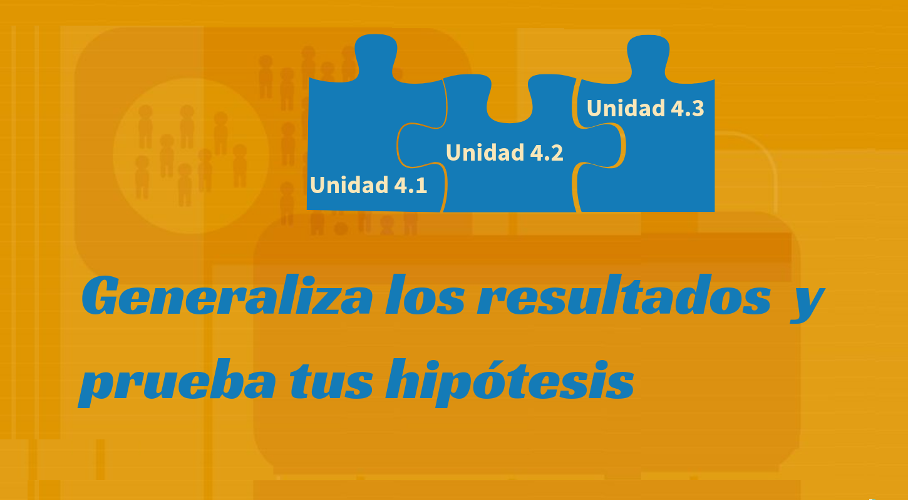

```{r setup, include=FALSE}
knitr::opts_chunk$set(echo = TRUE,comment = NA)
library(readr)
library(paquetepye)
# colores
c0="#0DA5A6" # VERDE CLARO
c1="#E77C00" # NARANJA
c2="#6666FF" # AZUL  
c3="#4CBFBA" # VERDE CLARO  
c4="#E09600" # AMARILLO  
c5="#BC2B6A" # MORADO  


```

<span style="color:#E77C00">**En construcción**</span>

# **Guía de aprendizaje 4.2**



<br/><br/>

<br/><br/>

## **1. Introducción**

La inferencia estadística constituye una de las principales componentes de la metodologia estadistica, encaminados a generar procedimiento para el avance de la ciencia. Con ella se pueden generalizar los
resultados obtenidos en una muestra a toda la población, previo cumplimiento de supuestos establecidos por la estadística (llamada paramétrica) .

Antes de empezar es necesario entender los conceptos básicos como: población, censo, parámetro, muestra, muestreo, estimador, estimación, métodos de estimación, propiedades de los estimadores como la insesgadez, la eficiencia, la consistencia .Las distribuciones muestrales : normal, t-student, chi-cuadrado y f de Fisher. Todos trabajados y tratados en la unidad 4.1.

El siguiente documento te  oriente sobre los pasos a seguir para alcanzar el objetivo planteado

<br/><br/>

## **2. Objetivos de la unidad**

Al finalizar la unidad el estudiante estará en capacidad de IDENTIFICAR, CALCULAR, INTERPRETAR e INFERIR sobre un intervalo de confianza para estimadores de una y dos poblaciones,
que le permita seleccionar la mejor alternativa para la estimación de un parámetro poblacional, orientados a la toma de decisiones  informadas.

<br/><br/>

## **3. Duración**


## **4. Cronograma de trabajo**


## **5. Criterios de evaluación**


## **6. Entregables** 
