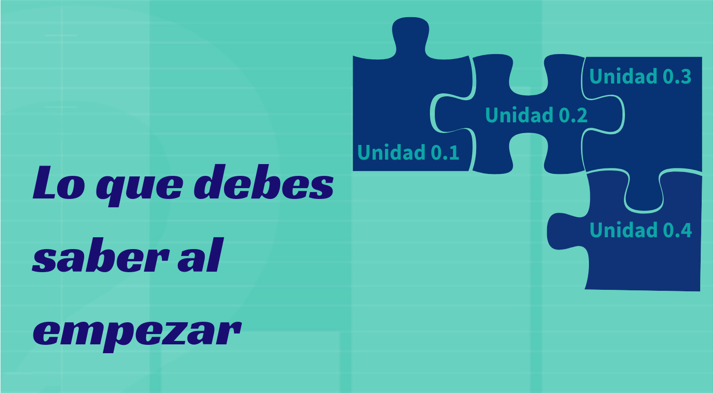

```{r setup, include=FALSE}
knitr::opts_chunk$set(echo = TRUE)
```




<br/><br/><br/>

### <span style="color:#0DA5A6">**Introducción**</span>

Este módulo contiene aquellos conceptos que se consideran necesarios para abordar los temas propuestos en  el curso. En caso de no recordarlos o de no  haberlos trabajado  previamente, te  recomiendo revisar el  contenido de esta modulo.

Son ellos: 

* Sumatoria y productoria (Módulo 1), 

* Teoría de conjuntos  (Módulo 2), 

* Técnicas de conteo  (Módulo 2), 

* Función exponencial (Módulo 3), 

* Función Logarítmica (Módulo 3), 

* Derivación  (Módulo 4) e 

* Integración (Módulo 4).

<br/><br/><br/>

### <span style="color:#0DA5A6">**Objetivo**</span>

Al finalizar este modulo los estudiantes RECORDARAN los conceptos de SUMATORIA, PRODUCTORIA, TEORIA DE CONJUNTOS, TECNCAS DE CONTEO, FUNCION EXOPNENCIAL y LOGARÍTMICA, DERIVACIÓN e INTEGRACIÓN, conceptos que serán requeridos para la mejor comprensión de los conceptos planteados en el curso.
