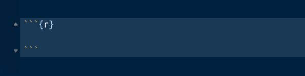

```{r setup, include=FALSE}
knitr::opts_chunk$set(echo = TRUE, message = FALSE, warning = FALSE, comment = NA)
library(psych)
library(summarytools)

# colores
c0="#0DA5A6" # VERDE CLARO
c1="#E77C00" # NARANJA
c2="#6666FF" # AZUL  
c3="#4CBFBA" # VERDE CLARO  
c4="#E09600" # AMARILLO  
c5="#BC2B6A" # MORADO  

```


# **1. Introducción** 

Al tener una base de datos se requiere resumirlos en una tabla o en indicadores que faciliten su análisis, dependiendo el tipo de variable ( cualitativas o cuantitativas) la tabla puede tener diferentes columnas. 

En el caso de los indicadores las variables cualitativas se les resumen en el nivel con mayor frecuencias a la que se le llama **MODA**

Las variables cuantitativas tiene un gran número de indicadores que se dividien en tres categorias:

+ Indicadores de tendencia central
+ Indicadores de dispersión
+ Indicadores de forma

A continuación se indica como realizar el proceso utilizando RStudio, bajo el supuesto que se cuenta con una base de datos que se ha importado en RStudio.


<br/><br/>

# **2. Tablas de frecuencia**

Resumirlos datos en tablas facilita su análisis y también su representación  gráfica. Varios gráficos están basados en tablas de frecuencia como veremos en la unidad 1.3

Antes de empezar vamos a cargar la base construida en el código anterior y las dos bases de Dataset de R

+ Base de datos Colombia 

```{r}
Colombia=readRDS(file = "data/Colombia.RDS")
```

+ Base de datos iris

```{r}
iris=data(iris)
```

+ Base de datos ventas

```{r}
library(readr)
ventas <- read_csv("data/ventas.csv")
```

<br/><br/>

## **Tablas variables cualitativas**

Iniciaremos con la construcción de tablas para variables cualitativas en escala nominal. Recordemos que las variables medidas en esta escala no presentan orden especial y en algunos casos son ordenadas de mayor a menor frecuencia

Utilizaremos en este caso  la función **table()**

```{r}
table(ventas$Metodo_Pago)
```
El resultado corresponde a un conteo de cada uno de los valores de la variable.  En caso de que se requiera calcular la proporción que corresponde cada caso utilizamos la función : **prop.table()** y se la aplicamos a la tabla anterior

```{r}
t1=table(ventas$Metodo_Pago)
prop.table(t1)
```
Si utilizamos la función **freq** del paquete summarytools, la salida es una tabla más elaborada 

```{r}
summarytools::freq(ventas$Metodo_Pago, cumul = F)
```
<br/><br/>

## **Tablas variables cuantitativas**

Para el caso de las variables cuantitativas que presentan muchos valores difentes construir una tabla como las anteriores no tiene sentido, pues salen muchas categorias probablemente con frecuencia uno.

En este caso es necesario construir rangos que den sentido y que permitan resumir la información para una facil interpretación.

El ejemplo a continuación da cuenta de ello.
Supongamos que queremos analizar la variable edad y para ello debemos establecer los limites y cuantos intervalo vamos aconstruir. En este caso tenemos tres alternativas posible_

1. Tomar los intervalos construidos en un estudio anterior con cual queremos comparar los nuestros
2. Tomar intervalos de acuerdo a estudios anteriores o teorias sobre el tema
3. Tomar intervalos de igual longitud. En este caso existen diferentes alternativas para establecer el numero de intervalos a construir. Uno de ellos indica como respuesta a este interrogante la formula construida por Sturgues  (se puede conocer mediante la función nclass.Sturges(variable) ) que es utilizada por otras funcione en R 

En el caso de la variable Edad procederemos asi: 

Consultados los ciclos de la vida tenemos:
 + Primera Infancia (0-5 años)
 + Infancia (6 - 11 años)
 + Adolescencia (12 - 17 años)
 + Juventud (18 - 26 años)
 + Adultez (27- 59 años)
 + Persona Mayor (60 años o mas) envejecimiento y vejez

```{r}
Colombia$edadR[Colombia$edad<=5]="1. (0  a 5  años]"
Colombia$edadR[Colombia$edad>5 & Colombia$edad<=11]="2. (5  a 11 años]"
Colombia$edadR[Colombia$edad>11 & Colombia$edad<=17]="3. (11 a 17 años]" 
Colombia$edadR[Colombia$edad>17 & Colombia$edad<=26]="4. (17 a 26 años]"
Colombia$edadR[Colombia$edad>26 & Colombia$edad<=59]="5. (26 a 59 años]"
Colombia$edadR[Colombia$edad>59]="6. (Más de 59 años]"
summarytools::freq(Colombia$edadR)
```
Esta tabla nos permite identificar los rangos de mayor frecuencia 

Tambien podemo realizar una tabla sin tener que realizar la recodificación. Esto se logra con la función **hist()**

```{r}
h=hist(Colombia$edad)
```
```{r}
h$breaks   # puntos de corte
h$counts   # frecuencias absolutas en cada intervalo
h$density  # densidad en cada intervalo
```

Seria de interés tambien construir una tabla con las edades de las personas fallecidas por covid en Colombia, para lo cual debemos primero seleccionar la base de datos de las fallecidas y luego en ello construir la tabla

En este caso vamos a seleccionar los rangos de edad y luego construimos la tabla

```{r}
Fallecidos=subset(Colombia, estado=="fallecido")
breaks=seq(0,110, by=10)
Edad.fallecidos=cut(Fallecidos$edad, breaks)
summarytools::freq(Edad.fallecidos)
```
O tambien

```{r}
h=hist(Colombia$edad, breaks = c(0,4.9, 11.9,17.9,26.9, 59.9,115))
# Con los valores contenidos en el objeto h construimos la tabla
LI=h$breaks[1:6]
LS=h$breaks[2:7]
FreAbs=h$counts
FreRel=round(h$counts/sum(h$counts),4)
FreAbAc=cumsum(FreAbs)
FreRAc=cumsum(FreRel)
data.frame(LI,LS,FreAbs,FreRel, FreAbAc, FreRAc)
```

## **Tablas de doble entrada**

```{r}
table(Colombia$ubicacion, Colombia$estado)
```
```{r}
tabla1=table(Colombia$ubicacion, Colombia$estado)
prop.table(tabla1)
```


<br/><br/>

# **3. Indicadores descriptivos **

Un indicador es un numero que resumen o representa un grupo de valores. El poder resumir una gran cantidad de valores en unos pocos, facilita el realizar un análisis de ellos 

En el caso de las variables cualitativas en escala nominal, se pueden representar por el valor mas frecuente. A este valor se le conoce como **Moda** y lo podemos ver claramente en una tabla de frecuencias

En el caso de las variables cuantitativas debemos de construirlos 


```{r}
summary(Colombia$edad)
```

```{r}
psych::describe(Colombia$edad)
```
```{r}
psych::describe.by(Colombia$edad, group = Colombia$ubicacion)
```


```{r}
summarytools::descr(Colombia$edad)
```


<br/><br/>
**YA ESTAMOS LISTOS PARA INTERPRETAR LA INFORMACION**

# **4. Documentos pdf con Rmarkdown**

A través de RStudio se pueden construir documentos en formatos **PDF**, **DOC**, **HTML** entre otros. En esta ocasión se describe como realizar un informe utilizando para ello un archivo Rmd en RStudio.

Inicialmente en RStudio abrimos un nuevo archivo en formato Rmd 

File/New File/ R Markdown...

Al hacerlo se despliega la siguiente ventana

{width=300px}

En este caso seleccionamos  **PDF** para abrir una plantilla que nos ofrece el programa para orientar nuestros primeros pasos


<iframe width="560" height="315" src="https://www.youtube.com/embed/rl1xsFMxJuY" title="YouTube video player" frameborder="0" allow="accelerometer; autoplay; clipboard-write; encrypted-media; gyroscope; picture-in-picture" allowfullscreen></iframe>

<br/><br/><br/>

```
---
title: "Untitled"
author: "dgonzalez"
date: "3/8/2021"
output: pdf_document
---
```
<br/>

El primer bloque contiene información sobre el titulo del documento, el autor, la fecha y el formato de salida 

Podemos tambien abregar un  subtitulo: subtitle: "Subtitulo"


Despues de este bloque encontramos el cuerpo del documento que puede contener texto escrito de manera normal, código html, código Markdown y LaTeX

Algunas de las principales instrucciones para empezar son 

### Titulos 

```
# Título 1
## Título 2
### Título 3
#### Título 4
##### Título 5
#####  Títuñlo 6
```
### Listas

```
+ Punto 1
+ Punto 2
+ Punto 3
  + Punto 3.1
  + Punto 3.2
```

  
Tambien se pueden hacer numerada

```
1. Punto 1
2. Punto 2
3. Punto 3
```
1. Punto 1
2. Punto 2
3. Punto 3

Permite tambien escribir ecuaciones en codigo LaTeX, como por ejemplo
 
```
$$\dfrac{1}{n}\sum_{i=1}^{n} x_{i} = \bar{x}$$
```

$$\dfrac{1}{n}\sum_{i=1}^{n} x_{i} = \bar{x}$$

Una de sus principales ventajas es el de permitir correr código **R** y de otros lenguajes como Phyton, SQL, entre otros

Para ello utilizamos el botón **+c** ubicado en la barra superior de la ventana **Source** 

{width=120px}


Dentro de este bloque podemos correr codigo R y asi ubicar dentro del documento tablas, indicadores o gráficos

{width=400px} 


En la siguiente página pueden encotrar resumen de varios paquetes de R dentro de los cuales está RMardown

https://www.rstudio.com/resources/cheatsheets/
