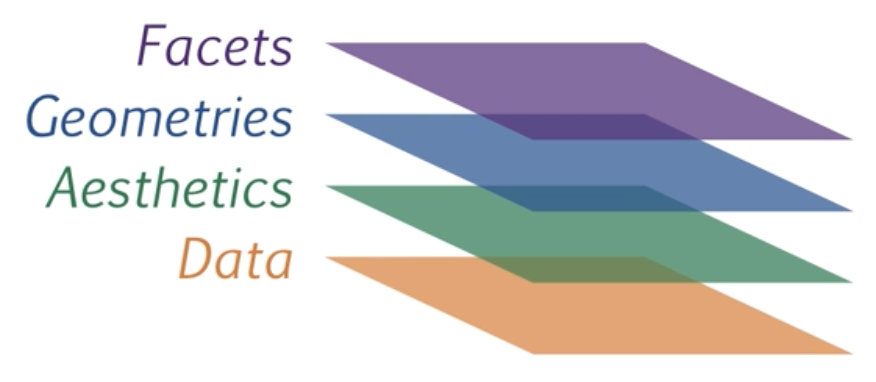

```{r setup, include=FALSE}
knitr::opts_chunk$set(echo = TRUE,comment = NA)
library(ggplot2)
library(readr)
casas=read_delim("data/casas.csv", delim = ";",escape_double = FALSE, trim_ws = TRUE)
beer=read.csv("data/beer.csv",header=TRUE, sep = ";")
mes=c(1,2,3)
casas$mes=rep(1:3, each =18 ) 
```

# **Introducción**

La visualización de datos es una de las partes más importantes del análisis de datos, que permite de manera gráfica representar la información con el fin de poder resumirlos e interpretarlos 


Algunas consideraciones

<br/><br/>

|Tipo de variable | Tipos de escala  |  Tipo de gráfico            |  Sintaxis R          | 
|:----------------|:-----------------|:----------------------------|:---------------------|
| Cualitativa     | Nominal          |  diagrama de torta          |  pie(table(x))       |
|                 |                  |                             |                      |
|                 | Ordinal          |  diagrama de barras         |  barplot(table(x))   |
|                 |                  |  diag.barras dobles         |  barplot(table(x,y)) |
|                 |                  |  diag. mosaico              |  plot(x,y)           |
|                 |                  |                             |                      |
|Cuantitativa     | De intervalo     |  diagrama de tallos y hojas | stem(x)              |
|                 |                  |  histograma                 | hist(x)              | 
|                 | De razón         |  diagrama de puntos         | plot(x,y)            |
|                 |                  |  diagrama de densidad       | density(x)           |
|                 |                  |  diagrama de cajas          | boxplot(x)           |
|                 |                  |  diagrama de linea          | plot(x, type="l")    |
|                 |                  |                             |                      |
 
 **Nota**: Además de estas formas de representación gráfica existen otras formas que combinan variables como:
 
 + Mapas
 + Diagrama de Mosaico
 + Diagramas de radar
 
 
<br/><br/><br/>

# **Variable cualitativa-nominal**

## **1. Gráfico de tortas**

```{r}
cc=c(20, 10, 20, 20, 20, 20, 20, 20, 20, 30, 20, 20, 20, 10, 30, 20, 20, 30, 20, 
     30, 30, 20, 10, 30, 20, 20, 30, 30, 10, 20, 10, 20, 20, 20, 10, 20, 10, 20, 
     20, 30, 30, 30, 10, 30, 20, 20, 20, 20, 20, 20, 10, 20, 30, 30, 10, 10, 10, 
     20, 10, 20, 10, 30, 20, 10, 20, 30, 10, 30, 30, 30, 20, 30, 30, 30, 30, 30, 
     30, 20, 10, 30, 10, 20, 20, 10, 20, 20, 20, 20, 10, 20) 
t1=table(cc)
pie(t1)
```


```{r}
cc=c(20, 10, 20, 20, 20, 20, 20, 20, 20, 30, 20, 20, 20, 10, 30, 20, 20, 30, 20, 
     30, 30, 20, 10, 30, 20, 20, 30, 30, 10, 20, 10, 20, 20, 20, 10, 20, 10, 20, 
     20, 30, 30, 30, 10, 30, 20, 20, 20, 20, 20, 20, 10, 20, 30, 30, 10, 10, 10, 
     20, 10, 20, 10, 30, 20, 10, 20, 30, 10, 30, 30, 30, 20, 30, 30, 30, 30, 30, 
     30, 20, 10, 30, 10, 20, 20, 10, 20, 20, 20, 20, 10, 20) 
labs=c("Ing. Mecánica","Ing. Civil ","Ing.Sistemas") 
pct=round(table(cc)/sum(table(cc))*100) 
labs=paste(labs, pct);labs=paste(labs, "%", sep = " ") 
t1=table(cc)
pie(t1, 
    labels=labs, 
    main=" Distribución por carrera")
```

<br/><br/><br/>

# **Variable cualitativa-ordinal**

## **2.Gráfico de barras**

```{r}
ev=c(5,13,30,52,35)
barplot(ev)
```


```{r}
ev=c(5,13,30,52,35)
ev=as.table(ev)
names(ev)=c("MR","R","B","MB","E")
barplot(ev, col=c("red","yellow","orange","green","blue"), 
        main = "Evaluación proceso de inducción",
        las=1)
```
<br/><br/><br/>

## **3. Gráfico de barras 2 **


```{r}
conteo <- table(mtcars$vs, mtcars$gear)
barplot(conteo)

```


```{r}
counts <- table(mtcars$vs, mtcars$gear)
rownames(counts)=c("Montor en linea", "Motor en V")
barplot(counts, main="Número de cambios adelante por Tipo de motor",  
        xlab="Número de cambios adelante ",
        col=c("dodgerblue3","orange"),
        legend = rownames(counts),
        las=1)
```


## **4. Diagrama de mosaico **


```{r}
mosaicplot(~gear + vs, 
           data = mtcars, 
           color =  c("dodgerblue3","orange"), 
           las = 1) 
```

<br/><br/><br/>

# **Variables cuantitativas**

## **5. Diagrama de tallos y hojas**

```{r}
nf=c(4.1, 2.7, 3.1, 3.2, 3.0, 3.2, 2.0, 2.4, 1.6, 3.2, 3.1, 2.6, 2.0, 2.4, 2.8, 
     3.3, 4.0, 3.4, 3.0, 3.1, 2.7, 2.7, 3.0, 3.8, 3.2, 2.2, 3.5, 3.5, 3.8, 3.5, 
     3.9, 4.2, 4.3, 3.9, 3.2, 3.5, 3.5, 3.7, 4.1, 3.7, 3.5, 3.6, 3.2, 3.1, 3.4, 
     3.0, 3.0, 3.0, 2.7, 1.7, 3.6, 2.1, 2.4, 3.0, 3.1, 2.5, 2.5, 3.6, 2.2, 2.4,
     3.1, 3.3, 2.7, 3.7, 3.0, 2.7, 3.0, 3.2, 3.1, 2.4, 3.0, 2.7, 2.5, 3.0, 3.0, 
     3.0, 3.2, 3.1, 3.8, 4.1, 3.7, 3.5, 3.0, 3.7, 3.7, 4.1, 3.7, 3.9, 3.7, 2.0)

# Diagrama de tallos y hojas
stem(nf)
```

<br/><br/><br/>

## **6. Histograma**

```{r}
hist(nf)
```


```{r}
h1=hist(nf, 
        main = "Nota final matemáticas fundamentales", 
        xlab = "nota", ylab="frecuencias absolutas", 
        labels=TRUE, 
        col="dodgerblue3",
        ylim = c(0,30))
abline(v=3,col="red")
```
<br/><br/><br/>

## **7. Diagrama de densidad**

```{r}
nf=c(4.1, 2.7, 3.1, 3.2, 3.0, 3.2, 2.0, 2.4, 1.6, 3.2, 3.1, 2.6, 2.0, 2.4, 2.8,
     3.3, 4.0, 3.4, 3.0, 3.1, 2.7, 2.7, 3.0, 3.8, 3.2, 2.2, 3.5, 3.5, 3.8, 3.5,
     3.9, 4.2, 4.3, 3.9, 3.2, 3.5, 3.5, 3.7, 4.1, 3.7, 3.5, 3.6, 3.2, 3.1, 3.4, 
     3.0, 3.0, 3.0, 2.7, 1.7, 3.6, 2.1, 2.4, 3.0, 3.1, 2.5, 2.5, 3.6, 2.2, 2.4, 
     3.1, 3.3, 2.7, 3.7, 3.0, 2.7, 3.0, 3.2, 3.1, 2.4, 3.0, 2.7, 2.5, 3.0, 3.0, 
     3.0, 3.2, 3.1, 3.8, 4.1, 3.7, 3.5, 3.0, 3.7, 3.7, 4.1, 3.7, 3.9, 3.7, 2.0)
plot(density(nf))
```


```{r}
plot(density(nf),
     main="Distribución notas de matemátias fundamentales", 
     col="dodgerblue3", 
     lwd=5,
     las=1, 
     xlab = "Nota",
     ylab = "Densidad")
```

<br/><br/><br/>

## **8. Diagrama de cajas** 

```{r}
boxplot(nf)
```


```{r}
boxplot(nf, main="Nota final matemáticas fundamentales",
        col="dodgerblue3",
        las=1)
abline(h=3, col="red")
```

<br/><br/><br/>

## **9. Comparación diagrama de cajas**

```{r}
boxplot(nf~cc)
```


```{r}
nf=c(4.1, 2.7, 3.1, 3.2, 3.0, 3.2, 2.0, 2.4, 1.6, 3.2, 3.1, 2.6, 2.0, 2.4, 2.8,
     3.3, 4.0, 3.4, 3.0, 3.1, 2.7, 2.7, 3.0, 3.8, 3.2, 2.2, 3.5, 3.5, 3.8, 3.5, 
     3.9, 4.2, 4.3, 3.9, 3.2, 3.5, 3.5, 3.7, 4.1, 3.7, 3.5, 3.6, 3.2, 3.1, 3.4, 
     3.0, 3.0, 3.0, 2.7, 1.7, 3.6, 2.1, 2.4, 3.0, 3.1, 2.5, 2.5, 3.6, 2.2, 2.4,
     3.1, 3.3, 2.7, 3.7, 3.0, 2.7, 3.0, 3.2, 3.1, 2.4, 3.0, 2.7, 2.5, 3.0, 3.0,
     3.0, 3.2, 3.1, 3.8, 4.1, 3.7, 3.5, 3.0, 3.7, 3.7, 4.1, 3.7, 3.9, 3.7, 2.0)

cc=c(20, 10, 20, 20, 20, 20, 20, 20, 20, 30, 20, 20, 20, 10, 30, 20, 20, 30, 20, 
     30, 30, 20, 10, 30, 20, 20, 30, 30, 10, 20, 10, 20, 20, 20, 10, 20, 10, 20, 
     20, 30, 30, 30, 10, 30, 20, 20, 20, 20, 20, 20, 10, 20, 30, 30, 10, 10, 10,
     20, 10, 20, 10, 30, 20, 10, 20, 30, 10, 30, 30, 30, 20, 30, 30, 30, 30, 30,
     30, 20, 10, 30, 10, 20, 20, 10, 20, 20, 20, 20, 10, 20)
labs=c("Ing. Mecánica","Ing. Civil ","Ing.Sistemas") 
boxplot((nf~cc),main="Nota final matemáticas fundamentales por carrera", 
        col="dodgerblue3")
abline(h=3, col="red")
abline(h=4, col="blue")
```

<br/><br/><br/>

## **10. Gráfico de series de tiempo**

```{r}
t=1:300 ; x=w=rnorm(300,0,1); x<-w; for(t in 2:300) x[t]<-x[t-1]+w[t]

plot(x, type="l",
     main="Número de pasajeros", 
     col="dodgerblue3", 
     lwd = 4)
```


<br/><br/><br/>

## **11. Resumen**

```{r, eval=FALSE }
x=rnorm(100,100,20)
y=rnorm(100,100,25)
z=rbinom(100,4,0.30)
t=1:100
pie(table(z))
barplot(table(z))
stem(x)
hist(x)
boxplot(x)
plot(x,y)
plot(t,y, type="l")
plot(density(x))
```

<br/><br/>

# **Paquetes adicionales**

Hasta el momento se ha utilizado R base para la elaboración de gráficos, a continuación se presentan algunos paquetes que mejoran la construcción de gráficos y su visualización :

<br/><br/>

## **ggplot2**. 


Este paquete de R permite la construcción de gráficos utilizando para ello una "grámatica" de los grafocos, la cual incorpora componentes como : los datos (data), un conjunto de coordenadas ( ), una serie de geometrias (geoms)  

Componentes de un gráfico en ggplot2:

+ **Data**: capa de los datos

+ **Aesthetics**: capa estetica (aes), definimos las variables a utilizar en el gráfico

+ **Geometries**: capa de geometrias, se define el tipo de gráfica a realizar

+ **Facets**: capa de facetas, permite detallar la gráfica por categorias

+ **Statistics**: capa de estadística, permite agregar modelos

+ ***Coordinates**: capa de coordenadas, permite ajustar las escalas de los ejes

+ **Theme**: capas de características del gráfico que no dependen de los datos

<br/><br/>

Para empezar, inicialmente se instalar el paquete

```{r, eval=FALSE}
install.packages("ggplo2")
```
Y luego habilitarlo para su uso

```{r}
library(ggplot2)
```

Se empieza con el primero de los lienzo, donde se declara la data que vamos a utilizar

{width=50%}

```{r}
fig=ggplot(data=casas)
fig
```


Como segundo paso se definen las variables que se van a utilizar en la construcción del gráfico

{width=50%}

```{r}
fig=ggplot(data=casas,  aes(x=area.con , y=precio))
fig
```

Luego de tener definida la base y las variables a utilizar se indica la geometria a utilizar, en este caso se trata de puntos

{width=50%}

```{r}
fig=ggplot(data=casas,  aes(x=area.con , y=precio))+
  geom_point()
fig
```

Otros elementos a utilizar son :

### **facet**  que nos ayuda a visualizar el gráfico por factor, construyendo la gráfica para cada mes en este caso


{width=50%}

```{r}
fig=ggplot(data=casas,  aes(x=area.con , y=precio))+
  geom_point() + facet_wrap(~ mes)
fig
```

### **stat** permite realizar modelos lineales y mostrar asi la relación existente entre las variables 

{width=50%}

```{r}
fig=ggplot(data=casas,  aes(x=area.con , y=precio))+
  geom_point() + facet_wrap(~ mes)+stat_smooth(method = "loess" , formula =y ~ x)
fig
```

### **coordinates**  la cual permite ajustar los ejes , por ejemplo podemos determian el rango de que queremos presentar en la gráfica

{width=50%}

```{r}
fig=ggplot(data=casas,  aes(x=area.con , y=precio)) + geom_point() +
        facet_wrap(~ mes) + 
        stat_smooth(method = "loess" , formula =y ~ x) +
        coord_cartesian(xlim = c(150,300))
fig
```

### **themes**  finalmente la capa del tema o fondo de la gráfica


{width=50%}

```{r}
fig=ggplot(data=casas,  aes(x=area.con , y=precio)) + geom_point() +
        facet_wrap(~ mes) + 
        stat_smooth(method = "loess" , formula =y ~ x) +
        coord_cartesian(xlim = c(150,300)) +
        theme_classic()
fig
```


### **Otros ejemplos de ggplot2**

```{r}
casas$mes=as.factor(casas$id)
fig2 = ggplot(data=casas, aes(x=precio, y=mes)) +
  geom_boxplot(fill="lightSalmon", 
               color="black")+
  geom_point(color="blue")+
  ggtitle("Precio de casas por mes")+
  labs(x="miles de pesos " , y="mes")
  
fig2        
```


```{r}
fig3=ggplot(casas, aes(edad)) +
       geom_histogram(bins = 7,fill="#69b3a2", color="#e9ecef", alpha=0.9)+
       theme_minimal() +
       labs(x = "años", y = "frecuencia absoluta") +
       ggtitle("Antigüedad de las casas")
fig3 
```


```{r}
fig=ggplot(data = diamonds, aes(x = cut, fill = color)) + 
      geom_bar(colour= "black", size = 0.3 ) +  
  coord_polar()
fig
```
```{r}
# Libraries
library(tidyverse)
library(hrbrthemes)
library(viridis)

# se crea la base
data <- data.frame(
  factor=c( rep("A",50), rep("B",55), rep("B",30), rep("C",20), rep('D',10)),
  valor=c(rnorm(50,10,18),rnorm(55,13,26),rnorm(30,18,15),rnorm(20, 25,34),rnorm(10,12,10)))

# Plot
data %>%
  ggplot( aes(x=factor, y=valor, fill=factor)) +
    geom_boxplot() +
    scale_fill_viridis(discrete = TRUE, alpha=0.6) +
    geom_jitter(color="black", size=0.4, alpha=0.9) +
    theme_ipsum() +
    theme(
      legend.position="none",
      plot.title = element_text(size=11)
    ) +
    ggtitle("Gráfico de cajas con puntos- geom_jitter") +
    xlab("")
```


## **highcharter**  


Este es un paquete especializado en la creación de gráficos dinámicos que emplea inrnamente  javascript.

Este paquete permite crear varios tipos de gráficos como: diagramas de dispersión, de burbuja, de línea, serie de tiempo, mapas de calor, treemap, gráficos de barras, redes, entre otros.

Gran parte de los gráficos se realizan con la función : ** hchart() ** que es aplicada a objetos 

Inicialmente se instala el paquete por una única vez

```{r, eval=FALSE}
# install.packages("highcharter")
```

Luego se carga para utilizar sus funciones

```{r, message=FALSE,warning=FALSE}
library(highcharter)
```


```{r, message=FALSE,warning=FALSE}
hchart(casas, "scatter", hcaes(x = precio, y = area.con, group = mes)) %>%
  hc_title(text = "Precio por área construida") 
```
```{r}
# paquetes requeridos
# install.packages("ggplot2")
library(ggplot2)
# install.packages("ggbeeswarm")
library(ggbeeswarm)

# construcción de la data
y <- round(rnorm(200), 1)
df <- data.frame(y = y,
                grupo = sample(c("G1", "G2", "G3"),
                               size = 200,
                               replace = TRUE))
# gráfico 
ggplot(df, aes(x = grupo, y = y, color = grupo)) +
  geom_beeswarm(cex = 3)
```


```{r}
# construccion de la data
# Datos de muestra
df <- diamonds[1:100, c("color", "depth")]

# instalacion de paquetes
# install.packages("ggridges")
library(ggridges)
# install.packages("ggplot2")
library(ggplot2)

# construcción de gráfico
ggplot(df, aes(x = depth, y = color, fill = color, color = color)) +
  geom_density_ridges() 
```

```{r}
# Datos
set.seed(3)
x <- rnorm(100)
y <- rnorm(150, 1)

# Estimaciones de densidad
denx <- density(x)
deny <- density(y)

# Gráfico
plot(denx,
     ylim = c(0, max(c(denx$y, deny$y))),
     xlim = c(min(c(denx$x, deny$x)),
              max(c(denx$x, deny$x))),
     las=1, main=" ", xlab=" ")
lines(deny)

# Colorear las áreas
polygon(denx, col = rgb(0.78, 0.89, 1, alpha = 0.6))
polygon(deny, col = rgb(0.41, 0.44, 1, alpha = 0.6))
```


Tomado de  : https://r-charts.com/es/distribucion/ggbeeswarm/

## **plotly**
 
 

<br/><br/><br/><br/>

## **fmsb** 

<br/><br/>

### **gráficos de radar** 

Paquete para el trabajo en Estadística Medica que se utiliza para la construcción de un diagrama de radar

```{r}
# install.packages("fmsb")
library(fmsb)

set.seed(1)
df <- data.frame(rbind(rep(10, 8), 
                       rep(0, 8),
                       matrix(sample(0:10, 8),nrow = 1)))
colnames(df) <- paste("Var", 1:8)

radarchart(df,
           cglty = 1, cglcol = "gray",
           pcol = 4, plwd = 2,
           pfcol = rgb(0, 0.4, 1, 0.25)) 

```
<br/><br/>

```{r}
# install.packages("fmsb")
library(fmsb)
# matriz de datos
df2 <- data.frame(rbind(rep(10, 8), rep(0, 8),
                       matrix(sample(0:10, 24,
                                     replace = TRUE),
                              nrow = 3)))
colnames(df2) <- paste("Var", 1:8)
# colores de areas
areas <- c(rgb(1, 0, 0, 0.25),
           rgb(0, 1, 0, 0.25),
           rgb(0, 0, 1, 0.25))

radarchart(df2,
           cglty = 1,       # Tipo de línea del grid
           cglcol = "gray", # Color líneas grid
           pcol = 2:4,      # Color para cada línea
           plwd = 2,        # Ancho para cada línea
           plty = 1,        # Tipos de línea
           pfcol = areas)   # Color de las áreas 

legend("topright",
       legend = paste("Grupo", 1:3),
       bty = "n", pch = 20, col = areas,
       text.col = "grey25", pt.cex = 2)

```

<br/><br/>

### **gráfico de barras polar**


```{r}

# Import tidyverse to have access to dplyr and ggplot2
library(tidyverse)

# Create a simple dummy data frame with columns "variable" and "value"
data <- data.frame(variable = paste("Var", 1:10), 
                   value = sample(10, replace = TRUE))


# Create grafico en coordenadas 
plot <- ggplot(data,aes(x = variable,y = value,
                 fill = factor(variable))) +
          geom_col(width = 1, color = "white") +
          coord_polar() +                         # vonvierte en grafico circular
          labs(x = "", y = "",title = "Titulo",   # add titulo, subtitulo, nota
                             subtitle = "Subtitulo", 
                             caption = "Nota" ) +
         theme_minimal() +                     # borra caracteristicas del grafico
         theme(                                # asigna caracteristicas
            legend.position = "none",
            axis.title.x = element_blank(),
            axis.title.y = element_blank(),
            axis.ticks = element_blank(),
            axis.text.y = element_blank(),
            axis.text.x = element_text(face = "bold"),
           plot.title = element_text(size = 24, face = "bold"),
          plot.subtitle = element_text(size = 12))

plot # imprime grafico


```
<br/><br/>

## **calendR**

```{r}
par(cex=0.3, cex.axis=.5, cex.lab=.5, cex.main=.5, cex.sub=.5)
# install.packages(calendR)
library(calendR)

# Datos
set.seed(2)
datos <- rnorm(365)

# Vertical calendar
calendR(year = 2021,
        special.days = datos,
        low.col = "#FCFFDD",
        special.col = "#00AAAE",
        gradient = TRUE,
        legend.pos = "none",
        orientation = "portrait",
        title.size = 7,  
        subtitle.size = 5,
        text.size = 2,
        weeknames.size = 3,
        day.size = 2,  # tamaño numero del dia
        months.size = 6,
        papersize="A3") # tamaño nombre del mes

```


Tomado de : https://r-charts.com/es/ranking/radar-chart/
 
 <br/><br/><br/>
 
# **Mapas** 
 
En el siguiente enlace encontrará los archivos para la construcción de los mapas en formato .shp (debe copiar los cuatro archivos)

Archivos .shp : https://sites.google.com/site/seriescol/shapes
 
A continuación el código para el mapa de Cali sin información
 
<br/>

### **Mapa de Cali** 

```{r, warning=FALSE, message=FALSE}
require(sp)
require(rgdal)
require(raster)

cali=shapefile("map/cali/cali.shp")  # importa mapa en formato .shp
plot(cali)                      # gráfico de Cali

```
 <br/>
 
### **Mapa de Cali con indice**
 
Para mostrar la información se debe incorporar un vector al objeto **cali** que contiene la información para el mapa. este objeto en formato lista tiene incorporada una data que contiene varias columnas al cual se le adiciona la información a publicar.  

En el caso de Cali tiene 22 comunas se adiciona un vector con 22 valores con el nombre de indice
 
<br/><br/>

```{r, warning=FALSE, message=FALSE}
cali=shapefile("map/cali/cali.shp")  # importa mapa en formato .shp
cali@data$indice=rnorm(22)      # se genera variable a ilustrar
spplot(cali[,21]) 
```
<br/><br/>

### **Mapa de Colombia**

Para el caso de Colombia se obtiene el archivo depto.shp que contiene la información de Colombia por departamentos (33)

<br/><br/>
```{r, warning=FALSE, message=FALSE}
require(sp)
require(rgdal)
require(raster)

mapco=shapefile("map/colombia/depto.shp")  # importa mapa en formato .shp
plot(mapco)                      # gráfico de Colombia

```
<br/>
Para representar información en el mapa seden ingresar una vector con 33 valores, igual numero de departamentos en el mismo orden en que se encuentran los nombre de los departamento en el archivo mapco

<br/>

```{r}
mapco$NOMBRE_DPT
```
<br/>

 Si se quiere representar un mapa con las muertes causadas por covid en Colombia por departamento debemos crear una tabla con la información relacionada con esta variable por departamento en el mismo orden contenida en el archivo **depto.shp** y adicionarla como variable : mapcol@data$muertes

De la base de datos abiertos Colombia se obtiene la siguiente información correspondiente al número de fallecidos por Covid19, durante el periodo marzo 2019 a agosto 25 de 2021

```{r}
# colombia=readRDS("data/Colombia.RDS")
# colombia$departamento_nom= str_to_upper(colombia$departamento_nom)
# t=table(colombia$departamento_nom,colombia$estado)
fallecidos=c(15174,3876,26516,807,2417,2151,880,1333,2388,3487,6495,382,2880,
             1296,1380,2076,2861,3961,1635,2119,6934,1546,3411,11929,400,844,
             620,249,29,87,17,45,133)
```
 

<br/><br/>

```{r, warning=FALSE, message=FALSE}
require(sp)
require(rgdal)
require(raster)
require(RColorBrewer)

mi.palette <- brewer.pal(n = 7, name = "OrRd")   # paleta de colores
mapco=shapefile("map/colombia/depto.shp")  # importa mapa en formato .shp
# colombia=readRDS("data/Colombia.RDS")
# colombia$departamento_nom= str_to_upper(colombia$departamento_nom)
# t=table(colombia$departamento_nom,colombia$estado)
fallecidos=c(15174,3876,26516,807,2417,2151,880,1333,2388,3487,6495,382,2880,
             1296,1380,2076,2861,3961,1635,2119,6934,1546,3411,11929,400,844,
             620,249,29,87,17,45,133) # vector con información
mapco@data$fallecidos=fallecidos # se adiciona variable con 33 valores = 33 dptos, en mismo orden
spplot(mapco[,6], col.regions = mi.palette, cuts = 6)  # mapa
```


<br/><br/>

## **tmap**

https://www.jstatsoft.org/article/view/v084i06


<br/><br/><br/> 

#  **Margenes de los gráficos**

```{r}
# Grafico normal
x=rnorm(100,100,20)
plot(density(x))
```

### **margenes de la grafica  c(bottom, left, top, right)**

```{r}

par(mar = c(5, 4, 4, 2) + 0.1)
x=rnorm(100,100,20)
plot(density(x))
```

###  **margenes de la gráfica**

```{r}

par(mai = c(1.5, 1.5, 1.5, 1.5))
x=rnorm(100,100,20)
plot(density(x))

```
 
 ### **Matriz de gráficos mfrow = c(2, 2)**

```{r}
x=rnorm(100,100,20)
y=rnorm(100,100,25)
z=rbinom(100,4,0.30)
t=1:100
par(mfrow = c(2, 2) ) # definición de la matriz

plot(density(x))
barplot(table(z))
hist(x)
plot(x,y)
```


### **margenes exteriores c(bottom, left, top, right)**

```{r}

par(mfrow = c(2, 2),   # matriz de graficos 2x2
    oma = c(3, 5, 2, 4) )  # margenes de la imagen
plot(density(x))
barplot(table(z))
hist(x)
plot(x,y)

```

# **Tamaño texto**


```{r}
x=rnorm(100,100,20)
plot(density(x),cex.lab=.8,  # tamaño de etiqueta ejes
                cex.axis=2, # tamaño escalas de los ejes 
                cex.main=1.5, # tamaño del titulo
                cex.sub=1)    # tamaño del subtitulo
```


https://r-charts.com/es/r-base/margenes/


# **Flexdashboard**

Este paquete permite la construcción de tableros que pueden ser publicados en formato html. A continuación se describen las principales características y la forma que podemos construir un tablero

Iniciaremos cargando el paquete (por una única vez)
```{r, eval=FALSE, message=FALSE, warning=FALSE}
install.packages("flexdashboard")
```

Tambien debemos activarlo, aunque este procedimiento viene en el formato que nos proporciona RStudio 

```{r, eval=FALSE, message=FALSE, warning=FALSE}
library(flexdashboard)
```


Inicialmente utilizamos la plantilla que para este propósito tiene RStudio, entrando por el menú : **File/ New file /  RMarkdown..**

{width=50%}

{width=50%}

Este procedimiento genera un formato para un tablero que puede ser modificado o ajustado a nuestras necesidades

{width=60%}


En este formato podemos distinguir varias partes :

+ Encabezado :  donde se define la estructura del tablero y los temas 
+ Bloque setup . Donde colocamos las instrucciones generales de R , como puede ser cargar las bases de datos que seran utilizadas durante todo el documento, ademas de cargar las librerias necesarias  
+ Definicion de columnas o filas del tablero y hojas del tablero
+ Bloques de R con el contenido


## **Uso de color**

https://r-charts.com/colors/


## **Algunos paquetes**

[Selección de paquetes de Sharpm Machis](https://www.computerworld.com/article/2921176/great-r-packages-for-data-import-wrangling-visualization.html)


