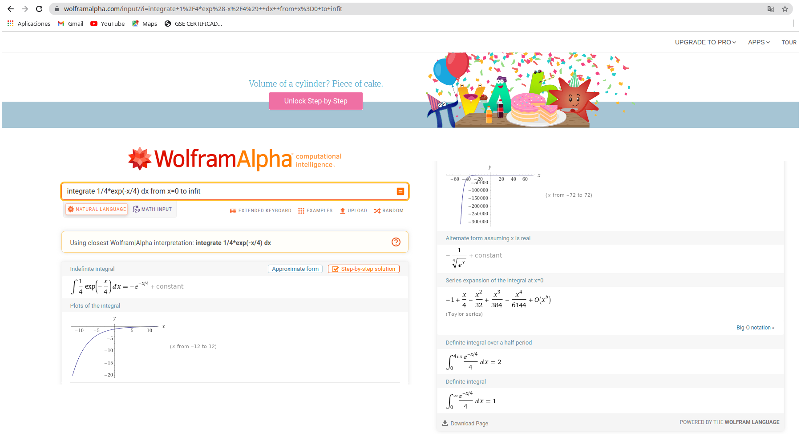

```{r setup, include=FALSE}
knitr::opts_chunk$set(echo = TRUE, message = FALSE, warning = FALSE, comment = NA)
library(psych)
library(summarytools)

# colores
c0="#0DA5A6" # VERDE CLARO
c1="#E77C00" # NARANJA
c2="#6666FF" # AZUL  
c3="#4CBFBA" # VERDE CLARO  
c4="#E09600" # AMARILLO  
c5="#BC2B6A" # MORADO  

```


# **Variables discretas**

En el caso de las variables discretas la función de distribución de probabilidad $f(x)$ debe cumplir las siguientes propiedades

+ $f(x) = P(X=x) > 0$,  la probabilidad es un valor mayor a cero

+ $\sum_{R_X} f(x) = 1$, la suma de todas las probabilidades es igual a uno


En este caso se puede utilizar la función sumatoria  `sum(x, na.rm = FALSE)`, donde `x` es un vector y `na.rm` indica si el vector tienen datos faltantes.

|    |                                     |
|:--|:------------------------------------|
| {width=80px} | Para la función $f(x)$   |

$$f_{_{X}}(x) = \left \{ 
				\begin{matrix} 
				\displaystyle\binom{40}{x}(0.7)^{x}(0.3)^{40-x} & \mbox{si }	x=0,1,2,\ldots,40\\ 
				& \\
				0  & \mbox{en otro caso }
				\end{matrix}\right.  
				$$


```{r}
# declaracion de la funcion
fw=function(w){choose(40,w)*0.70^w*0.30^(40-w)}
w=0:40

# grafico de la funcion
plot(w, fw(w), pch=19, col="#BC2B6A", las=1)
grid()

```


Para verificar que la suma de todas las probabilidades es igual a uno 

```{r}
fw=function(w){choose(40,w)*0.70^w*0.30^(40-w)}
w=0:40
sum(fw(w))
```

Para calcular la probabilidad $P(20 \leq X \leq 30)$

```{r}
sum(fw(20:30))
```

### **Valor esperado**


```{r}

fw=function(w){choose(40,w)*0.70^w*0.30^(40-w)}
w=0:40
Ex=sum(fw(w)*w)
cat("E[X] = ",Ex)
```

### **Varianza**

```{r}

fw=function(w){choose(40,w)*0.70^w*0.30^(40-w)}
w=0:40
Ex=sum(fw(w)*w)
Ex2=sum(fw(w)*w^2)
Vx=Ex2-Ex^2
cat("V[X] = ",Vx)
```


# **Variables continuas**

## **Integración** 

El concepto de integración se utiliza en probabilidad para determinar el área bajo la curva de una función de densidad $f(x)$ para una variable aleatoria continua.

Dos de las propiedades de una $f(x)$ son:

+  $\displaystyle\int\limits_{-\infty}^{+\infty} \dfrac{1}{4} f(x) \:dx = 1$

+ $P(a \leq X \leq b) = \displaystyle\int\limits_{a}^{b} f(x) \:dx$

<br/><br/>

Estas verificaciones se pueden realizar en R con dos instrucciones: 
 
 + Construcción de la función en R
 + Realizar la integral : para ello utilizamos la función `integrate` que tiene los parámetros, `integrate( f, lower, upper)` 
    + `f`: la función
    + `lower` : limite inferior  . Puede ser un número o `-Inf`
    + `upper` : limite superior  . Puede ser un número o `+Inf`
 
 
 `integrate(function(x) x, lower = 0, upper = 1)`
 
 <br/><br/>
 
 
|    |                                     |
|:--|:------------------------------------|
| {width=80px} | Para la función $f(x)$   |


$$f_{_{X}}(x) = \left \{ 
				\begin{matrix} 
				\dfrac{1}{4} e^{-x/4} & \mbox{ , }	x \geq 0\\ 
				& \\
				0  & \mbox{en otro caso }
				\end{matrix}\right.  
				$$
				
$$P(X < 5)$$				
 
```{r}
# declaracion de la funcion
fx=function(x){1/4*exp(-x/4)}

# representación gráfica de la función
x=0:20
plot(x,fx(x), type="l", col="#BC2B6A", lwd=5)

# área de integración
x1=seq(0,5,0.01)
f1=fx(x1)
polygon(c(0,x1,5),c(0,f1,0),col="skyblue")


```


```{r}
# integral entre 5 y 15 : P( X < 5)
integrate(fx, 0,5)

```
<br/><br/>

## **Valor esperado**

$$E(X) = \displaystyle\int\limits_{-\infty}^{+\infty}x f(x)dx$$

En este caso la función se multiplica por $x$

```{r}
Mx=function(x){1/4*exp(-x/4)*x}
Ex=integrate(Mx, 0, Inf)
cat("E[X] = ", Ex$value,"\n")
```
<br/><br/>

## **Varianza**

$$V[X] = E[X^{2}]-(E[X])^{2}  = E[X^{2}]-\mu^{2}$$ 


```{r}
fx=function(x){1/4*exp(-x/4)}
Mx1=function(x){1/4*exp(-x/4)*x}
Mx2=function(x){1/4*exp(-x/4)*x^2}
Ex=integrate(Mx1, lower=0,upper=Inf)
Ex2=integrate(Mx2, lower=0,upper=Inf)

cat("V[X] = ", Ex2$value-Ex$value^2)
```


```{r}
fx=function(x){1/4*exp(-x/4)}
Mx1=function(x){1/4*exp(-x/4)*x}
Mx2=function(x){1/4*exp(-x/4)*x^2}
Ex=integrate(Mx1, lower=0,upper=Inf)
Ex2=integrate(Mx2, lower=0,upper=Inf)
cat("E[X] = ", Ex$value,"\n")
cat("V[X] = ", Ex2$value-Ex$value^2)
```

<br/><br/>

## **Otras herramientas**

### **WolframAlpha**



https://www.wolframalpha.com/


### **Symlab**


https://es.symbolab.com/
