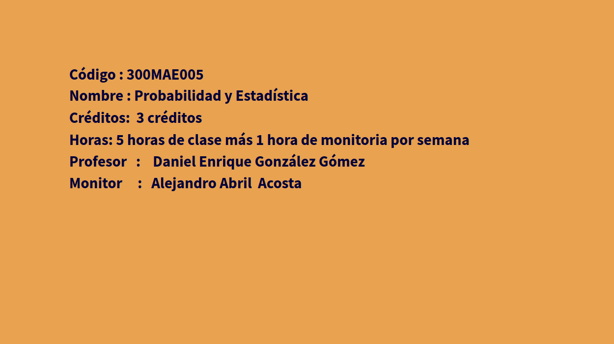
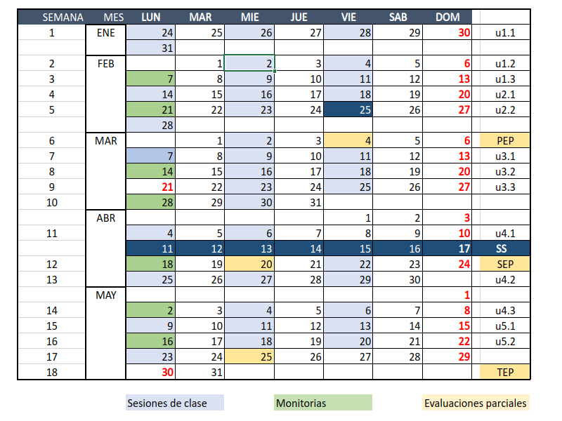
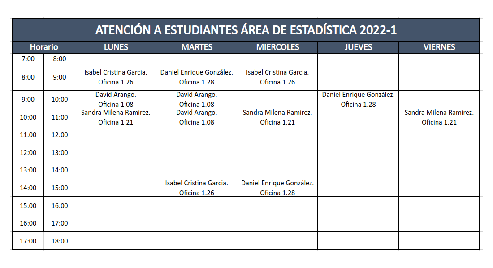

```{r setup, include=FALSE}
knitr::opts_chunk$set(echo = TRUE)
```

<br/><br/>

<H1> 
<span style="color:#0036b1">**Descripción del curso**</span>
</H1>


<br/><br/>


<br/><br/>


<br/><br/><br/>

<H1> 
<span style="color:#0036b1">**Calendario 2022-1**</span>
</H1>


<br/><br/><br/>

<H1> 
<span style="color:#0036b1">**Atención a Estudiantes**</span>
</H1>




