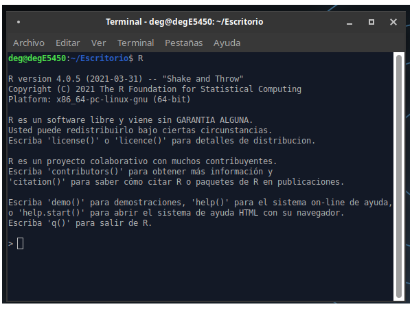
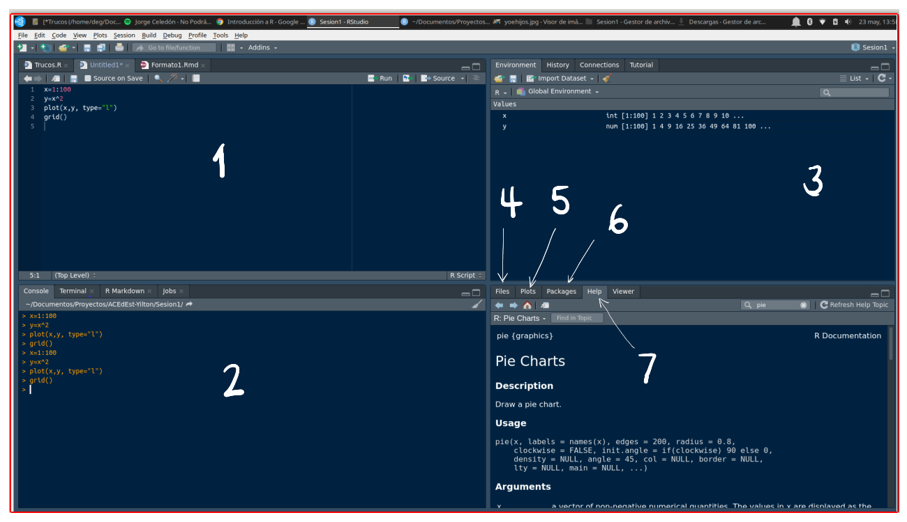

# **Que es R** 

Es un lenguaje para la computación  estadística, utilizado para el procesamiento de información y generación de modelos estadísticos. Entre las principales caractarísticas  estan:

   + Licencia (GNU GPL)  abierta y gratis
   
   + Creciente popularidad en ciencia de datos

   + Multipalataforma (UNIX, Windows, MacOS)

   + Ross Ihaka y Robert Gentieman (U.Auckland - Nueva Zelanda) 1993

   + Lenguaje multiparadigma
   
   + Codigo construido en C y Fortran
   
   + Gran comunidad muy activa 
   
   + Mas de 7000 paquetes 
   
<br/><br/>



<br/>
En el siguiente enlace se pueden obtener los archivos para su instalación : https://www.r-project.org/

<br/><br/>

Podemos usar este lenguaje utilizando una terminal o mediante la IDE **RStudio**, la cual integra un conjunto de herramientas que facilitan el uso R a los usuarios 


Esta interfaz esta conformada por varias ventana como se muestra en la siguiente imagen



1. Fuente (Source) : Ventana donde se trabajan los script  con código que se guardan para posterior utilización
2. Consola (Console) : Ventana donde se pueden escribir comandos de manera directa
3. Ambiente (Environment) : Ventana donde se pueden observar las varables y objetos creados
4. Archivos (Files) : Ventana que muestra el directorio y los archivos en el que estamos trabajando
5. Graficos (plots) : Ventana que presenta los gráficos construidos
6. Paquetes (Packages) : Ventana que permite instalar los paquetes requeridos
7. Ayudas (Help) : Ventana en la que podemos pedir ayuda sobre las sintaxis de funciones

En los siguientes enlaces se pueden descargar los programas :

+ [R download](https://cran.r-project.org/)

+ [RStudio download](https://rstudio.com/products/rstudio/download/)

<br/>

Bilbiografia recomendada:

+ [**R para principiantes**](https://cran.r-project.org/doc/contrib/rdebuts_es.pdf)

+ [**Manual de R**](https://fhernanb.github.io/Manual-de-R/index.html)

+ [**Curso de R** - Videos -Rafa Gonzalez Gouveia](https://www.youtube.com/watch?v=k3tiNvTmug8&list=PLbDLkhJ5sFvCWFbP4tAFALHkNWNFo_FiL)

<br/>
A continuación se relacionan algunas ayudas para la iniciación del lenguaje

<br/><br/>

# **Tipos de datos en R**

<br/><br/>

## **vector**  

Arreglo unidimensional de valores, caracteres o cadenas

```{r tidy=FALSE, eval=TRUE}
x=c(1,2,3,4,5)         #<<
x
```


```{r tidy=FALSE, eval=TRUE}
y=c("Muy regular", "Regular", "Bueno", "Muy bueno", "Excelente")
y
```

<br/><br/>

## **matriz** 

Arreglo bidimensional de valores

```{r tidy=FALSE}
x=1:9
m=matrix(x,nrow=3)   #<<
m
```
<br/><br/>

## **arrays**  

Arreglos multimensionales de valores. 
En el siguiente ejemplo se representa un arreglo de 3 matrices 3x3 que conformarian en 3D un cubo de datos

```{r tidy=FALSE}
x=1:9
y=10:18
z=19:27
mn=array(c(x,y),dim=c(3,3,3)) #<<
mn
```
<br/><br/>

## **factores** 

Vector de variables categóricas, por lo general se utilizan para dividir una base en subgrupos  

```{r tidy=FALSE, eval=TRUE}
x=c("rojo", "verde", "azul")
y=rep(x, times=4)
x
y

```
<br/><br/>

## **listas** 

Colección de objetos cada uno de tipos diferentes. El objeto de esta clase guarda valores en diferentes formatos. 

En el siguiente ejemplo se construye un objeto **h** que contiene varios elementos dentro de si, todos relacionados con un histograma

```{r tidy=FALSE, eval=FALSE}
h=hist(rnorm(100,25,10)) #<<
h$breaks
h$counts
h$density
h$mids
h$xname
h$equidist
```
<br/><br/>

## **data.frames**

Estructura de datos de dos dimensiones - filas y columnas - base de datos. En este caso se puede obtener un fila (data[1,] o una columna (data[,1], por separado o un elemento de la data directamente data[20,2].

```{r tidy=FALSE, eval=FALSE}
data(iris) #<<
head(iris)
iris[1,]
iris[1,5]

```
<br/><br/>

## **funciones**

Para construir una función utilizamos la palabra *function*, entre parentesis los valores de entrada y entre corchetes la formula que conforma la función. Por ejemplo:

$$f(x)=\dfrac{1}{(x-1)^{2}} $$

```{r }
fx=function(x){1/(x-1)^2} #<<
fx(100) # funcion evaluada en x=100
```

En este caso la función es evaluada dentro de un otra función en la construcción de un gráfico

```{r }
x=seq(from=2,to=10, by=0.01)  # genera secuencia de numeros entre 2 y 10 con paso 0.01
plot(x, fx(x), type="l", col="red") # genera grafica
```

El siguiente ejemplo construye una función para la realización de un gráfico. En este caso los valores de entrada estan conformados por un vector de datos y un color

```{r}
y=sample(1:6,100, replace = T)  # generacion de datos
# funcion definida para la construccion de graficos
grafica=function(x,color){
        barplot(x,
                col=color, las=1)
        grid()
}

z=table(y) # generacion de tabla de datos
grafica(z,"red")  # evalua la funcion en los datos z y colo rojo
```


```{r}
w=round(prop.table(z)*100,2)  # genera datos y constuye tabla en porcentaje
grafica(w,"blue")  # evalua la funcion con w y color azul
```

<br/><br/>

## **ts**

Objeto para series de tiempo

<br/><br/><br/>

#  **Operadores en R**

|      |Aritméticos         |      | Comparativos       |        | Lógicos     |
|:----:|:-------------------|:----:|:-------------------|:------:|:------------|
|  +   | adición            | <    | menor que          | !x     | NO lógico   |
|  -   | substracción       | >    | mayor que          | x & y  | Y lógico    |
|  *   | multiplicación     | <=   | menor o igual que  | x | y  | O lógico    |
|  /   | división           | >=   | mayor o igual que  | x or y | O exclusivo |
|  ^   | potencia           | ==   | igual              |        |             |
|  %%  | módulo             | !=   | diferente de       |        |             |
|  %/% | división enteros   |      |                    |        |             |

<br/><br/>

# **Instalación de paquetes en R**


El lenguaje **R** esta conformado por miles de paquetes o **Packages** construidos por investigadores en diversos temas y área del conocimiento

Al instalar inicialmente R contiene una serie de funciones listas para ser utiliadas las que llamamos -**base** con el que R funciona de manera adecuada para dar respuesta a problemas básicos, sin embargo en algunos casos es necesario instalar paquetes adicionales, los cuales iremos anunciando en la medida que sean necesario.

Para instalar un paquete lo podemos hacer de dos formas : 


1. Utilizando la vengtana **Packages** ubicada en la parte inferior derecha de RStudio

<iframe width="560" height="315" src="https://www.youtube.com/embed/D5MfQu__FJU" title="YouTube video player" frameborder="0" allow="accelerometer; autoplay; clipboard-write; encrypted-media; gyroscope; picture-in-picture" allowfullscreen></iframe>

<br/><br/>

2. Digitando en la consola la función **install.packages ()** 

```{r, eval=FALSE}
install.packages("ggplot2")
```


<iframe width="560" height="315" src="https://www.youtube.com/embed/4KY2xFm05JA" title="YouTube video player" frameborder="0" allow="accelerometer; autoplay; clipboard-write; encrypted-media; gyroscope; picture-in-picture" allowfullscreen></iframe>

<br/><br/>

### **Paquetes más utilizados** 

#### **Análisis descriptivo**

+ agricolate
+ spych
+ summarytools
+ ggplot2


+ flexdashboard
+ Rmarkdown

[Paquetes RStudio](https://gallery.shinyapps.io/087-crandash/)

