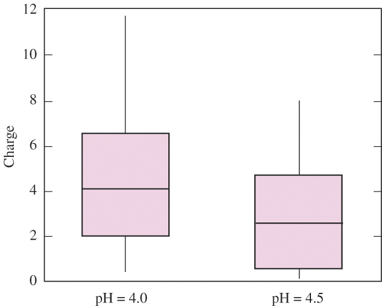

```{r setup, include=FALSE}
knitr::opts_chunk$set(echo = TRUE,comment = NA)
```

<br/><br/>

## **Problema 1**:

Los pesos en libra de 54 paquetes de hamburguesas fueron obtenidos en el mostrador de un supermercado de cadena de la ciudad:

```{r}
peso=c(1.08,0.99,0.97,1.18,1.41,1.28,0.83,1.06,1.14,1.38,
       0.75,0.96,1.08,0.87,0.89,0.89,0.96,1.12,1.12,0.97,
       1.24,0.89,0.98,1.14,0.92,1.18,1.17,0.75,0.83,0.87,
       0.86,0.89,0.89,0.92,0.93,0.96,0.96,0.97,0.98,0.99,
       1.06,1.08,1.08,1.12,1.12,1.14,1.14,1.17,1.18,1.18,
       1.24,1.28,1.38,1.41)

stem(peso)
```
<br/><br/>

```{r, eval=FALSE}
sum(peso)
sum((peso-mean(peso))^2)
sum(peso^2)
```

<br/><br/>
$\displaystyle\sum_{i=1}^{54}(x_{i}-\bar{x})=0$
<br/>

$\displaystyle\sum_{i=1}^{54}x_{i} =56.83$
<br/>

$\displaystyle\sum_{i=1}^{54}(x_{i}-\bar{x})^{2}=1.429387$
<br/>

$\displaystyle\sum_{i=1}^{54}x_{i}^2 = 61.2377$
<br/><br/>

+ Construya un  diagrama de cajas y a partir de este resultado determine si su forma es simétrica

Para construir el diagrama de cajas se emplean los cuartiles ($Q_{1}$, $Q_{2}$ y $Q_3$). Ellos determinan la caja central del diagrama. Las lineas a lado y lado 


+ Se puede afirmar que existen datos atípicos?


+ Podría afirmarse que más del 20% de los paquetes tienen un peso superior a 1.11 libras?
+ Realice un breve descripción de la información obtenida

(Tomado de Mendenhall 2006)

<br/><br/><br/>

## **Problema 2**:

El puntaje alcanzado por estudiantes en un test para medir el razonamiento deductivo mediante una prueba de personalidad de Millon (MPIS) se presenta en la siguiente tabla:

| Edad     |Marca de clase   |Frecuencia Absoluta |Frecuencia Relativa | Frec. Acum. Absoluta  |Frec. Acum. Relativa |
:----------|:----------------|:------------------:|--------------------|-----------------------|:--------------------|
|[0-10)    |                 | 3                  |                    |                       |                     |         
|[10-20)   |                 | 6                  |                    |                       |                     |
|[20-30)   |                 | 7                  |                    |                       |                     |
|[30-40)   |                 | 12                 |                    |                       |                     |
|[40-50)   |                 | 3                  |                    |                       |                     |
A partir de la información responda los siguientes interrogantes:

+ Los valores obtenidos se pueden considerar como valores homogéneos?
+ La distribución representada por la tabla se puede considerar como simetrica?
+ Qué indiador de centro podría ser más apropiado para representar los datos? Justifique su respuesta.
+  Describa los resultados obtenidos en la medición.

<br/><br/><br/>

## **Problema 3**:

Los tiempo en minutos de demora en la entrega de pedidos por parte de dos proveedores de insumos para laboratorio que llamaremos $P_{A}$ y $P_{B}$ sun los siguentes


```{r}
PA=c(13,44,10,11,20,29,30,44,56,63,70,82)
PB=c(25,14,20,22,30,33,40,45,49,52,55,58)
```

Con base en la información, cuál proveedor escogería? Justifique su respuesta

(Tomado de Arroyo(2012))

<br/><br/><br/>

## **Problema 4**:

Determine el concepto referido en cada uno de los siguientes enunciados

1. Divide la distribución de los datos en dos partes de igual proporción

2. Describe la variabilidad de los datos con respecto a la media y tiene las mismas unidades que el promedio

3. Los valores de  la variable se pueden ordenar en sentido lógico, pero no es  posible establecer diferencias entre un par de valores

4. Se obtien al promediar el cuadrado de las desviaciones al cuadrado en un conjuno de datos

5. Medida de centramiento que es muy sencible a los valores extremos

6. Estadístico que conlleva al centramiento por mayoria de datos

7. Estima el número de datos que pertenecen a un intervalo en una tabla de frecuencias

8. Brinda información sobre la amplitud de un conjunto de datos

9. Con respecto a este valor la suma de las desviaciones es igual a cero

10. Permite comparar  el nivel de dispersión para diferentes grupos de datos y para diferentes variables

<br/><br/><br/>

## **Problema 5**

Defina para cada una de las siguientes variables, el tipo de variable y su escala de medición

1. Número de botellas plásticas producidas diariamente en un proceso de modelado, en  Agua Limpia S.A.

2. Número de defectos observados por gabinete para equipos de computo de una comercializadora de equipos

3. Tiempo de respuesta de los pedidos realizados por wapp en una pizzeria

4. Perdidas de hojas de papel por dia en la fotocopiadora Copiamenos S.A.

5. Tipo de defecto en una tarjeta de circuito impreso de un lote de producción

6. Temperatura de cocción de la meladura en un proceso de producción de azúcar

7. Espesor de las piezas de metal producidas en la empresa Tornos del Norte

8. Técnica de mezclado del cemento tipo A 

9. Cantidad de corriente en microamprerios por cada medición en un cinescopio

10. Grado de satisfación de los clientes ante el servicio prestado en la Mercateria

<br/><br/><br/>

## **Problema 6 **

Determine en cada caso si la afirmación es F (Falsa) o V (Verdadera):

1. La desviación estandar de un conjunto de valores : 2,2,2,2,2,2,2,2 es 2

2. En una distribución de frecuencias acampanada, el rango de los datos es aproximadamente igual a seis desviaciones estandar

3. Dos conjuntos de datos de tamaños $n_{1}$ y $n_{2}$ tienen respectivamente promedios $\bar{x}_{1}$ y $\bar{x_{2}}$. A partir de esta información, se puede obtener la media de todos los datos ($n_{1}+n_{2}$)

4. Una variable cualitativa se puede representar mediante un histograma

5. El diagrama de barras se utiliza para representar datos en escala ordinal

6. Si sumamos una constante a una variable, la varianza  se altera

7. En una distribución sesgada a la derecha, la media es mayor que la mediana

<br/><br/><br/>

## **Problema 7 **

Un vendedor convierte los pesos de los paquetes que se producen en un su empresa de libras a kilogramos  ($1 kg \approx 2.2 lb$)  Como afecta esta conversión a la media y a la desviación estandar?

<br/><br/><br/>

##  **Problema 8**

Para analizar la rapidez con la que una máquina etiqueta botellas en una compañía de jugos, se decide hacer seguimiento al número de botellas etiquetadas por dia. A continuación se presentan los resultados obtenidos.

```{r}
rapidez=c(5944, 5985, 6275,6337,6429,6485,6501,6549, 6578,6581,6584,
          6825,6854, 6867,6897,6953,6991,7032,7237,7253,7318,7352,
          7396,7453,7457,7470,7496,7532,7569,7593,7693,7883,7932,
          8011,8019,8115,8119,8240,8254,8337,8457,8457,8457,8643,
          8736,8745,8963,9121)
```

Presente un breve análisis estadístico de los resultados obtenidos

<br/><br/><br/>

## **Problema 9**

El director de la asociación de aguacates del Valle del Cauca estudia el comportamiento de las ventas diarias durante los últimos dos meses para una muestra de 60 nuevos microempresarios en la región. Las ventas tenidas en cuenta para el estudio corresponden a los meses de enero y febrero del 2022 y el nivel tecnológico de la empresa. La siguiente información corresponde a las ventas :

```{r}
Enero=c(14.3,14.4,11.1,11.2,11.4,11.4,11.4,11.4,10.0,9.1,8.4,8.5,7.2,7.1,6.2,13.7,
        13.8,15.0,10.0,10.5,10.5,10.6,10.7,12.1,12.3,12.4,12.8,9.3,9.2,9.1)
  
Febrero=c(12.0,12.0,12.0,12.7,12.8,12.9,8.0,13.2,13.3,13.5,13.6,11.0,11.5,11.6,11.9,
          11.9,10.4,10.3, 10.7,9.0,9.2,7.4,7.7,6.1,5.9,14.3,14.2,14.8,15.1,15.2)  
```


El nivel tecnológico de los 60 distribuidores mostró el siguiente comportamiento

```{r, echo=FALSE}
p=c(14,40, 46)
p=as.table(p)
names(p)=c("Alto","Medio","Bajo")
barplot(p, ylim = c(0,50), ylab = "frecuencia relativa (%)")
grid()
```

De acuerdo con la información anterior, responda falso o verdadero a las siguientes afirmaciones. En caso de ser falsa, justifique su respuesta

1. La variable ventas mensuales se miden en escala de razón

2. Las ventas por valor de 6.2 obtenidas durante el mes de enero corresponden a un dato atípico

3. Las ventas de enero son más homogeneas que las ventas obtenidas para el més de febrero

4. La mediana correspondiente a la información de enero es de 11.5

5. La varianza para el més de enero es de 5.21

6. Aproximadamente el 68% de las ventas de enero están entre 8.7 y 13.3

7. Si el estado cobra un impuesto sobre las ventas del 16%, el promedio del impuesto pagado en el més de enero es de 1.75

8. En la variable nivel tecnológico, el  promedio es :

$$\dfrac{14+40+46}{3}$$

9. El cuartil 1 ($Q_{1}$) para las ventas de enero es de 8.0

10. 40 empresas tienen un nivel tecnológico medio

11. Las ventas de febrero muestran un sesgo negativo

(Basado en Arroyo-2012)


12. Para cualquier lista de números, la  mitad de  ellos está por debajo de la media.

13. La mediana de una muestra siempre corresponde al valor de uno de los valores de la muestra

14. Si un grupo de empleados recibe un aumento en sus salarios del 50\%, el promedio de sus salarios se duplica.

<br/><br/><br/>

## **Problema 10**

Los siguientes diagramas de cajas que comparan la carga [en coulombs entre mol $(C/mol) \times 10^{-25}$] a pH 4.0 y a pH 4.5 para un conjunto de proteínas ( del artículo Optimal Synthesis of Protein Purifivation Processes, E. Vasquez-Alvarez, M. Leinqueo y J. Pinto, en Biotechnology Progress 2001). Verdadero o falso:
			
 
			
1. La mediana de la carga para el pH 4.0 es mayor que el 75avo. percentil de la carga para el pH 4.5 

2. Aproximadamente 25\% de las cargas para el pH 4.5 son menores que la carga más pequeña en el pH 4.0

3. Cerca de la mitad de los valores de la muestra para el pH 4.0 está entre 2 y 4

4. Hay una proporción mayor de valores fuera de la caja para el pH 4.0 que para el pH 4.5.

5. Ambas muestras están sesgadas a la derecha

6. Ambas muestras contiene datos atípicos 


