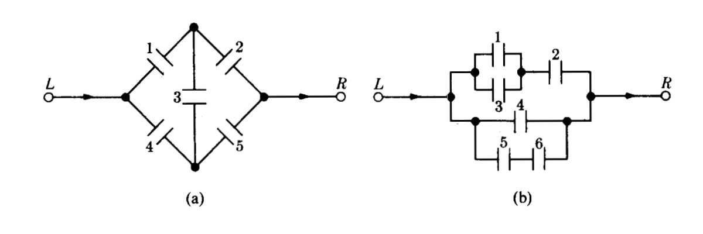

---

```{r setup, include=FALSE}
knitr::opts_chunk$set(echo = TRUE)
```


## **Ejemplos de Primeros parciales**

<br/><br/>

### [**Primer parcial 2015-2**](https://github.com/dgonzalez80/pye20221.io/blob/main/pdf/PARCIAL1.pdf)

<br/><br/>

### [**Primer parcial 2017-1**](https://github.com/dgonzalez80/pye20221.io/blob/main/pdf/Primer%20parcial_20171-C.pdf)
Nota: el **punto 2** corresponde al módulo 3 . No hacer

<br/><br/>

## **Problemas propuestos**

### **Punto 1**:

Un cargamento de 1500 lavadoras contiene 400 defectuosas y 1100 no defectuosas. Se eligen al azar doscientas lavadoras (sin sustitución) y se clasifican. 
a. ¿Cual es la probabilidad de que se encuentren exactamente 50 artículos defectuosos?, 
b. ¿?Cual es la probabilidad de que se encuentren al menos 50 artículos defectuosos? 
c. ¿ entre 50 y 60 artículos defectuosos?

<br/><br/>

### **Punto 2**:

Diez fichas numeradas del 1 al 10 se mezclan en una urna. Se sacan de la urna dos fichas numeradas $(X,Y)$ una y otra a la vez sin sustitución. ¿Cuál es la probabilidad de que $X+Y=10$ ?

<br/><br/>

### **Punto 3**:

Un lote consta de 10 artículos buenos, 4 con pequeños defectos y 2 con defectos graves. Se elige un artículo al azar. Encontrar la probabilidad de que : 
a. No tenga defectos, 
b. Tenga un defecto grave, 
c. Que sea bueno o tenga un defecto grave
	
<br/><br/>

### **Punto 4**:

Un mecanismo puede ponerse en cuatro posiciones digamos $a$,$b$,$c$ y $d$ . Hay 8 de tales mecanismos en un sistema. 
a. ¿De cuántas maneras diferentes se puede instalar el sistema ?, 
b. ¿Cuantas maneras son posibles si sólo se usan las posiciones $a$ y $b$ con la misma frecuencia?

<br/><br/>

### **Punto 5**:

Entre los números $1,2,3 .... 50$ se escoge un número al azar. ¿Cuál es la probabilidad de que el número escogido sea divisible por $6$ o por $8$?
	
<br/><br/>

### **Punto 6**:

La urna 1 contiene $x$ bolas blancas e $y$ bolas rojas. LA urna 2 contiene $z$ bolas blancas y $v$ bolas rojas. Se escoge una bola al azar de la urna 1 y se pone en la urna 2. Entonces se escoge una bola al azar de la urna 2. ¿Cuál es la  probabilidad de que esta bola sea blanca?
	
<br/><br/>

### **Punto 7**:

En las siguientes figuras (a) y (b) se supone que la probabilidad de que cada interruptor  este cerrado es $p$  y que cada  interruptor se abre o se cierra independientemente de cualquier otro. Encontrar en cada caso la probabilidad de la corriente pase de *Izquierda* a *Derecha*
	



*Ejercicios tomados de Meyer( 1986)	*

<br/><br/>

### **Punto 8**:

Los contaminantes más comunes de las aguas son de origen orgánico. Puesto que la mayor parte de los materiales orgánicos se descompone por acción de bacterias que requieren oxígeno, un exceso de materia orgánica puede significar una disminución en la cantidad de oxígeno disponible. Ello afecta eventualmente a otros organismos presentes en el agua. La demanda de oxígeno por parte de una bacteria se llama demanda biológica de oxígeno (DBO). Un estudio de las corrientes acuáticas que circulan en las proximidades de un complejo industrial revela que el 35% tiene una alta DBO, el 10% 	muestra una acidez elevada y un 4% presenta ambas características. ¿Son independientes los sucesos «la corriente tiene una alta DBO» y «la corriente posee una acidez elevada»? Calcular la probabilidad de que la corriente tenga una acidez elevada, dado que presenta una alta DBO.
	
<br/><br/>

### **Punto 9**:

Suponga que una familia tiene cuatro hijos.  
a. Hallar la probabilidad de que exactamente dos sean varones. 
b. Cuál es la probabilidad de que dos sean varones si el nacido en primer lugar es un varón?. 
c. ¿Cuál es la probabilidad de que el último hijo nazca varón si los tres primeros son mujeres?
	
<br/><br/>

### **Punto 10**: 

Unos estudios muestran que los ejemplares de una cierta raza de liebres de alta montaña (liebre esquiadora) mueren antes de lo normal, aun en ausencia de depredadores o de 	enfermedad conocida alguna. Dos de las causas de muerte identificadas son: baja cantidad de azúcar en sangre y convulsiones. Se estima que el 7% de los animales presenta ambos síntomas, el 40% tiene bajo nivel de azúcar en sangre, y el 25% sufre convulsiones. 
a.¿Cuál es el porcentaje de muertes producidas por causas que no sean las que hemos mencionado? 
b.¿Cuál es la probabilidad de que un animal elegido aleatoriamente que tiene bajo nivel de azúcar en sangre sufra también convulsiones?
	
<br/><br/>

### **Punto 11**:

Se cree que la distribución de los grupos sanguíneos en Estados Unidos en la Segunda Guerra Mundial era: tipo A, 41%; tipo B, 9%; tipo AB, 4%; y tipo O, 46%. Se estima que en esa época, el 4% de las personas pertenecientes al tipo O fue clasificado como del tipo A; el 88% de los del tipo A fue correctamente clasificado; el 4% de los del tipo B se clasificó como del tipo A, y el 10% de los del tipo AB fue, igualmente, clasificado como del tipo A. Un soldado fue herido y conducido a la enfermería. Se le clasificó como del tipo A. ¿Cuál es la probabilidad de que tal grupo sea ciertamente el suyo?
	
*Tomados de J. Susan Milto (2001)* 


